```{r, echo = FALSE, message = FALSE, warning = FALSE, include=FALSE}
#tinytex::reinstall_tinytex(repository = "illinois")
# Global knitr options
knitr::opts_chunk$set(
  echo = FALSE, 
  message = FALSE, 
  warning = FALSE, 
  fig.pos = "H", 
  out.width = "100%"
)

# Load libraries - loading dplyr AFTER plyr to prevent function masking
pacman::p_load(plyr, dplyr, knitr, ggplot2, pander, reshape2, patchwork)
pacman::p_load(officedown, officer, flextable) # processes BLOCK_LANDSCAPE markers in Word output; flextable for cross-referenceable tables
pacman::p_load(wtsGMACS, wtsUtilities) # https://github.com/wStockhausen?tab=repositories


# Buck's packages have to be installed in this order
# devtools::install_github("wStockhausen/wtsQMD")
# devtools::install_github("wStockhausen/wtsUtilities")
# devtools::install_github("wStockhausen/wtsPlots")
# devtools::install_github("wStockhausen/tcsamFunctions")
# devtools::install_github("wStockhausen/rTCSAM02")
# devtools::install_github("wStockhausen/wtsMarkdown")
# devtools::install_github("wStockhausen/rCompTCMs")
# devtools::install_github("wStockhausen/wtsGMACS")

# Mapping and Analysis
pacman::p_load(PBSmodelling, PBSmapping, maps, mapproj, ggridges)

# Additional utilities
pacman::p_load(coda, plotrix, miceadds)

# Pander options for cleaner tables
panderOptions('table.alignment.default', 'left')
panderOptions('table.split.table', Inf)


#  --- Load model results ----
# Ensure rda_ModelsResLst.RData is in the working directory
# written by 03_build_results_object.R
reslst <- wtsUtilities::getObj("Models/rda_ModelsResLst.RData")

# Extract case names
cases <- names(reslst$repsLst)
nCases <- length(cases)

# Create a clean string for referencing models in the text
# Converts "25_1_gmacs" to "25.1.gmacs"
clean_cases <- gsub("_", ".", cases)
strMdls <- ifelse(nCases == 1, "model", "models")

# Build the descriptive string (e.g., "model A, model B, and model C")
if (nCases > 1) {
  strCases <- paste(paste(clean_cases[-nCases], collapse = ", "), 
                    "and", clean_cases[nCases])
} else {
  strCases <- clean_cases
}

# --- Report Configuration ---
# 20% buffer on the OFL: the figure the September 2025 assessment recommended
# and the one historically applied to crab stocks with Tier 3-adequate data. The
# SSC applied 40% for the 2025/26 specification; the divergence is argued in
# Section G.
ABC_buffer     <- 0.8
source("0-models.R") # Load model definitions

# model_defs is now the September set exactly (pruned 2026-08-28), so this is
# normally all of it. It stays as a guard: a model that has not been built yet
# drops out of the tables and the narrative count instead of rendering as a row
# of NAs or zeros. 0-models.R warns by name when that happens. Narrative model
# counts must use n_models, never length(model_defs).
models_present <- model_defs[dir.exists(model_defs)]
n_models       <- length(models_present)

## --- Tier 4: the 2026 harvest specification -------------------------------
## SINGLE SOURCE OF TRUTH for the specification scalars. Every downstream
## section (Exec Summary items 5-7, the OFL and ABC sections, status determination,
## Appendix B) must read THESE names and never recompute them -- that is how two
## tables in one document end up disagreeing.
##
## Source is the CSV 07_calc_tier4.R writes. The Phase-1 sketch (§15a) guessed
## at "Models/tier4_results.rds" with a [[VERIFY]] on it; 07 writes a CSV, not an
## RDS, and there is no tier4$by_currency list. Interface is
## currency/Bmsy/B_curr/status/M/Fofl/OFL plus the alternatives.
##
## BASIS (backlog 7d/7e), Grant 2026-08-30, superseding the flat rule decided
## earlier the same day: the RAMPED crab FMP Tier 4 control rule with the BARANOV
## catch equation and a 20% ABC buffer. This is the FMP form and is what the
## October 2025 SSC specified for this stock. The flat rule is retained and
## reported as the sensitivity (OFL_flat). Note the groundfish Tier 5 rule is a
## DIFFERENT tier system and was never a valid citation for a crab stock,
## whichever rule is chosen (2026-08-29;
## the linear F_OFL * B form was the basis before that date). The ramped-HCR and
## linear-equation alternatives are carried alongside for reporting; neither is
## the basis.
TIER4_CSV <- "data/tier4/tier4_by_currency.csv"
if (file.exists(TIER4_CSV)) {
  tier4_by_currency <- read.csv(TIER4_CSV, stringsAsFactors = FALSE)
  t4_rec <- tier4_by_currency[tier4_by_currency$currency == "morphometric", ]
  stopifnot("tier4_by_currency.csv has no single morphometric row" = nrow(t4_rec) == 1)
  bmsy_2026        <- t4_rec$Bmsy      # mean REMA-smoothed biomass, years < BMSY_WINDOW_END
  mmb_2026         <- t4_rec$B_curr    # terminal-year REMA-smoothed morphometric MMB
  status_2026      <- t4_rec$status    # mmb_2026 / bmsy_2026
  fofl_2026        <- t4_rec$Fofl
  ofl_2026         <- t4_rec$OFL
  ## Uncertainty on the biomass the control rule uses. Required for Tiers 4-5
  ## by the groundfish guidelines (4.11.2); derivation stated in Section F.
  ## REMA's 95% prediction interval on the SMOOTHED series -- NOT the survey's
  ## own sampling CV, which is an input to that fit.
  mmb_2026_lci     <- t4_rec$B_curr_lci
  mmb_2026_uci     <- t4_rec$B_curr_uci
  mmb_2026_cv      <- t4_rec$B_curr_cv
  ## Status and OFL at the ends of the biomass interval. The OFL bounds are READ
  ## from 07, not derived here. Under the flat rule they could be got by scaling
  ## the point estimate with biomass, because F_OFL was constant; under the ramp
  ## adopted 2026-08-30 F_OFL is itself a function of status, so the OFL is
  ## quadratic in biomass and that shortcut is wrong in both directions -- it
  ## gave [13.82, 24.63] where the correct interval is [10.11, 31.73]. 07 applies
  ## the selected rule and equation at each bound, so this stays right across a
  ## change of either.
  status_2026_lci  <- mmb_2026_lci / bmsy_2026
  status_2026_uci  <- mmb_2026_uci / bmsy_2026
  ofl_2026_lci     <- t4_rec$OFL_lci
  ofl_2026_uci     <- t4_rec$OFL_uci
  stopifnot("OFL interval must bracket the reported OFL" =
              is.na(ofl_2026) || (ofl_2026_lci <= ofl_2026 && ofl_2026 <= ofl_2026_uci))
  ofl_2026_ramp    <- t4_rec$OFL_ramp     # = the reported basis from 2026-08-30
  ## How far the choice of currency moves the OFL, on the SELECTED rule. This was
  ## written as "more than a factor of four" while the flat rule was the basis;
  ## the ramp adopted 2026-08-30 widened it to ~16x, because both large-male
  ## currencies sit just above the beta = 0.25 closure and the ramp cuts their
  ## F_OFL to near zero. Computed, not stated, for that reason.
  ofl_curr_ratio   <- max(tier4_by_currency$OFL) / min(tier4_by_currency$OFL)
  ofl_2026_flat    <- t4_rec$OFL_flat     # sensitivity: flat F_OFL = M, no ramp
  fofl_2026_flat   <- t4_rec$Fofl_flat
  ofl_2026_linear  <- t4_rec$OFL_flat_linear   # flat HCR, linear equation
  ## Sloped rule AND linear equation -- the combination the SSC used to set the
  ## 2025/26 specification, so the like-for-like comparison in Section G.
  ofl_2026_ramp_linear <- t4_rec$OFL_ramp_linear   # reported HCR, linear equation
  NAT_M            <- t4_rec$M            # target F; read, not restated

  ## BMSY_WINDOW_END is a constant inside 07_calc_tier4.R and is not carried in
  ## its output, so the document cannot simply read it. Rather than restate the
  ## literal and let the two drift, recover it: B_MSY is the mean of the REMA
  ## series over years strictly before the cutoff, so the correct cutoff is the
  ## one that reproduces the stored B_MSY. If none does, the constant in 07 has
  ## changed and the document says so instead of printing a stale year.
  ##
  ## The candidate set must run one year PAST the end of the series: with the
  ## full-series window (07's BMSY_WINDOW_END = 2027, i.e. 1982-2026) the cutoff
  ## is not itself a year in the data, and searching only over observed years
  ## silently failed to recover it. What the document actually reports is the
  ## averaging RANGE, not the exclusive cutoff, so build that here.
  BMSY_WINDOW_END <- NA_integer_
  BMSY_WINDOW_LAB <- NA_character_
  if (file.exists("data/tier4/rema_predictions.csv")) {
    .rp <- read.csv("data/tier4/rema_predictions.csv", stringsAsFactors = FALSE)
    .rp <- .rp[.rp$size == "morphometric", ]
    if (nrow(.rp)) {
      .yrs  <- sort(unique(.rp$Year))
      .cand <- c(.yrs, max(.yrs) + 1L)
      .fit  <- vapply(.cand, function(y) {
        v <- .rp$rema_pred[.rp$Year < y]
        if (!length(v)) NA_real_ else abs(mean(v) - bmsy_2026)
      }, numeric(1))
      if (any(is.finite(.fit)) && min(.fit, na.rm = TRUE) < 1e-6) {
        BMSY_WINDOW_END <- .cand[which.min(.fit)]
        .in <- .yrs[.yrs < BMSY_WINDOW_END]
        BMSY_WINDOW_LAB <- sprintf("%d-%d", min(.in), max(.in))
      }
    }
  }
} else {
  ## Stub so the document still knits before 07 has been run. The empty frame
  ## matters: the Tier 4 and ABC sections select rows out of tier4_by_currency
  ## by currency, and without it those lookups error the knit rather than
  ## printing the not-yet-computed marker.
  tier4_by_currency <- data.frame(
    currency = character(0), Bmsy = numeric(0), B_curr = numeric(0),
    status = numeric(0), Fofl = numeric(0), OFL = numeric(0),
    Fofl_ramp = numeric(0), OFL_ramp = numeric(0), OFL_linear = numeric(0),
    M = numeric(0), stringsAsFactors = FALSE)
  bmsy_2026 <- mmb_2026 <- status_2026 <- fofl_2026 <- ofl_2026 <- NA_real_
  ofl_2026_ramp <- ofl_2026_linear <- ofl_2026_ramp_linear <- NA_real_
  ofl_2026_flat <- fofl_2026_flat <- ofl_curr_ratio <- NA_real_
  mmb_2026_lci <- mmb_2026_uci <- mmb_2026_cv <- NA_real_
  status_2026_lci <- status_2026_uci <- ofl_2026_lci <- ofl_2026_uci <- NA_real_
  NAT_M <- NA_real_
  BMSY_WINDOW_END <- NA_integer_
  BMSY_WINDOW_LAB <- NA_character_
}
## Inline text uses these; render them as a visible marker rather than "NA".
## Length-0 is treated like NA: a currency lookup that matches no row must print
## the marker, not abort the knit on `if (logical(0))`.
.f  <- function(v, d = 3) if (length(v) != 1L || is.na(v)) "[[not yet computed]]" else sprintf(paste0("%.", d, "f"), v)
.fy <- function(v) if (length(v) != 1L || is.na(v)) "[[unrecovered -- BMSY_WINDOW_END changed in 07]]" else as.character(v)
# MSST = half the B_MSY proxy, the NPFMC crab FMP definition. The stock is
# overfished if mature male biomass falls below it.
msst_2026 <- 0.5 * bmsy_2026
abc_2026  <- ABC_buffer * ofl_2026    # ABC_buffer <- 0.8, set above

## --- OFL probability distribution (Executive Summary item 8) ----------------
## The OFL is a deterministic function of the terminal smoothed biomass through
## the control rule and the catch equation, so its distribution follows by
## propagating REMA's lognormal prediction interval on that biomass through the
## SAME ramp + Baranov basis 07 applied at the point and at the interval bounds.
## Reconstructed here rather than read because 07 writes no draws file; the
## stopifnot pins the reconstruction to 07's reported OFL and its 95% interval,
## so a change of basis in 07 that this block did not follow aborts the knit
## instead of printing a distribution that disagrees with Section F.
OFL_DRAWS_N <- 200000L
ALPHA_HCR   <- 0.10   # ramp intercept, crab FMP Tier 4 control rule
BETA_HCR    <- 0.25   # closure threshold; OFL = 0 at or below this status
PSTAR_CRAB  <- 0.49   # June 2026 SSC default P* for crab; maxABC = P* quantile
if (!is.na(ofl_2026) && !is.na(mmb_2026) && !is.na(bmsy_2026) &&
    !is.na(mmb_2026_lci) && !is.na(mmb_2026_uci) && mmb_2026 > 0) {
  ## sdlog is REMA's log-scale prediction SD. Take it from the reported CV,
  ## sdlog = sqrt(log(1 + CV^2)) -- the CV is REMA's native uncertainty on the
  ## terminal smoothed biomass, and this does not assume the reported interval is
  ## the exact 95% lognormal one. Cross-check against the interval endpoints,
  ## which must agree because 07 builds the CV and the interval from the same fit.
  .sdlog     <- sqrt(log(1 + mmb_2026_cv^2))
  .sdlog_int <- (log(mmb_2026_uci) - log(mmb_2026_lci)) / (2 * qnorm(0.975))
  stopifnot("REMA CV and 95% interval imply different log-scale SDs" =
              abs(.sdlog - .sdlog_int) < 1e-3)
  set.seed(20260909)
  .b      <- exp(rnorm(OFL_DRAWS_N, log(mmb_2026), .sdlog))
  .status <- .b / bmsy_2026
  .fofl   <- pmin(NAT_M, NAT_M * (.status - ALPHA_HCR) / (1 - ALPHA_HCR))
  .fofl[.status <= BETA_HCR] <- 0
  ofl_draws <- .b * (.fofl / (.fofl + NAT_M)) * (1 - exp(-(.fofl + NAT_M)))
  ofl_draws[.fofl == 0] <- 0
  stopifnot(
    "reconstructed OFL median must match 07's point OFL" =
      abs(stats::median(ofl_draws) - ofl_2026) < 0.25,
    "reconstructed OFL 2.5% must match 07's lower bound" =
      abs(as.numeric(stats::quantile(ofl_draws, 0.025)) - ofl_2026_lci) < 0.5,
    "reconstructed OFL 97.5% must match 07's upper bound" =
      abs(as.numeric(stats::quantile(ofl_draws, 0.975)) - ofl_2026_uci) < 0.5)
  maxabc_2026 <- as.numeric(stats::quantile(ofl_draws, PSTAR_CRAB))
} else {
  ofl_draws   <- NULL
  maxabc_2026 <- NA_real_
}

## --- Observed survey biomass, all three currencies -------------------------
## OBSERVED survey estimates, distinct from the REMA-smoothed B_curr the Tier 4
## calculation uses. Read from data, never hardcoded, so the text cannot drift
## from the survey pull. All in kt.
##   morphometric mature male -> data/derived/survey_indices.csv (the model input)
##   >=95 mm  ("large_male")     -> 02's crabpack pull, BIOMASS_MT
##   >101 mm  ("preferred_male") -> same file
## 2026 is the terminal survey; 2025 is the preceding one, which is what the
## October specification is compared against.
.svy_num <- function(x) if (length(x) == 1L) as.numeric(x) else NA_real_
if (file.exists("data/derived/survey_indices.csv")) {
  .si <- read.csv("data/derived/survey_indices.csv", stringsAsFactors = FALSE)
  .mm <- .si[.si$sex == "male" & .si$maturity == "mature", ]
  survey_morph_2025 <- .svy_num(.mm$biomass[.mm$year == 2025])
  survey_morph_2026 <- .svy_num(.mm$biomass[.mm$year == 2026])
} else survey_morph_2025 <- survey_morph_2026 <- NA_real_

if (file.exists("data/survey/survey_large_male_index_derived.csv")) {
  .lg <- read.csv("data/survey/survey_large_male_index_derived.csv", stringsAsFactors = FALSE)
  .get <- function(cat, yr) .svy_num(.lg$BIOMASS_MT[.lg$CATEGORY == cat & .lg$YEAR == yr]) / 1000
  survey_large_2025 <- .get("large_male", 2025);     survey_large_2026 <- .get("large_male", 2026)
  survey_pref_2025  <- .get("preferred_male", 2025); survey_pref_2026  <- .get("preferred_male", 2026)

  ## Preferred males (> 101 mm) are the industry currency and the one the CPT and
  ## the State track, so the terminal estimate is carried in full -- abundance in
  ## millions of crab as well as biomass, both with their survey CVs -- and placed
  ## against the whole 1982- series. Biomass alone understates the case: the
  ## question asked of this stock is how many marketable crab are on the grounds.
  .pref <- .lg[.lg$CATEGORY == "preferred_male", ]
  .pref <- .pref[order(.pref$YEAR), ]
  .pg <- function(col, yr) .svy_num(.pref[[col]][.pref$YEAR == yr])
  pref_abund_2025 <- .pg("ABUNDANCE", 2025) / 1e6      # millions of crab
  pref_abund_2026 <- .pg("ABUNDANCE", 2026) / 1e6
  pref_abund_cv_2026 <- .pg("ABUNDANCE_CV", 2026)
  pref_biom_cv_2026  <- .pg("BIOMASS_MT_CV", 2026)
  pref_biom_chg  <- 100 * (survey_pref_2026 / survey_pref_2025 - 1)
  pref_abund_chg <- 100 * (pref_abund_2026 / pref_abund_2025 - 1)
  pref_n_yrs     <- nrow(.pref)
  pref_rank_2026 <- rank(.pref$BIOMASS_MT)[.pref$YEAR == 2026]   # 1 = lowest on record
  pref_pct_mean  <- 100 * .pref$BIOMASS_MT[.pref$YEAR == 2026] / mean(.pref$BIOMASS_MT)
  stopifnot("preferred-male index must cover both terminal survey years" =
              all(c(2025, 2026) %in% .pref$YEAR))
} else {
  survey_large_2025 <- survey_large_2026 <- survey_pref_2025 <- survey_pref_2026 <- NA_real_
  pref_abund_2025 <- pref_abund_2026 <- pref_abund_cv_2026 <- pref_biom_cv_2026 <- NA_real_
  pref_biom_chg <- pref_abund_chg <- pref_pct_mean <- NA_real_
  pref_n_yrs <- pref_rank_2026 <- NA_integer_
}

## Tier 4 results for ALL THREE currencies, for the comparison table in Section F.
if (exists("tier4_by_currency")) {
  tier4_all <- tier4_by_currency[, intersect(
    c("currency","Bmsy","B_curr","status","M","Fofl","OFL","OFL_ramp","OFL_linear"),
    names(tier4_by_currency))]
} else tier4_all <- NULL

# Case selection
# SEPTEMBER 2026 PORT — repointed from the May candidate bracket to the accepted model.
# Accepted (RECOMMENDED) model = "26.1 gmacs (update + compfix + plus group + new_mat)"
# (Models/26_gmacs_update_newmat_plus_group, shortname Model 26.1b) -- May's 25.2c advanced to
# end year 2025, i.e. fishery through 2025 and survey through 2026. Repointed 2026-08-28; it
# previously named the *May* folder (terminal 2024), which would have reported the wrong fit.
# Reference (2025 accepted, rolled forward) = "25.1 gmacs" (Models/25_gmacs).
# These names must match the case names produced when rda_ModelsResLst.RData is regenerated (03_build_results_object.R).
# >>> REVIEW: confirm comparison pairs once the 2026 results object exists.
accepted_model      <- "26.1 gmacs (update + compfix + plus group + new_mat)"
reference_model     <- "25.1 gmacs"
case_for_resids     <- accepted_model                            # model to print size-comp residuals for
case_for_data_table <- c(reference_model, accepted_model)
case_for_mat_plot   <- c(reference_model, accepted_model)        # show effect of new maturity (reference lacks new_mat)
report_model <- model_defs[accepted_model]

## --- Tier 3 quantities for the author-recommended model ---------------------
## Read once, here, so the Executive Summary can contrast the Tier 3 answer with
## the Tier 4 one without either being retyped. Same source the step-change table
## reads (Table \@ref(tab:stepchange)); nothing is recomputed.
.t3 <- local({
  f <- file.path(report_model, "Gmacsall.out")
  out <- list(bmsy = NA_real_, status = NA_real_, ofl = NA_real_,
              mmb = NA_real_, mmb_proj = NA_real_, year = NA_real_)
  if (!file.exists(f)) return(out)
  tmp <- readLines(f, warn = FALSE)
  grab <- function(key) {
    l <- grep(paste0("^", key, " :"), tmp, value = TRUE)[1]
    if (is.na(l)) NA_real_ else as.numeric(strsplit(trimws(l), " +")[[1]][3])
  }
  out$bmsy   <- grab("BMSY")
  out$status <- grab("Bcurr/BMSY")
  out$ofl    <- grab("OFL\\(tot\\)")
  ## GMACS's status is Bcurr/BMSY, in which Bcurr is the PROJECTED mature male
  ## biomass the control rule acts on -- not the terminal MMB at mating read
  ## from the Summary block below. Carrying only one of the two invited exactly
  ## the error this fixes: the Executive Summary paired terminal MMB of 141.5 kt
  ## with a status of 1.32 and told the reader 141.5 was above a proxy of 145.0
  ## (2026-08-29). Both are kept, and each is named where it is used.
  out$mmb_proj <- if (is.na(out$status) || is.na(out$bmsy)) NA_real_ else
                    out$status * out$bmsy
  s <- grep("^Summary: dataframe", tmp)[1]
  if (!is.na(s)) {
    rows <- character(0)
    for (ln in tmp[(s + 2):length(tmp)]) {
      if (!nzchar(trimws(ln)) || startsWith(ln, ">")) break
      rows <- c(rows, ln)
    }
    if (length(rows)) {
      last <- strsplit(trimws(tail(rows, 1)), " +")[[1]]
      out$year <- as.numeric(last[1]); out$mmb <- as.numeric(last[2])
    }
  }
  out
})


# Global Switches
do_size_comps  <- 1 # Set to 1 to regenerate PNGs (can take time)
do_proj        <- 0 # Set to 1 to process projection files
make_proj_fig  <- 0 # Set to 1 to generate projection plots

# --- Plot size comp ----
if(do_size_comps==1){
  # Extract results using Buck's package tools
  dfrZCs <- wtsGMACS::extractRep1Results(reslst, "Size_fit_summary") |> 
    dplyr::mutate(across(c(year, size, inpSS, inpN, aggObs, aggPrd, aggRes), as.numeric))
  
  # 2. Assign models to Groups
  # Maturity ogive and hybrid status will affect
  dfrZCs <- dfrZCs |> 
    dplyr::mutate(
      fleet = dplyr::case_when(
        grepl("compfix", case, ignore.case = TRUE) & fleet == "Pot_Fishery" ~ "Pot_fishery_compfix",
        grepl("hyb_surv|hyb_both", case, ignore.case = TRUE) & fleet == "NMFS_Trawl_1982" ~ "NMFS_Trawl_1982_hybrid",
        grepl("hyb_surv|hyb_both", case, ignore.case = TRUE) & fleet == "NMFS_Trawl_1989" ~ "NMFS_Trawl_1989_hybrid",
        .default = fleet
      ),
      fleet = ifelse(
        grepl("plus group", case, ignore.case = TRUE) & fleet == "Pot_Fishery", "Pot_fishery_plus_group", fleet),
      fleet = ifelse(
        grepl("hyb_fishery|hyb_both", case, ignore.case = TRUE) & fleet == "Pot_Fishery", "Pot_fishery_hybrid", fleet),
    maturity_ogive = ifelse(grepl("new_mat", case, ignore.case = TRUE), 
                           "New maturity", 
                           "Old maturity"),
    ) |>
    dplyr::group_by(fleet, maturity_ogive, comp_type, sex, maturity) %>%
    dplyr::mutate(comp_id = dplyr::cur_group_id())
  
  # Plotting Logic
  unique_comps <- dfrZCs |> distinct(comp_id, aggID, fleet, comp_type, sex, maturity_ogive, maturity, shell_cond, case) # Grant: case, may not be needed...
  
  for (i in seq_along(unique(unique_comps$comp_id))) { # Loop around comp data types
    curr_id <- i
    tmp     <- dfrZCs |> filter(comp_id == curr_id)
    
    # Size Composition Plot (use shortnames in the legend)
    tmp$case_short <- to_short(tmp$case)
    p <- ggplot(tmp) +
      geom_bar(aes(x = as.numeric(size), y = aggObs), stat = "identity", position = "identity", fill = 'lightgrey') +
      geom_line(aes(x = as.numeric(size), y = aggPrd, col = case_short)) +
      facet_wrap(~year) +
      theme_bw() +
      labs(x = "Carapace width (mm)", y = "Proportion", col = "Model",
           title = paste(tmp$fleet[1], tmp$sex[1], tmp$comp_type[1], tmp$maturity[1], tmp$maturity_ogive[1],  sep = " / "))
    
    compname <- paste(tmp$fleet[1], tmp$sex[1], tmp$comp_type[1], tmp$maturity[1], tmp$maturity_ogive[1], sep = "_")
    ggsave(paste0("plots/size_comp_plot_",  curr_id, "_", compname, ".png"), p, height = 8, width = 8, dpi = 300)
    
    # Residual Plot for specific case
    res_data <- tmp |> 
      filter(case == case_for_resids) |> 
      mutate(raw_res = aggObs - aggPrd)
    
    p_res <- ggplot(res_data) +
      geom_point(aes(x = year, y = size, size = abs(raw_res), col = as.factor(sign(raw_res))), alpha = 0.9) +
      theme_bw() +
      labs(x = "Year", y = "Carapace width (mm)", col = "Residual direction", size = "Raw residual size")
    
    ggsave(paste0("plots/size_comp_resid_", curr_id, "_", compname, ".png"), p_res, height = 10, width = 8, dpi = 300)
  }
}


#=================================
# this code pulls the projections for selected models
# to do the projections, follow these steps:
# this requires a converged model with a hessian
# make a new folder with the model to project in it, specify projection details in .PROJ file
# .PROJ file needs to change strategies
# save .par file as .pin file
# run '.\gmacs.exe -phase 6 -nohess -mcmc 1 -mcsave 1'
# that executes one draw (at the MLE) of MCMC and saves the results
# run '.\gmacs.exe -mceval -noest' in that folder to write output to 'mcoutPROJ.REP'
# run code below to pull relevant info, be sure to modify years to make 'mcoutPROJ.REP'

# BE SURE TO CHANGE THE F IN THE PROJ FILE TO THE FOFL
proj_dir <- file.path(getwd(), report_model)

if(do_proj==1)
{
  proj_dirs<-c(paste(proj_dir,"proj/mcoutPROJSSB.REP",sep=''))
  
  proj_mmb_under_ofl<-rep(NA,length(proj_dirs))
  proj_stat_ofl<-rep(NA,length(proj_dirs))
  proj_mmb_under_nof<-rep(NA,length(proj_dirs))
  proj_stat_nof<-rep(NA,length(proj_dirs))
  
  for(x in 1:length(proj_dirs))
  {
    innames<-c("Draw","Replicate","Treatment",paste("F",seq(1,4)),
               "B35",seq(1982,2035))
    projfile<-as.data.frame(matrix(scan(proj_dirs[x],skip=1),ncol=length(innames),byrow=TRUE))
    colnames(projfile)<-innames
    
    proj_mmb_under_ofl[x]<-filter(projfile,Treatment==2)$'2025'[1]
    proj_stat_ofl[x]<-proj_mmb_under_ofl[x]/filter(projfile,Treatment==2)$'B35'[1]
    
    proj_mmb_under_nof[x]<-filter(projfile,Treatment==1)$'2025'[1]
    proj_stat_nof[x]<- proj_mmb_under_nof[x]/filter(projfile,Treatment==2)$'B35'[1]
  }
}


if(make_proj_fig==1)
{
  #==make a figure that shows projections under given assumptions about rec and M and F
  yams<-melt(projfile[,c(1,2,3,4,9:ncol(projfile))],id.vars=c("Draw","Replicate","Treatment","F 1"))
  yams$Treatment<-c("No fishing","OFL")[yams$Treatment]
  meds<-yams%>%
    group_by(Treatment,variable)%>%
    summarize(med_ssb=median(value))
  
  #==compare to survey biomass
  tmp<-readLines(paste(report_model,"/Gmacsall.out",sep=''))   # was model_defs[1] (reference); use the accepted report model, which is guaranteed run
  male_wt_len<-as.numeric(filter(reslst$repsLst[[names(report_model)]]$IndivWeightByXM,Sex=="male"&Year=="1982"&Maturity=='mature')[,4:25])
  
  #==mature males
  st<-grep(c("N(males): dataframe"),tmp,fixed=TRUE)
  tmp2<-tmp[st:(st+50)]
  tmp3<-tmp2[grep("1982",tmp2)[1]:(grep("EOD",tmp2)-1)]
  
  N_males<-NULL
  for(x in 1:length(tmp3))
    N_males<-rbind(N_males,as.numeric(unlist(strsplit(tmp3[x],split=" "))))
  
  
  sweep1<-sweep(N_males[,3:ncol(N_males)],2,male_wt_len,FUN='*')
  sizes<-seq(27.5,132.5,5)
  mat_95<-rep(0,length(sizes))
  mat_95[sizes>95]<-1  
  mat_95[sizes<95&sizes>90]<-0.5
  sweep2<-apply(sweep(sweep1,2,mat_95,FUN='*'),1,sum)/1000000
  surv_lg_male<-data.frame(Year=N_males[,1],MMB=sweep2)
  
  png(paste("plots/projections.png",sep=""),height=8,width=8,res=300,units='in')
  ggplot()+
    geom_line(data=yams,aes(x=as.numeric(as.character(variable)),y=value,col=as.factor(Treatment),group=interaction(Replicate,Treatment)),alpha=.3)+
    geom_line(data=meds,aes(x=as.numeric(as.character(variable)),y=med_ssb,col=as.factor(Treatment)),lwd=2)+
    geom_line(data=filter(meds,as.numeric(as.character(variable))<2026),aes(x=as.numeric(as.character(variable)),y=med_ssb,col=as.factor(Treatment)),lwd=2,col='grey')+
    theme_bw()+ylab("MMB (>=95mm)")+
    xlab("Year")+labs(color="Fishing")+ylim(0,900)+
    geom_line(data=surv_lg_male,aes(x=Year,y=MMB))
  dev.off()
}

```

This report may be cited as: Adams, G. and C. Szuwalski. 2026. The 2026 assessment for eastern Bering Sea snow crab. North Pacific Fishery Management Council, Anchorage, AK. Available from https://www.npfmc.org/library/safe-reports/

*This information is distributed solely for the purpose of pre-dissemination peer review under applicable information quality guidelines. It has not been formally disseminated by the National Marine Fisheries Service and should not be construed to represent any agency determination or policy.*

[[author: confirm the author list and its order for the citation, and remove the disclaimer paragraph once the document is no longer a draft. Placed at the head of the body rather than on the title page because the title page is generated from the YAML; move it if a different layout is wanted.]]

\newpage

<!-- The jitter scalars are loaded here, ahead of the Executive Summary, because
     the summary quotes the recovery rate of the accepted fit. Section E is where
     they are discussed; this chunk only defines them. -->

```{r jitter-setup, echo=FALSE, warning=FALSE, message=FALSE}
# Jitter outputs, written by 05_run_jitter.R. Every jitter value quoted in this
# document is pulled from this object at knit time so the text cannot drift
# from the runs. Absent runs yield NA and a visible note, never a plausible
# placeholder.
jit_path <- "Models/rda_jitter.RData"
jit_have <- file.exists(jit_path)
if (jit_have) load(jit_path)          # -> `jitter`: results / summary / modes / attribution / manifest

## 05_run_jitter.R writes this path for WHATEVER model it was given, so a jitter
## on any other configuration silently leaves its results here. On 2026-08-30 this
## file held 26_gmacs_combined for a period; a render then would have relabelled
## that model's diagnostics as the accepted model's, in the section the SSC asked
## for, with nothing on the page looking wrong. Assert the identity instead --
## this guard CAN fire on the case it exists to protect, unlike a check against a
## baseline that has been deleted.
if (jit_have) stopifnot(
  "Models/rda_jitter.RData is not the accepted model -- another model's jitter overwrote it" =
    identical(as.character(jitter$summary$model[1]), "26_gmacs_update_newmat_plus_group"))

jit_sum <- if (jit_have) jitter$summary   else NULL
jit_res <- if (jit_have) jitter$results   else NULL
jit_man <- if (jit_have) jitter$manifest  else NULL

.js <- function(field, default = NA) {          # NA-safe accessor on the summary row
  if (!jit_have || !field %in% names(jit_sum)) return(default)
  jit_sum[[field]][1]
}
jit_fmt <- function(x, d = 2) if (is.null(x) || length(x) == 0 || is.na(x)) "NA" else
  formatC(x, format = "f", digits = d, big.mark = "")

## Male-only's recovery of ITS OWN BEST fit, on the same convention used for the
## accepted model and in Appendix C: runs within 0.01 nll of that model's minimum,
## over converged runs. NOT the rate against `base_nll` -- that model was promoted,
## so its base is a superseded fit and scoring against it gives 12.0% where the
## accepted fit is recovered 25.3% of the time (found by review, 2026-08-30).
.mo_path <- "Models/rda_jitter_male_only.RData"
if (file.exists(.mo_path)) {
  .mo <- new.env(); load(.mo_path, envir = .mo)
  .mor <- .mo$jitter$results
  .mok <- !is.na(.mor$mode)
  .mobest <- min(.mor$objFun[.mok], na.rm = TRUE)
  jit_mo_pct <- 100 * sum(abs(.mor$objFun[.mok] - .mobest) < 0.01) / sum(.mok)
  stopifnot("male-only jitter file is not the male-only model" =
              identical(as.character(.mo$jitter$summary$model[1]), "26_gmacs_male_only"))
} else jit_mo_pct <- NA_real_

jit_n         <- .js("n_runs")
jit_sd        <- .js("jitter_sd")
jit_conv      <- .js("n_converged")
jit_complete  <- .js("n_complete")
jit_pct_best  <- .js("pct_at_best_mode")
jit_base_nll  <- .js("base_nll")
jit_best_nll  <- .js("best_nll")
jit_improve   <- .js("nll_improvement")
jit_ofl_min   <- .js("ofl_min");  jit_ofl_max <- .js("ofl_max")
jit_mmb_min   <- .js("mmb_min");  jit_mmb_max <- .js("mmb_max")
jit_term_yr   <- .js("terminal_year")
jit_promoted  <- isTRUE(.js("promoted", FALSE))

# Number of distinct optima the runs settled into ("minor" = clusters too small
# to count as a mode, see classify_modes() in R/gmacs_jitter.R).
jit_nmodes <- if (jit_have)
  length(setdiff(unique(jit_res$mode[!is.na(jit_res$mode)]), "minor")) else NA_integer_
jit_multimodal <- !is.na(jit_nmodes) && jit_nmodes > 1

## How many runs actually recover the fit this document reports?
##
## `pct_at_best_mode` is NOT that number. classify_modes() (R/gmacs_jitter.R)
## letters a cluster only once at least three runs share it, so a solution found
## by one or two runs is bucketed as "minor" -- and for the recommended model the
## accepted fit IS such a solution. Its nll, -23546.3458, is the best any run
## reached, while lettered mode A is 0.81 units worse and holds the 5.1 percent
## the statistic reports. Describing that as "the best-fitting mode" inverted the
## diagnostic (found 2026-08-29); the honest figure is worse, not better.
jit_n_conv    <- if (jit_have) sum(!is.na(jit_res$mode)) else NA_integer_
jit_n_at_base <- if (jit_have)
  sum(abs(jit_res$objFun[!is.na(jit_res$mode)] - jit_base_nll) < 0.01) else NA_integer_
jit_pct_at_base <- if (jit_have && !is.na(jit_n_conv) && jit_n_conv > 0)
  100 * jit_n_at_base / jit_n_conv else NA_real_
## The reported fit must be at least as good as every lettered mode, or the
## document is reporting something other than the best solution found.
if (jit_have) stopifnot(
  "a lettered jitter mode beats the reported fit" =
    jit_base_nll <= min(jit_res$objFun[!is.na(jit_res$mode) & jit_res$mode != "minor"]) + 1e-6)
```

<!-- Lists of tables and figures. Word (the primary output) uses officedown's
     block_toc keyed to the caption sequence ids used throughout (run_autonum
     seq_id = "tab" for flextables; the default "fig" for figure captions);
     PDF uses the LaTeX \listof* commands. Each path is guarded to its format. -->

`r if (knitr::is_latex_output()) "\\newpage\n\\listoftables\n\\newpage\n\\listoffigures\n\\newpage"`

```{r lot-heading, echo=FALSE, results='asis', eval=identical(knitr::pandoc_to(), "docx")}
cat("# List of Tables\n")
```

```{r lot, echo=FALSE, eval=identical(knitr::pandoc_to(), "docx")}
officer::block_toc(seq_id = "tab")
```

```{r lof-heading, echo=FALSE, results='asis', eval=identical(knitr::pandoc_to(), "docx")}
cat("\n# List of Figures\n")
```

```{r lof, echo=FALSE, eval=identical(knitr::pandoc_to(), "docx")}
officer::block_toc(seq_id = "fig")
```

[[author: confirm both lists render on your machine --- block_toc collects only captions carrying the "tab"/"fig" sequence ids, so any table or figure built through a different caption mechanism will be absent and should be brought onto the standard autonum path.]]

# Executive Summary

This document is the September 2026 stock assessment for eastern Bering Sea (EBS) snow crab (*Chionoecetes opilio*), prepared for the Crab Plan Team and the Scientific and Statistical Committee, and provides the basis for the 2026/27 harvest specifications.

The stock was declared overfished in October 2021 and is rebuilding under Amendment 53. The directed fishery was closed for the 2022 and 2023 seasons and has since reopened at a reduced scale: the State set a total allowable catch of 4.22 kt for 2025/26, of which 4.13 kt was retained.

**Stock status is reported on the Tier 4 basis, not from a Tier 3 size-structured model.** The quantities below come from a random-effects (REMA) model fit to the NMFS summer survey series, following the October 2025 and June 2026 SSC recommendations that Tier 4 be used until the Tier 3 model's convergence problems are resolved.

Mature male biomass is `r .f(mmb_2026, 1)` kt, or `r .f(100*status_2026, 0)` percent of the B~MSY~ proxy of `r .f(bmsy_2026, 1)` kt, and is above the minimum stock size threshold of `r .f(msst_2026, 1)` kt. The stock is therefore not overfished. The 95 percent confidence interval runs from `r .f(mmb_2026_lci, 1)` to `r .f(mmb_2026_uci, 1)` kt. That interval lies above the minimum stock size threshold throughout and includes the B~MSY~ proxy, so a rebuilt stock cannot be ruled out; given the uncertainty, however, the authors do not consider the stock rebuilt. The recommended OFL is `r .f(ofl_2026, 2)` kt.

The Tier 3 model is more optimistic. It estimates mature male biomass at mating of `r .f(.t3$mmb, 1)` kt in `r .f(.t3$year, 0)` --- the model's terminal year, since mating precedes the `r .f(.t3$year + 1, 0)` survey --- and projects it forward to `r .f(.t3$mmb_proj, 1)` kt in February `r .f(.t3$year + 1, 0)`, when the control rule is applied. That is a stock status of `r .f(.t3$status, 2)`, above its B~MSY~ proxy of `r .f(.t3$bmsy, 1)` kt, where the Tier 4 model puts the stock at `r .f(100*status_2026, 0)` percent of its own proxy. The Tier 3 model cannot identify a single solution when fit to these data: jittering the starting values locates several optima whose management quantities differ materially at similar likelihoods. Its OFL is therefore not reported here. The authors recommend that status be determined from the Tier 4 model.

Following the June 2026 SSC recommendation, the overfishing limit is calculated under Tier 4 until a more stable Tier 3 model can be developed. The recommended OFL is `r .f(ofl_2026, 2)` kt, and the ABC after a `r sprintf("%.0f", 100*(1-ABC_buffer))` percent buffer is `r .f(abc_2026, 2)` kt. [[author: confirm the buffer, and state the currency and control rule the recommendation rests on -- the choice of currency changes the OFL by a factor of `r .f(ofl_curr_ratio, 0)` (Table \@ref(tab:tier4-currencies)), and the September 2025 assessment recommended >= 95 mm carapace width rather than morphometric maturity.]]

## Management performance {-}

```{r mgmt-performance, echo=FALSE, warning=FALSE, message=FALSE}
## Executive Summary item 6. The checklist requires the last five crab years of
## MMB, OFL, MSST, ABC, TAC and retained catch, in BOTH 1,000 t and million lb.
##
## BASIS (Grant, 2026-08-29): the values AS SPECIFIED at the time, not restated
## from this cycle's model. The checklist is explicit -- "the record of specified
## management reference points are not updated in those tables since they were
## the basis for SSC and Council decision-making" -- and the September 2025
## assessment used the same convention (its Tier 3 and >= 95 mm tables carry
## identical rows for every year before the terminal one).
##
## The consequence is visible and is footnoted below the table: MMB falls from
## 106.52 to 60.08 kt between 2023/24 and 2024/25 because the SSC determined
## that year's status on the TIER 4 assessment, not because the stock fell. Every
## row is sourced in data/historical/management_performance.csv.
# 1,000 t -> million lb, the second rendering the checklist requires.
MLB_PER_KT <- 2.20462262

mp_path <- "data/historical/management_performance.csv"
mp_have <- file.exists(mp_path)
if (mp_have) {
  mp <- read.csv(mp_path, stringsAsFactors = FALSE, check.names = FALSE)
  stopifnot("management_performance.csv must carry five crab years" = nrow(mp) == 5L)

  .mp_cols <- c(msst = "MSST", mmb = "MMB", tac = "TAC", retained = "Retained catch",
                total_catch = "Total catch", ofl = "OFL", abc = "ABC")

  mp_table <- function(scale, unit_label, digits) {
    d <- data.frame(Year = mp$crab_year, check.names = FALSE)
    for (nm in names(.mp_cols)) d[[.mp_cols[[nm]]]] <- mp[[nm]] * scale
    flextable::flextable(d) |>
      flextable::fontsize(size = 9, part = "all") |>
      flextable::colformat_double(j = unname(.mp_cols), digits = digits) |>
      flextable::autofit() |>
      flextable::set_caption(
        caption = paste0(
          "Management performance across the five most recent assessment years (", unit_label,
          "). Values are those estimated in that assessment, not from the ",
          "current assessment."),
        autonum = officer::run_autonum(seq_id = "tab", pre_label = "Table ",
                                       bkm = paste0("mgmt-performance-", gsub("[^a-z]", "", tolower(unit_label))))
      )
  }
}
```

`r if (mp_have) "" else "*Management performance table not available: data/historical/management_performance.csv is missing.*"`

\Needspace{12\baselineskip}

```{r mgmt-performance-kt, echo=FALSE, warning=FALSE, message=FALSE}
if (mp_have) mp_table(1, "1,000 t", 2)
```

\Needspace{12\baselineskip}

```{r mgmt-performance-lb, echo=FALSE, warning=FALSE, message=FALSE}
if (mp_have) mp_table(MLB_PER_KT, "million lb", 2)
```

Each row carries the values specified at the time rather than estimates from the current assessment. Mature male biomass (MMB) and the minimum stock size threshold (MSST) come from two different tiers: for 2021/22 to 2023/24 they are the Tier 3 estimates accepted by the SSC, and for 2024/25 and 2025/26 the Tier 4 values accepted by the SSC. That is why MMB falls from `r if (mp_have) .f(mp$mmb[mp$crab_year == "2023/24"], 2) else "NA"` to `r if (mp_have) .f(mp$mmb[mp$crab_year == "2024/25"], 2) else "NA"` kt: the change is one of tier, not of the stock. It then rises to `r if (mp_have) .f(mp$mmb[mp$crab_year == "2025/26"], 2) else "NA"` kt for 2025/26. Both of those years are Tier 4, so that increase is a real change in the smoothed survey biomass rather than another change of basis. The 2025/26 total allowable catch includes a 1 million lb hybrid add-on. The 2025/26 MMB here, `r if (mp_have) .f(mp$mmb[mp$crab_year == "2025/26"], 2) else "NA"` kt, is what the September 2025 assessment projected for that year and used to set the specification, whereas Table \@ref(tab:current-status) reports `r .f(mmb_2026, 2)` kt for the same year --- this cycle's estimate of the same quantity, made with the 2026 survey.

Two rows differ from the same table in the September 2025 assessment. The 2024/25 row differs because of the change of tier: that document reported Tier 3 estimates of 137.50 kt against a threshold of 90.05 kt, where the values here are the Tier 4 ones the SSC used.

The 2023/24 MMB differs because the earlier value appears to be an error. That document gave 155.91 kt, which is the previous year's B~MSY~ proxy rather than a biomass estimate. It is also inconsistent with its own row: an MSST of 95.90 kt implies a B~MSY~ proxy of 191.81 kt and a status of 0.81, where the October 2024 SSC report records 0.56. The value used here, `r if (mp_have) .f(mp$mmb[mp$crab_year == "2023/24"], 2) else "NA"` kt, comes from that SSC report and reproduces its status. Remaining differences are rounding.

The stock was determined to be overfished for 2024/25, mature male biomass of `r if (mp_have) .f(mp$mmb[mp$crab_year == "2024/25"], 2) else "NA"` kt lying below the minimum stock size threshold of `r if (mp_have) .f(mp$msst[mp$crab_year == "2024/25"], 2) else "NA"` kt, and it remains in the rebuilding plan. Overfishing did not occur in any of the five years shown: total catch was below the specified OFL in every one.

## Current status of the stock {-}

```{r current-status, echo=FALSE, warning=FALSE, message=FALSE}
## Executive Summary "Current Status" table -- SSC Table 1, the new Table 3 the
## May 2026 CPT describes. Column set follows the SSC's own: tier, MSST, B_MSY,
## MMB for the just-completed crab year, MMB/B_MSY, that year's OFL, its total
## catch, and rebuilding status.
##
## The CPT's rule pairs reference points from TWO assessments on purpose: MSST
## from the most recent (this one) and B_MSY from the previous. The B_MSY
## carried here is therefore the 142.79 kt the SSC specified for 2025/26, not
## this cycle's 146.56 kt.
##
## MMB is where the Tier 4 basis and the required column do not meet, and the
## table is footnoted for it rather than fudged: the CPT asks for mature male
## biomass in February after fishing, and Tier 4 produces a REMA-smoothed
## SURVEY biomass, which is neither projected forward nor at the time of mating.
## The SSC footnotes its own table the same way.
cs_bmsy_prev <- 142.79     # October 2025 SSC report, Table 2 (2025/26 specification)
cs_ofl_prev  <- 20.11      # OFL specified for the just-completed crab year, same source

cs_df <- data.frame(
  `Crab year`   = "2025/26",
  MSST          = msst_2026,
  `B_MSY`       = cs_bmsy_prev,
  MMB           = mmb_2026,
  `MMB/B_MSY`   = mmb_2026 / cs_bmsy_prev,
  OFL           = cs_ofl_prev,
  `Total catch` = 7.10,
  `Rebuilding status` = "rebuilding",
  check.names = FALSE, stringsAsFactors = FALSE)

flextable::flextable(cs_df) |>
  # 9 columns measured 7.12 in against the 6.5 in portrait line; this table sits
  # in the Executive Summary and must not be turned landscape (2026-08-29).
  flextable::fontsize(size = 8, part = "all") |>
  flextable::colformat_double(j = c("MSST","B_MSY","MMB","OFL","Total catch"), digits = 2) |>
  flextable::colformat_double(j = "MMB/B_MSY", digits = 3) |>
  flextable::autofit() |>
  flextable::set_caption(
    caption = paste(
      "Current status of the eastern Bering Sea snow crab stock under Tier 4b",
      "(biomass, OFL and catch in 1,000 t). MSST is from this assessment; the B_MSY proxy is the one",
      "specified for 2025/26 in the October 2025 SSC report, following the May 2026",
      "CPT convention that the two come from different assessment years. Mature",
      "male biomass is the Tier 4 estimate at the time of the survey, not at the",
      "time of mating and not projected forward after fishing; see the note below.",
      "OFL and total catch are for the completed 2025/26 crab year."),
    autonum = officer::run_autonum(seq_id = "tab", pre_label = "Table ", bkm = "current-status")
  )
```

**Is the stock subject to overfishing?** No. Total catch in 2025/26 was 7.10 kt against the OFL of 20.11 kt.

**Is the stock overfished?** No. Mature male biomass of `r .f(mmb_2026, 2)` kt is above the minimum stock size threshold of `r .f(msst_2026, 2)` kt, and remains above it across the whole of the 95 percent interval on that biomass (Section F). The stock was determined to be overfished for 2024/25 and remains in the rebuilding plan adopted under Amendment 53; it has not yet reached the biomass at which it would be declared rebuilt (Section H).

**Is the stock approaching an overfished condition?** Unknown.

*Note on the mature male biomass reported above.* Tier 4 takes its biomass from a random-effects smooth of the NMFS summer survey, so the value is an estimate at the time of the survey. It is not mature male biomass in February after fishing, which is what a Tier 3 model would supply from its projection. The two are not interchangeable, and no projection to the time of mating is made here. The October 2025 SSC report notes the same substitution, footnoting that "snow crab MMB represents an estimate at the time of the survey, not at the time of mating".

## Basis for the OFL {-}

\Needspace{14\baselineskip}

```{r basis-ofl, echo=FALSE, warning=FALSE, message=FALSE}
## Executive Summary item 7. Year, tier and subtier, M, B_MSY and the years it
## averages over, projected MMB, MMB/B_MSY and F_OFL, for the last five crab
## years -- the fields the checklist asks for, in the order the SSC's own
## specification table uses.
##
## Rows for 2022/23 to 2025/26 are the SPECIFIED values, read from the Table 2
## of each October SSC report, matching the basis used for management
## performance above. The 2026/27 row is this assessment and is filled at knit
## time from the Tier 4 scalars, so it cannot drift from Section F.
bo_path <- "data/historical/basis_for_ofl.csv"
bo_have <- file.exists(bo_path)
if (bo_have) {
  bo <- read.csv(bo_path, stringsAsFactors = FALSE, check.names = FALSE)
  stopifnot("basis_for_ofl.csv must carry five crab years" = nrow(bo) == 5L,
            "the last row must be this cycle" = bo$crab_year[nrow(bo)] == "2026/27")

  ## Fill the current row from the Tier 4 calculation rather than restating it.
  .i <- nrow(bo)
  bo$m[.i]          <- NAT_M
  bo$bmsy[.i]       <- bmsy_2026
  bo$bmsy_basis[.i] <- if (is.na(BMSY_WINDOW_LAB)) "NA" else BMSY_WINDOW_LAB
  bo$proj_mmb[.i]   <- mmb_2026
  bo$status[.i]     <- status_2026
  bo$fofl[.i]       <- fofl_2026
  bo$ofl[.i]        <- ofl_2026
  stopifnot("2026/27 row did not fill from the Tier 4 scalars" =
              !is.na(bo$ofl[.i]) && !is.na(bo$bmsy[.i]))

  bo_df <- data.frame(
    `Crab year`     = bo$crab_year,
    Tier            = bo$tier,
    M               = as.numeric(bo$m),
    `B_MSY`         = as.numeric(bo$bmsy),
    `B_MSY basis`   = bo$bmsy_basis,
    `Projected MMB` = as.numeric(bo$proj_mmb),
    `MMB/B_MSY`     = as.numeric(bo$status),
    `F_OFL`         = as.numeric(bo$fofl),
    OFL             = as.numeric(bo$ofl),
    check.names = FALSE, stringsAsFactors = FALSE)

  flextable::flextable(bo_df) |>
    flextable::fontsize(size = 7, part = "all") |>   # 9pt measured 7.05 in and 8pt 6.56 in, both over the 6.5 in line
    flextable::colformat_double(j = c("M", "F_OFL"), digits = 2) |>
    flextable::colformat_double(j = c("B_MSY", "Projected MMB", "OFL"), digits = 2) |>
    flextable::colformat_double(j = "MMB/B_MSY", digits = 3) |>
    flextable::autofit() |>
    flextable::set_caption(
      caption = paste(
        "Basis for the OFL over the five most recent crab years (biomass and OFL",
        "in 1,000 t; M per year). Values for 2022/23 to 2025/26 are those",
        "specified at the time; the 2026/27 row is the Tier 4 calculation",
        "recommended in this document."),
      autonum = officer::run_autonum(seq_id = "tab", pre_label = "Table ", bkm = "basis-ofl")
    )
}
```

`r if (!bo_have) "*Basis-for-the-OFL table not available: data/historical/basis_for_ofl.csv is missing.*"`

The stock moved from Tier 3 to Tier 4 for the 2025/26 specification, on the October 2025 SSC's finding that the convergence problems in the Tier 3 model were severe enough to prevent its use for harvest advice. The 2026/27 recommendation continues on that basis. Rows for 2022/23 to 2025/26 are read from Table 2 of the corresponding October SSC report, so they are the values specified at the time rather than estimates restated here; the 2026/27 row is this assessment's Tier 4 calculation. Three features of the table follow from the change of tier. The B~MSY~ proxy is now the mean of a smoothed survey series rather than a spawning-biomass-per-recruit reference point, which is why both its value and its averaging period move between 2024/25 and 2025/26. F~OFL~ for the 2026/27 row is the natural mortality rate itself, so it is directly comparable with M in the adjacent column; the 2025/26 value is lower than M because the SSC applied the sloped control rule at that year's status, as set out below. The Tier 3 values are comparable with neither, being carried on the scale used in the source tables. And, following the October 2025 SSC report, mature male biomass for the Tier 4 years is an estimate at the time of the survey rather than at the time of mating, and is the terminal smoothed value rather than a projection forward.

## OFL probability distribution {-}

The OFL is a function of the terminal smoothed survey biomass through the control rule and the catch equation, and the random-effects model supplies that biomass with a lognormal prediction interval, so the OFL has a corresponding distribution rather than a single value. Propagating the biomass interval --- a coefficient of variation of `r .f(100*mmb_2026_cv, 1)` percent on `r .f(mmb_2026, 1)` kt --- through the sloped control rule and the Baranov catch equation gives the distribution in Figure \@ref(fig:ofl-distribution). Its median is `r .f(ofl_2026, 2)` kt, equal to the point calculation, and its central 95 percent runs from `r .f(ofl_2026_lci, 2)` to `r .f(ofl_2026_uci, 2)` kt. The distribution is right-skewed: below the B~MSY~ proxy the control rule lowers F~OFL~ as biomass falls, so rate and biomass compound on the downside, while above the proxy F~OFL~ is held at M and only biomass carries the OFL upward. This is the interval reported in Section F, shown here as the full distribution on which the ABC control rule acts; it carries the random-effects process error alone and not the choice of currency or averaging window, which move the OFL by more than it does.

```{r ofl-distribution, echo=FALSE, warning=FALSE, message=FALSE, fig.width=6.5, fig.height=3.4, out.width="80%", fig.cap="Probability distribution of the 2026/27 overfishing level for the recommended Tier 4 basis --- morphometrically mature male biomass, the sloped crab-FMP control rule and the Baranov catch equation --- obtained by propagating the random-effects prediction interval on the terminal smoothed survey biomass through the control rule and the catch equation. The dashed line is the recommended OFL; the shaded band is the central 95 percent interval reported in Section F."}
if (!is.null(ofl_draws)) {
  .pos <- ofl_draws[ofl_draws > 0]
  .op  <- par(mar = c(4.2, 4.2, 0.6, 0.8))
  .dd  <- density(.pos)
  plot(.dd, main = "", xlab = "OFL (1,000 t)", ylab = "Density",
       xlim = c(0, max(ofl_2026_uci * 1.12, as.numeric(quantile(.pos, 0.995)))),
       lwd = 1.4)
  .in <- .dd$x >= ofl_2026_lci & .dd$x <= ofl_2026_uci
  polygon(c(ofl_2026_lci, .dd$x[.in], ofl_2026_uci),
          c(0, .dd$y[.in], 0), col = "grey85", border = NA)
  lines(.dd, lwd = 1.4)
  abline(v = ofl_2026, lty = 2)
  par(.op)
} else {
  plot.new(); text(0.5, 0.5, "OFL distribution not yet computed", cex = 1.1)
}
```

## Models presented {-}

This assessment presents `r n_models` models, all of them Tier 3. `Model 26.1b` is the author-recommended model: it carries the corrections endorsed by the CPT in May 2026 and the SSC in June 2026 and is fit to the most recent data; two sensitivities examine the removal of the female population and the truncation of the data to 2019. **None is proposed for the 2026/27 specification.** They are presented to document progress on the convergence problem, which remains the principal difficulty: jittering the recommended model locates six clusters of solutions plus a long tail of one- and two-run optima, and the fit adopted here --- the best any run reached --- was recovered by `r jit_fmt(jit_n_at_base, 0)` of the `r jit_fmt(jit_n_conv, 0)` runs that converged. Their separation in likelihood is small but their management quantities differ materially. Removing the female population improves that markedly, to 25.3 percent, and is the most promising direction identified this cycle.

[[author: the SAFE guidelines specify ten numbered Executive Summary items -- stock, catches, data sources, stock biomass, recruitment, a management performance table, a basis-for-the-OFL table, the OFL probability distribution, the ABC basis, and a rebuilding summary. Item 6, management performance, is the table above. Item 7, the basis for the OFL, is the table above it. Item 8, the OFL probability distribution, is the figure and text above. Still to build: the new "Current Status" table the May 2026 CPT describes, which pairs MSST from this assessment with B~MSY~ from the previous one and therefore needs MMB in February after fishing for every model brought forward -- a quantity this document does not yet compute. The section is also not yet laid out as ten numbered items, and management performance currently follows the OFL and ABC rather than preceding them.]]

\newpage

# A. Summary of Major Changes

1. **Management:** The eastern Bering Sea snow crab population was declared overfished in October 2021 and the directed fishery was closed by the State of Alaska for the 2022 and 2023 seasons. A small fishery occurred in 2024, with 2.15 kt retained, and a larger one in 2025, with 4.13 kt retained. The stock remains under a rebuilding plan.

2. **Input data:** The 2026 NMFS summer trawl survey and the 2025 fishery data have been added. Four corrections have been made to the inputs themselves. The total-male size composition has been corrected, resolving a discrepancy between the file used in September 2025 and the file produced by the script that translates the ADF&G delivery. The plus group has been enlarged to include all crab greater than 135 mm carapace width, which the previous configuration discarded. The size-composition bin convention has been changed so that a crab falling exactly on a 5 mm cutoff is assigned to the upper bin, and a transcription error in the growth data has been corrected, a 26.3 mm crab's molt increment having been recorded as 73 mm rather than 7.3 mm. Hybrid *Chionoecetes* catch and survey data were evaluated in the May 2026 preliminary assessment and are not included in any model presented here, following CPT and SSC advice; an immature survey index was likewise evaluated and is not carried forward.

3. **Assessment methodology:** Management quantities were derived from maximum likelihood estimates of model parameters in a size-based, integrated assessment method using GMACS, version 2.20.34. Retrospective and jittering analyses were performed for four of the six models presented (Table \@ref(tab:model-overview)); Model 25.3 and Model 26.1a were not re-run for either. The probability of terminal molt at size is now taken from the maturity workflow developed by the Kodiak laboratory (Ryznar, in prep) rather than the design-based series used previously. Every fit that could be polished was polished with Newton steps taken using the inverse Hessian, which reduces the maximum gradient to zero without materially moving the fit. The averaging period for the Tier 4 B~MSY~ proxy has been widened to the full survey time series, 1982 to 2026, where the September 2025 assessment averaged 1982 to 2024; this moves the proxy for morphometrically mature males to `r .f(bmsy_2026, 2)` kt and stock status to `r .f(status_2026, 3)` --- against 148.18 kt and 0.769 on the earlier window --- and lowers the minimum stock size threshold, but does not change the recommended OFL, which does not depend on the proxy (Section F). Following the June 2026 SSC recommendation, the Tier 4 calculation is brought forward as the basis for the harvest specification while a simpler and more stable Tier 3 model is developed; the Tier 3 models are presented to document progress and are not proposed for specification.

4. **Assessment results:** [[author: state the recommended OFL and ABC for 2026, the tier and currency they rest on, and the F~OFL~ applied, in the same form as the 2025 document. Two comparisons against 2025 are available and they tell different stories, so state which one is meant. The 2025 *author-preferred* OFL was 3.26 kt at F~OFL~ = 0.18, on Tier 3 with >= 95 mm carapace width as the currency; the specification the SSC went on to adopt for 2025/26 was Tier 4b with an OFL of 20.11 kt and an ABC of 12.07 kt. The 2025 *Tier 4* calculation, which is the like-for-like comparison now that the SSC has directed Tier 4 for this cycle, gave 28.41, 8.64 and 6.11 kt on the morphometric, >= 95 mm and > 101 mm currencies. Those were computed with the linear catch equation, so the like-for-like figures for this cycle are `r .f(ofl_2026_linear, 2)`, `r .f(tier4_by_currency$OFL_linear[tier4_by_currency$currency == ">95 mm"], 2)` and `r .f(tier4_by_currency$OFL_linear[tier4_by_currency$currency == ">101 mm"], 2)` kt -- higher on morphometric by 8 percent and lower on both large-male currencies by about 24 percent, which is the effect of the data update alone. The recommended figures are lower again because the catch equation has changed to Baranov this cycle: `r .f(ofl_2026, 2)`, `r .f(tier4_by_currency$OFL[tier4_by_currency$currency == ">95 mm"], 2)` and `r .f(tier4_by_currency$OFL[tier4_by_currency$currency == ">101 mm"], 2)` kt. State which comparison is meant.]]

\newpage

# B. Responses to SSC and CPT comments

Comments are reproduced below in italics and grouped by the meeting at which they were made, most recent first. The two most recent sets of comments from each body are covered in full: the June 2026 and October 2025 SSC reports, and the May 2026 and September 2025 Crab Plan Team reports. Selected earlier comments are retained where the request is still open.

***2026(6) SSC.** The SSC recommends that the author only bring the Tier 4 model forward in October, to allow more time for development of a simpler, viable Tier 3 model.*

The overfishing limit and acceptable biological catch recommended in this document are calculated under Tier 4 (Section F). The `r n_models` Tier 3 models are presented to document progress on the convergence problem and are not proposed for specification; the type and purpose of each is stated in Table \@ref(tab:model-overview).


***2026(6) SSC.** The SSC supports bringing forward the composition correction and the expanded plus group in future models, as these appear to be clear technical improvements and corrections to the treatment of size compositions (>135 mm carapace width) that were previously ignored.*

Both corrections are carried in every model presented here other than the rolled-forward 2025 model, which is reported as originally fitted. Their derivation is described in Section A; they enter the model set at `Model 26.1`, which is the step from the rolled-forward 2025 model that carries them (Section E).


***2026(6) SSC.** The SSC agrees with the CPT that the immature survey index should not be treated as a convergence fix by itself. Although it may remove the visible bimodality in jitters, it also appears to shift the model toward higher natural mortality among mature males and unstable reference point behavior. Importantly, there is a clear question of whether this represents a duplicative use of the same survey data within the model.*

The immature survey index is not included in any model presented here. The underlying question — what actually generates the multiple optima — is unresolved and is listed among the research priorities in Section I.


***2026(6) SSC.** The SSC notes that, with a new lead author, this may be an opportunity to strip the model down to a minimal parameter set that avoids convergence issues and then add back biological or process features as needed while maintaining model stability. This sequential approach to increasing model complexity by unfixing (estimating) parameters can be informed by the existing correlations among parameters in Model 25.2c.*

`Model 26.2` is a first step in this direction. Removing the female population reduces the estimated parameter count from 412 to 234 and improves numerical behavior on every diagnostic examined: the Hessian is better conditioned, jittering returns to the best-fitting mode in 25.3 percent of runs against 5.1 percent for the two-sex model, and the retrospective pattern in both mature male biomass and recruitment is smaller (Section E). The full sequential exercise — fixing the parameters that can be fixed, confirming convergence, and then re-estimating them one group at a time in an order informed by the estimated correlations — has not been carried out for this cycle. [[author: state when this will be done, and whether the male-only configuration or the two-sex configuration is the intended starting point.]]


***2026(6) SSC.** For potential new Tier 3 models brought forward in 2027, the SSC recommends that the assessment include a focused convergence section that identifies which parameters separate the jitter clouds, including correlation diagnostics, likelihood profiles for terminal MMB, recent recruitment, M, and OFL, and targeted model simplification runs. Those simplifications should be targeted rather than broad. Examples include fixing the recruitment sex ratio at 50:50, and reducing confounding among growth, M, and selectivity.*

Partially addressed, and reported under Model convergence and comparison in Section E. The parameters that separate the jitter clouds are identified and ranked in Table \@ref(tab:jitter-attribution) and Figure \@ref(fig:jitt-attrib). Two targeted simplification runs are presented: `Model 26.2`, which removes the female population and therefore the confounding between female growth, natural mortality and selectivity, and `Model 26.1c`, which tests whether the post-collapse data are the source of the problem. Correlation diagnostics drawn from the estimated covariance matrix, and likelihood profiles on terminal mature male biomass, recent recruitment, natural mortality and the OFL, have not been produced. [[author: these are the two remaining items and both were promised for this cycle; give a date.]]


***2026(6) SSC.** The SSC continues to request a yield-per-recruit analysis that could be used to inform development of an alternative harvest control rule.*

Not completed for this cycle. See the response to the October 2025 SSC comment below, which sets out what the analysis is to contain. [[author: give the reason and a date.]]


***2026(6) SSC.** The SSC recommends that future snow crab SAFEs include a “Rebuilding Analysis and Update” section as appropriate, given the stock’s 2021 overfished determination.*

Section H of this document reports the status of the rebuilding plan adopted under Amendment 53, its relationship to the two earlier plans, and progress toward the rebuilt threshold on the basis used for the specification.


***2026(6) SSC.** The SSC agrees with the CPT that it is premature to include hybrid catch data in the snow and Tanner crab assessment models … the SSC agrees that uncertainties associated with hybrids can be accounted for in existing buffer setting processes for Tanner and snow crab, though the SSC cautions against a predetermined direction in modifying any buffer, recognizing this uncertainty could go either way.*

No hybrid catch or survey data are included in any model presented here. Hybrid-related uncertainty is carried in the risk table (Table \@ref(tab:risk-table)) and in the buffer discussion in Section G, and the two outstanding data problems — identification consistency between ADF&G and NMFS, and the apportionment of retained catch between snow crab and hybrids — are listed in Section I.


\newpage

***2026(5) CPT.** The base model brought forward was model 25.3 (which was mistakenly labeled as model 25 in the proposed model document and presentation), the author- and CPT-recommended model from 2025 … Numbers for new models that were brought forward at this meeting were mistakenly labeled as corresponding to 2025 rather than 2026, and this will be corrected for the September CPT meeting.*

The models are renumbered accordingly in this document. The 2025 accepted assessment is `Model 25.3`, and the runs introduced in May 2026 carry 26.x numbers. The correspondence with the numbering used in the May 2026 preliminary assessment is set out under Model scenarios in Section E, because the June 2026 SSC report refers to the accepted configuration by its May number, `Model 25.2c`, and the review checklist asks that model numbers be cross-validated against those the SSC endorsed. That configuration is `Model 26.1` here.


***2026(5) CPT.** The CPT noted that the authors did not present an analysis the CPT had previously requested: a model run with only data through 2019 to test the hypothesis that the model convergence problems stem from difficulties estimating recruitment following the population crash and the lack of 2020 survey data … The CPT continues to request this analysis as the authors seek to understand the causes of the convergence problems.*

This analysis is presented as `Model 26.1c` (Section E). The answer is that truncating the data does not resolve the convergence problem; it makes it worse. More jitter runs return a usable fit than for the model carrying all of the data, and more meet the conventional gradient criterion, but they settle into ten distinct optima rather than six, only 3.4 percent of runs reach the best-fitting one against 5.1 percent for the full model, and the directed OFL across the runs ranges from zero to 158.9 kt against 81.8 to 90.6 kt for the full model. The convergence problem is therefore not attributable to the estimation of recruitment across the collapse and the missing 2020 survey. The run is reported as a diagnostic and is not proposed for specification; note also that its accepted fit does not meet the 1e-3 gradient criterion before polishing.


***2026(5) CPT.** As an additional step to investigate the convergence problems, the CPT recommended that the authors take the following approach: fix most of the model parameters that can be fixed, confirm that the model run with very few parameters converges, then add estimation of parameters sequentially and evaluate when convergence fails. The CPT also recommended that the authors look at the parameter covariance matrix, pull out the top two or three parameters that are highly correlated, and explore the effects of those parameters on model convergence.*

Neither exercise has been completed. `Model 26.2` removes 178 estimated parameters at once and demonstrates that a substantially smaller model is better behaved, but that is a single large reduction rather than the sequential procedure the CPT described, and the parameters separating the jitter clouds were identified from the jitter runs themselves (Table \@ref(tab:jitter-attribution)) rather than from the estimated covariance matrix. [[author: both requests are also in the June 2026 SSC report. Give a date.]]


***2026(5) CPT.** For September 2026, the CPT would like to see the following: Tier 4 analysis … Model 25.2c … Model 25.2c with only males included.*

All three are presented. The Tier 4 calculation is in Section F and is the basis for the recommended harvest specification. `Model 26.1` is carried as the step-change baseline, and `Model 26.2` is the male-only sensitivity, which the CPT asked for on the grounds that simplifying the model in this way might resolve the persistent convergence problems. It substantially reduces them without removing them (Section E).


***2026(5) CPT.** The CPT recommended that future Tier 3 models for the snow crab stock should include all three of these error corrections* [the total-male size composition, the sizes included in the plus group, and the new maturity workflow]*.*

All three are carried in every September Tier 3 model other than the rolled-forward 2025 model. `Model 26.1a` isolates the effect of the size-composition binning convention and the growth transcription error against the May baseline.


***2026(5) CPT.** The CPT did not request that model runs including hybrids be brought forward for September 2026, due to their small influence on output in the sensitivity runs and the larger issues in the Tier 3 snow crab models that need to be resolved.*

No hybrid model is presented. The May 2026 hybrid candidates and their results remain available in the preliminary assessment document.


\newpage

***2025(10) SSC.** Snow crab was declared overfished in 2021, but the SAFE did not include a section on “Rebuilding Analysis and Update.” The SSC recommends that this section be included in future SAFEs as appropriate.*

Section H of this document reports progress toward rebuilding against the 2026 survey, together with the definition of the rebuilt threshold, the rebuilding period, and the projections underlying it.


***2025(10) SSC.** The SSC considered convergence problems with Model 25.3 to be severe enough to prevent its use for harvest recommendations. Due to this uncertainty, the SSC recommends the Tier 4 approach using mature male biomass as a fallback until the Tier 3 model's convergence and identifiability are clearly improved … The SSC intends this be a temporary approach until an acceptable Tier 3 model can be developed.*

The harvest specification recommended in this document is calculated under Tier 4 on morphometrically mature male biomass, following this recommendation and the June 2026 SSC recommendation that only the Tier 4 model be brought forward. Results for the large-male (>= 95 mm) and preferred-male (> 101 mm) currencies are reported alongside for comparison (Table \@ref(tab:tier4-currencies)) but are not the basis of the recommendation. The convergence and identifiability of the Tier 3 model have improved on several diagnostics this cycle but the multiple optima persist, so the Tier 4 approach remains the appropriate basis.


***2025(10) SSC.** The SSC recommends that the assessment author explore strategies to constrain the model complexity during this period. For example, reducing the number of years with increased natural mortality may provide the model enough constraint to allow model convergence. More generally, the snow crab assessment would likely benefit from a decrease in flexibility to ensure convergence and stable, interpretable parameter estimates and results.*

`Model 26.2` addresses this directly by removing the female population and 178 of the 412 estimated parameters. It is the best-behaved model in the set on the diagnostic that bears most directly on this comment — the fraction of jitter runs reaching the best-fitting optimum, 25.3 percent against 3.4 to 6.1 percent for the three other models jittered (Section E). The number of years carrying an additional mortality event has not been reduced; both the 2018 and 2019 events are retained in all models presented. The second immature-female natural mortality block is the one parameter that is clearly not identified from these data, and whether it should be fixed rather than estimated is put to the Plan Team under Model convergence and comparison. [[author: a run with a single mortality event, or with the immature-female block fixed, is a small piece of work and would answer this comment directly.]]


***2025(10) SSC.** Table 13 also raises questions about what is actually being fit in the GMACS model; a significant number of parameters are either showing estimates of zero or are estimated identically to other parameters. If it is true that these parameters are active and being estimated, that would clearly cause some of the pathologies seen in the jitter analysis.*

The estimated parameters of the accepted fit are examined under Model convergence and comparison in Section E. Twenty-four of the 412 estimated parameters have a standard error larger than the absolute value of the estimate; sixteen of those are deviation or offset parameters estimated within 0.1 of zero, where a large ratio is arithmetic rather than diagnostic. No parameter reached a bound, and the Hessian has no non-positive eigenvalues. [[author: the SSC's specific observation was about parameters estimated identically to one another, which is a different check from the one reported here and has not been made. A pairwise comparison of the estimated parameter vector would settle it.]]


***2025(10) SSC.** To explore development of an ABC control rule, the SSC requests that a yield per recruit analysis be developed for snow crab. This analysis should graph the yield per recruit as a function of fishing mortality, along with associated reductions in various stock metrics, including mature male biomass and male biomass >95 mm. Show the F~0.1~ fishing mortality rate … The SSC is still interested in developing a wider range of options for reference points for snow crab rather than entirely abandoning morphometric male maturity per recruit. For example, as an interim measure, adopting a more conservative F~SPR~ proxy (e.g., F~65%~) would keep the control rule tied to biology. It would also be of interest to explore a two-sex, fertilized-egg SPR analysis (“fathers matter”) so spawning output reflects male abundance/size-dependent fertilization.*

This analysis has not been produced for this cycle, and the request was repeated by the SSC in June 2026. [[author: give the reason and a date. Note that the specification here is detailed — yield per recruit against fishing mortality, the associated reductions in mature male biomass and in male biomass >= 95 mm, F~0.1~, an F~65%~ interim proxy, and a two-sex fertilized-egg SPR — so the deliverable is well defined.]]


***2025(10) SSC.** The SSC requests an exploration of whether the estimated large differences in male and female recruitment years could be related to the lack of fit to molt-increment data.*

Not undertaken. The growth data and the model fits to them are shown in Figure \@ref(fig:growthfits), and a transcription error in the growth data has been corrected this cycle (Section A), but the relationship between the fit to molt increment and the divergence between male and female recruitment years has not been examined. The male-only model removes the question rather than answering it.


***2025(10) SSC.** As with a similar SSC recommendation for Tanner crab, the SSC recommends consideration of different inclusions/exclusions of hybrids into the snow crab assessment (i.e., in survey and catch data) to evaluate sensitivity to these options and ensure an internally consistent approach.*

In the May 2026 preliminary assessment we evaluated the inclusion of hybrids in the snow crab assessment by including them in both the survey and the fishery data. The effect on management advice was minor. The CPT in May 2026 and the SSC in June 2026 both concluded that hybrid catch and survey data should not be included in the assessment models at this time, and no hybrid model is carried forward here. One data problem remains: retained catch already contains both hybrids and snow crab and there is at present no method for separating them, so the retained time series is identical between the hybrid and non-hybrid configurations. That unaccounted removal is a source of scientific uncertainty in the OFL, and it is one of the considerations bearing on the ABC buffer discussed in Section G. [[author: the sentence that stood here recommended a *smaller* buffer on this account. Additional unattributed removals argue for more precaution, not less, so state the intended direction explicitly; the June 2026 SSC cautioned against a predetermined direction in modifying any buffer.]]


***2025(10) SSC.** The SSC recommends that research be conducted to evaluate whether clutch fullness is a reliable indicator of female reproductive output, using histology or lab rearing experiments.*

This has been added to the wish list of laboratory studies.


***2025(10) SSC.** The SSC is willing to participate in a collaborative working group during spring 2026 to facilitate additional progress on the development of an ABC control rule for snow crab.*

We appreciate the SSC’s willingness to collaborate. [[author: the spring 2026 window this comment refers to has passed -- say whether a working group met, and if not, propose when.]]


***2025(10) SSC.** The SSC also reiterates its general comments from December 2024 suggesting that authors use likelihood profiles to describe uncertainty in model parameters and management quantities and use jittering analyses only to ensure that the results provided come from the model with the lowest negative log likelihood (the “MLE”).*

Jittering is reported here for four of the six models presented (Table \@ref(tab:model-overview)), and the accepted fit of each jittered model is the run with the lowest negative log likelihood among its jitters, which is the use of jittering the SSC describes. The provenance of each promoted fit, including its random seed, is archived with the model. Likelihood profiles have not been produced. [[author: profiles were promised for this document, and the June 2026 SSC repeated the request, asking specifically for profiles on terminal MMB, recent recruitment, M and the OFL as part of a focused convergence section. Either produce them or state when they will follow.]]

\newpage

***2025(10) SSC.** The SSC recommends that morphometric maturity status be overlaid on the size distribution plots (Figure 9) to allow visual tracking of growth and the transition to maturity by cohort.*

The figure below plots the abundance of immature and mature crab at size observed in the survey by year, through the 2026 survey, with maturity assigned by the new workflow the CPT recommended for adoption in May 2026.

<!-- Was , which does not exist in this repo -- it is a MAY
     artefact (../snow_crab/NumbersMaturity.png) that was never carried across, so
     pandoc dropped it with "Could not fetch resource ... replacing image with
     description" and the SSC-response section rendered with no figure at all.
     Repointed 2026-08-28 to the September equivalent, which 02_prep_survey_data.R
     regenerates from the current survey pull: "Numbers at size by maturity state
     by year" (02 :472-475) -- the same immature/mature-at-size-by-year content the
     paragraph above describes, but on 2026 data rather than last cycle's. -->
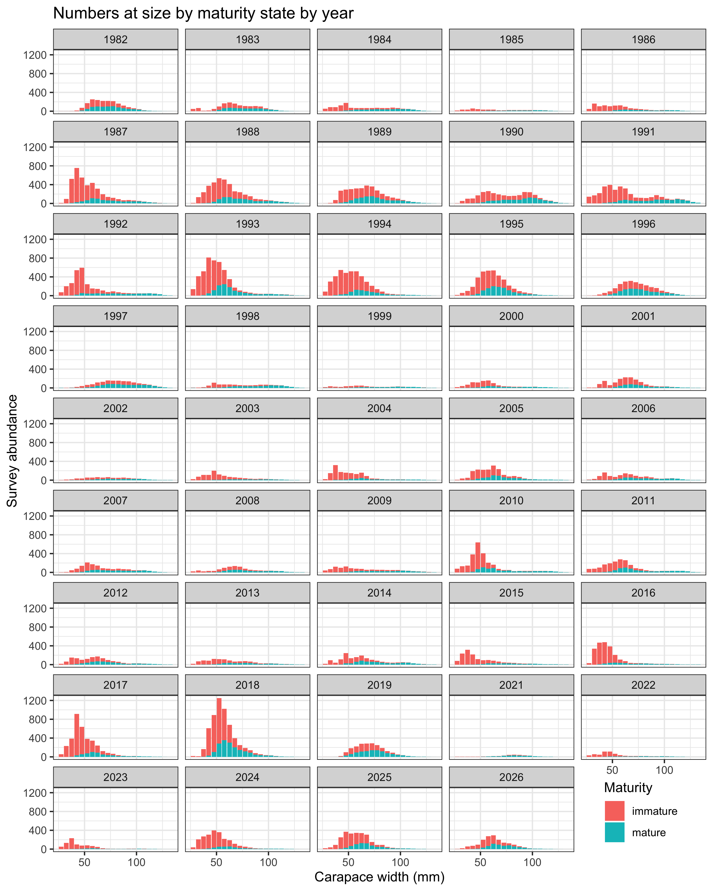{width=100%}

\newpage

***2025(9) CPT.** While the model the author presented produced Hessian matrices with small gradients, a concerning issue arose during the jittering analysis: jittering produced two clouds of model solutions at or near the MLE with OFLs that differed by 5,000 t. The author explained that the difference in OFLs resulted from differences in the terminal year estimates of MMB, driven by differences in recent recruitment estimates. In order to determine whether the absence of the 2020 survey data point is contributing to this issue, the CPT requested seeing the results of the jittering analysis from the accepted model but only including data through 2019.*

This analysis is presented as `Model 26.1c` (Section E), and the answer is that the absence of the 2020 survey point is not the source of the problem: truncating the data to 2019 leaves the model less stable, not more, with ten distinct optima against six and only 3.4 percent of runs reaching the best-fitting one. The multimodality itself persists in the 2026 model, with six optima and a directed OFL spanning 81.8 to 90.6 kt across the jitter runs of the author-recommended model. See also the response to the May 2026 CPT report above.


***2025(9) CPT.** For future work in which results are shown from the same model configuration using different size-at-maturity, the CPT recommended against running separate jittering analyses for each scenario. Instead, after jittering is complete for the first scenario and the putative MLE has been identified, the parameter estimates from that run should be used for all comparisons that differ only in the size-at-maturity scenario because the MLE would be the same for all such scenarios (i.e., the size-at-maturity scenario should not affect the parameter estimates).*

No model presented this cycle differs from another only in the size-at-maturity scenario, so the situation the recommendation addresses does not arise. The three maturity currencies are compared within the Tier 4 calculation (Table \@ref(tab:tier4-currencies)), which is applied to the smoothed survey series and involves no re-estimation.


***2025(9) CPT.** The CPT further requested that the author investigate whether it is necessary to use the same number of size bins for males and females, noting that the BBRKC model uses different numbers of bins for the sexes.*

Not undertaken for this cycle. [[author: give a date, or state that the male-only model supersedes the question.]]


***2025(9) CPT.** There is a strong consensus by the CPT that the best available scientific information supports the conclusion that the status quo definition is not appropriate in terms of conserving the reproductive potential for the stock, or in terms of supporting optimal yield of commercial-sized animals for harvest. The CPT therefore again recommended a change to the definition of maturity for this stock, from morphometric maturity to >= 95 mm CW.*

The two bodies have not converged on this question: the CPT recommended the >= 95 mm definition in 2024 and again in September 2025, and on both occasions the SSC concluded that the available region-specific information was not sufficient to support the change and directed that morphometrically mature male biomass be retained, including for the Tier 4 fallback. This document follows the SSC's direction and reports morphometrically mature male biomass as the currency, with the large-male (>= 95 mm) and preferred-male (> 101 mm) currencies computed alongside for comparison in Table \@ref(tab:tier4-currencies). The choice matters a great deal at Tier 4: it moves the OFL by a factor of `r .f(ofl_curr_ratio, 0)`. Under the sloped control rule adopted this cycle it matters more than it did under a flat rate, because both large-male currencies sit only just above the closure threshold, where the ramp reduces F~OFL~ to near zero. [[author: the CPT's concern — that reference points built on morphometric maturity permit the removal of essentially all large males while the trend in large males is firmly negative — is not answered by reporting the alternatives. State your position.]]


***2025(6) SSC.** The maximin analysis should be completed assuming a Ricker stock-recruitment relationship, but including the same compensation ratios as the original Clark (1991) analysis.* 

The Ricker curves used in Clark were implemented in the maximin analysis presented last cycle (and now published in Fisheries Research: Szuwalski and Punt (2025) “Spawning-biomass-per-recruit proxies for fisheries reference points under multiple axes of uncertainty”). Incorporating these into the analysis shifted the SPR% from ~36% to ~34%.


***2025(6) SSC.** As the figures presented on the updated 1991+ catch data appear to indicate substantial differences in male discards, the SSC requests that the September document more clearly describe changes in the discard estimation and accounting process.*

A presentation from January 2025 from ADF&G (available on the council website) noted that the largest changes occurred for total catch through implementing consistent data filtering, expansion using directed pot lifts, and adjustments to biological strata. This process now allows for the production of a data file with all years of available data for each assessment cycle, rather than single years at a time which were appended to an existing data file. An apparent shift upwards in discards of males from the directed fishery results primarily from a change in when discard mortality is applied (before input into the data file [before 2025] or within the assessment code itself [after 2025]).


***2025(6) SSC.** Given the findings described in Mullowney and Baker (2021) from Canadian research indicating that the molt to maturity may occur at smaller sizes when lower densities of large males are present, it would be useful to determine if there is evidence for the same process occurring in EBS snow crab, and whether fishing mortality on the large males is consistently high enough to result in a strong effect. Further, it would be useful to evaluate whether clutch fullness may be related to size at maturity or the abundance of large-sized crab.*

*Given that natural mortality events seem to switch among years and sexes depending on the model or input data, it would be prudent to investigate whether it is possible to estimate a direct link between natural mortality and a bottom temperature covariate of appropriate spatial and temporal scale.*

A manuscript describing both of these relationships for Bering Sea snow crab was presented in May/June 2024 (Figure 3; “Density dependence can modulate climate change impacts on populations”) and was published in 2026 (Szuwalski et al., 2026). In that manuscript, warmer temperatures were associated with elevated mortality and higher densities of large males were associated with lower probabilities of terminally molting at
size. 

The SSC responded to this presentation with the following text: “The SSC emphasizes that projections of climate change impacts, while useful, are highly uncertain and. . . caution should be used when presenting
these results.”

Clutch fullness does not appear to be related to the abundance of large-size crab based on analyses in “Spatial depletion rates in the eastern Bering Sea snow crab fishery” (also presented in May 2024 and now in review for external publication). It is unclear if there is any relationship between clutch fullness and recruitment, though preliminary analyses suggest clutch fullness is not an important covariate for predicting recruitment strength.

These analyses were carried out under the legacy maturity workflow. The Kodiak laboratory has since revised that workflow, and the revision is used in every model presented here, so the analyses would be worth revisiting on the new series.


***2025(6) SSC.** To explore development of an ABC control rule, the SSC requests that a yield per recruit analysis be developed for snow crab.*

Not completed. The SSC restated this request with a detailed specification in October 2025 and again in June 2026; see the response to the October 2025 comment above.


***2024(10) SSC.** SSC recommends standardizing the approach to the Tier 4 fallback across BBRKC, Tanner and snow crab assessments so that the same methods are used for each including all mature male biomass, a BMSY proxy based on the time-series of REMA-smoothed survey estimates and an FMSY proxy based on the best estimate of natural mortality (from the Tier 3 model). As the SSC intends the Tier 4 calculation only as a fallback if the Tier 3 analysis fails to converge, no other Tier 4 calculations need to be included in future assessments.*

In the 2025 document, Tier 4 harvest control rules were applied to REMA-smoothed survey biomass estimates of three different size ranges: morphometrically mature males, large males (>= 95 mm), and preferred males (> 101 mm). The target biomass was set as the average of the time series from 1982 to 2024 and the target fishing mortality was set as 0.27, the median of the prior on natural mortality used in the integrated assessment. No kink exists in this harvest control rule. The resulting OFLs were 28.41 kt, 8.64 kt, and 6.11 kt for morphometric, large, and preferred males, respectively.

The same three currencies are carried forward here, and the calculation is described in Section F. Following the October 2025 SSC recommendation, morphometrically mature male biomass is the currency of the recommended specification; the other two are reported for comparison only. The recommended basis departs from the standard this comment sets out in one respect --- it applies the Baranov catch equation rather than F times biomass --- and the standard linear result is reported alongside it in Table \@ref(tab:tier4-currencies) so the comparison across BSAI crab stocks is preserved. [[author: the SSC asked that no Tier 4 calculation other than the standard one be included. This document reports the ramped-rule and linear-equation alternatives as well, because the basis has changed and the alternatives are what make the change legible. Confirm that is acceptable.]]


***2024(10) SSC.** The SSC highlighted that more research is needed on the basic reproductive biology of snow crab, specifically addressing the question of whether small males can and do mate with large females and produce progeny that will be large males under the right environmental conditions. The SSC strongly supports the proposed collaborative research to explore in situ observations of mating crab using a camera sled.*

We agree. Camera-sled observations (Weems et al., in preparation) recorded small morphometrically mature males grasping mature females in the eastern Bering Sea (n = 21). Broader sampling coverage is needed before conclusions can be drawn.


***2024(10) SSC.** The highest priority would be to continue to refine the Maximin analysis as requested by the SSC in June 2024, specifically using values of steepness of 0.50, 0.67, and 0.80, and considering both the Beverton-Holt and Ricker stock recruitment relationships. The yield analysis also indicated that fishing mortality rates much lower than F35% achieved a high percentage of MSY, indicating potential flexibility in specifying reference points. The SSC suggested that some type of collaborative work during the spring, perhaps including SSC members and/or others might facilitate additional progress on this topic. The SSC is interested in developing a wider range of options for reference points for snow crab for consideration in the next assessment cycle.*

The analysis was not extended beyond what was presented in appendix A of the 2024 SAFE and would be of limited use until we know more about reproductive contribution of large male snow crab. The specific values for steepness recommended by the SSC do not match estimates or available data on the reproductive dynamics of snow crab. We suggest focusing efforts on understanding the dynamics of large males given the reliance of the fishery on large males that are at historical lows.


***2024(10) SSC.** The SSC again requests an analysis of the probability of maturing/terminal molt which addresses the observation error in these data and the lack of a monotonically increasing curve. A hierarchical analysis that treats years as random effects might be a starting point. The SSC would also like to better understand the sampling design for the molt data and is concerned about the weighting of the spatial samples in the analysis; weighting should be based on abundance if the sampling rate differs by area (which it would, unless abundance were uniform and/or the targets were in direct proportion to abundance).*

The Kodiak lab presented its workflow for analyzing these data to the CPT in January 2025, and a summary was given to the SSC. The revised workflow, which fits a spatiotemporal `sdmTMB` model to the chela-based maturity classifications and borrows information across years and locations for size bins with sparse chela data, was recommended for adoption by the CPT in May 2026 and is used in every model presented here other than the rolled-forward 2025 model, which retains the legacy series. The two can therefore be compared directly (Figure \@ref(fig:predmat)); the revised series shows a markedly weaker temporal trend in the probability of terminal molt at intermediate sizes. The observation error in the maturity data is still not propagated into the assessment: the ogive enters the model as a fixed input rather than as data with an associated likelihood, which remains an area for improvement. [[author: the SSC's specific concerns about the spatial weighting of the molt samples are for the Kodiak laboratory to answer; say whether that has been taken up.]]


***2024(10) SSC.** Investigate whether there is information outside the assessment model (e.g., larval or post-settlement data) or in the model, supporting estimated skewed sex-ratios at recruitment and the mismatch between recent large recruitments for males and females occurring in different years. Explore whether the estimated large differences in male and female recruitment years could be related to the lack of fit to molt-increment data.*

No new information has come to light on why this might be the case. Previous discussion centered around the possibility that different spatial distributions by sex of small crab could expose them to different environments, which could alter what we perceive as recruitment five years after settlement. While this difference is an interesting scientific question to pursue, solving it will not address the central problem in management: commercially preferred males are at historic lows over the last decade. Removing the females from the model entirely is a prudent step towards focusing on the most pressing management problem at hand, and that step is taken here: `Model 26.2` estimates male recruitment only and is presented as a sensitivity (Section E). The related request — to explore whether the divergence between male and female recruitment years is connected to the lack of fit to the molt-increment data — has not been taken up, and removing the females sets it aside rather than answering it.


***2024(10) SSC.** Geostatistical (e.g. VAST) modeling of trawl survey data including both the NBS and EBS should be prioritized. This could help understand some of the inconsistent recruitment/growth trends observed in recent years as well as prepare for potential changes in stock distribution or productivity under future warming of the Bering Sea. Geostatistical modeling should evaluate alternative error distributions and other model configurations as appropriate.*

The Kodiak lab presented indices for mature females and large males in the 2025 May CPT. The northern Bering Sea is not included in the geostatistical modelling, because estimates would have to be extrapolated in years when that area was not surveyed. [[author: the request was that geostatistical modelling be prioritised; say whether an EBS-only analysis is planned and when.]]


***2024(6) CPT.** Tier 4 fallback - CPT supports: The author suggested an alternative for snow crab to the basic Tier 4 calculation that is being brought forward for other stocks. Specifically, a fallback Tier 4 option would be calculated as the vulnerable biomass in this year’s survey (not smoothed, and vulnerable defined by a cutoff of 95 mm CW), decremented by the proportion of natural mortality that occurs between the time of the survey and the fishery, and M applied as the proxy for FMSY to calculate the Tier 4 OFL. The motivations identified for using the annual survey design-based estimate of vulnerable biomass rather than a REMA smooth through the survey time series were: 1) that the high number of positive stations for snow crab on survey (238 stations in 2023) make the design-based estimate a robust measure of annual biomass; and 2) that the large interannual fluctuations in biomass observed in some recent years would be poorly captured by a smooth. The motivation for decrementing the biomass estimate by the proportion of natural mortality occurring between the survey and the fishery is that failing to account for this mortality could lead to unintentionally high values of F if the Tier 4 fallback was used.*

The Tier 4 calculation is presented in Section F and is the basis of the recommended harvest specification for 2026/27. It follows the standardized approach the SSC set out in October 2024 rather than the decremented, unsmoothed variant described in this comment: it uses all morphometrically mature male biomass, a B~MSY~ proxy taken from the REMA-smoothed survey series, and the best estimate of natural mortality as the F~MSY~ proxy, and it is not decremented for the mortality occurring between the survey and the fishery.


***2024(6) SSC.** Concerning the GMACS assessment model, the SSC continues to recommend that the assessment author explore ways to incorporate the molt to maturity data in the model in a way that reflects the observation error associated with those estimates. An analysis in a GLMM modeling framework, which treats years as random effects, would provide smoother estimates, accommodate differing sample sizes by year and length, and deal appropriately with years in which data are missing. Another possibility that was suggested in the CPT report was to include the annual observed probabilities of terminal molt as data and then fit them, as in the Tanner crab assessment.*

Observation error is still not carried through into the assessment: the maturity ogive enters the model as a fixed input rather than as data with an associated likelihood. The Kodiak laboratory presented its workflow to the Plan Team in May 2026, and that workflow was recommended for adoption and is used in every model presented here (see the response to the October 2025 comment above). The Tanner crab assessment does fit to the maturity data with its observation error, and doing the same for snow crab remains an area for improvement.


***2024(6) SSC.** The SSC recommends that this model be brought forward in the fall but requests that an additional Tier 4 model be provided for comparison, as recommended in the Simpler Modeling Workshop report and requested in the SSC’s June 2023 and October 2023 Reports. This additional model would use the random effects model (REMA) to smooth survey estimates and would not decrement with natural mortality.*

A Tier 4 calculation using the random-effects model to smooth the survey estimates, without a decrement for natural mortality, has been included in each assessment since 2024 and is presented in Section F of this document, where it is the basis of the recommended specification rather than a comparison.

\newpage

# C. Introduction

Studies and data relevant to key population and fishery processes are discussed below to provide background for the modeling choices made in this assessment. A model description is available on the github repository for GMACS and the files needed to reproduce these assessments also have a github repo, both of which are linked at the end of this document.

## Distribution
Snow crab (*Chionoecetes opilio*) are distributed on the continental shelf of the Bering Sea, Chukchi Sea, and in the western Atlantic Ocean as far south as Maine.  In the Bering Sea, snow crab are distributed widely over the shelf and are common at depths less than ~200 meters (see tech memo; Zacher et al., 2025). Smaller crab tend to occupy more inshore northern regions and mature crab occupy deeper areas to the south of the juveniles (see Zacher et al., 2025; Zheng et al. 2001). The eastern Bering Sea population within U.S. waters is managed as a single stock; however, the distribution of the population may extend into Russian waters to an unknown degree.

## Natural Mortality

Relatively few targeted studies exist to determine natural mortality for snow crab in the Bering Sea.  Nevissi, et al. (1995) used radiometric techniques to estimate shell age from last molt (Figure \@ref(fig:nevissi)).  The total sample size was 21 male crab (a combination of Tanner and snow crab) from a collection of 105 male crab from various hauls in the 1992 National Marine Fisheries Service (NMFS) Bering Sea survey. Representative samples for the 5 shell condition categories were collected from the available crab.  Shell condition 5 crab (SC5 = very, very old shell) had a maximum age of 6.85 years (s.d. 0.58, 95% CI approximately 5.69 to 8.01 years; carapace width of 110 mm).  The average age of 6 crab with SC4 (very old shell) and SC5, was 4.95 years (range: 2.70 to 6.85 years).  Given the small sample size, this maximum age may not represent the 1.5th percentile of the population that is approximately equivalent to Hoenig's method (1983). Tag recovery evidence from eastern Canada revealed observed maximum ages in exploited populations of 17-19 years (Nevissi, et al. 1995, Sainte-Marie 2002).  A maximum time at large of 11 years for tag returns of terminally molted mature male snow crab in the North Atlantic has been recorded since tagging started about 1993 (Fonseca, et al. 2008).  Fonseca, et al. (2008) estimated a maximum age of 7.8 years post terminal molt using data on dactyl wear.

```{r nevissi, echo=FALSE, out.width="100%", fig.cap="Radiometric estimates of shell age in male snow and Tanner crab collected during the NMFS survey of 1992. Reproduced from Ernst et al. (2005)'s presentation of Nevissi et al. (1995)."}
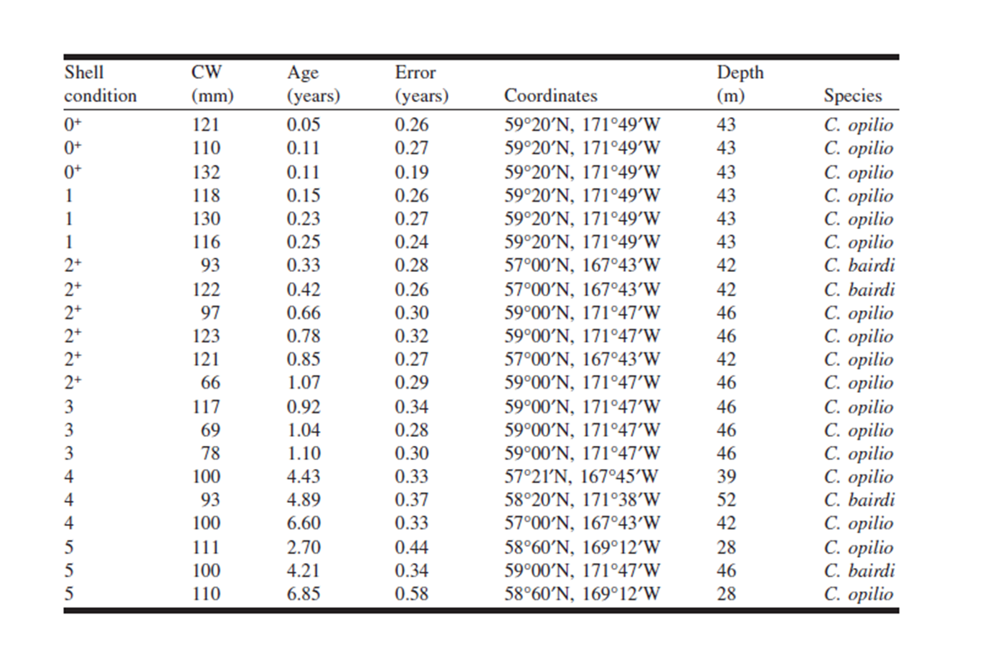
```

In recent years, the mean for the prior for natural mortality used in the eastern Bering Sea snow crab assessment was based on the assumption that longevity would be at least 20 years in an unfished population of snow crab, informed by the studies above.  Under negative exponential depletion, the 99th percentile corresponding to age 20 of an unexploited population corresponds to a natural mortality rate of 0.23.  Using Hoenig's (1983) method a natural mortality equal to 0.23 corresponds to a maximum age of 18 years.

In contrast to the implied natural mortalities from the methodology used above, Murphy et al. (2018) estimated time-varying natural mortality for eastern Bering Sea snow crab with a mean of 0.49 for females and 0.36 for males based on the output of state-space models fit to NMFS survey data. Further, natural mortality estimates produced from empirical analyses by Then et al. (2015) and Hamel (2015) using similar assumed maximum ages as the methodology above produced natural mortalities larger than 0.23 (\autoref{natM_empir}). Then et al. (2015) compared several major empirical estimation methods for M (including Hoenig's method) with an updated data set and found that maximum age was the best available predictor. A maximum age of 20 years corresponded to an M of ~0.315 in Then et al.'s analysis. Hamel (2015) developed priors in a similar manner to Then et al., but forced the regression of observed natural mortality onto maximum age through the intercept, which resulted in an M of ~0.27 for an assumed maximum age of 20 years.

```{r,echo=FALSE,warning=FALSE,message=F}

# format all the above into a tabular format

dat<-data.frame( c(0.277,0.315,0.365),
            c(0.19,0.212,0.257),
            c(0.194, 0.223, 0.261),
            c(0.235, 0.271, 0.318))

rownames(dat)<-c(23,20,17)
colnames(dat)<-c("Then","Hoenig (1983)","Hoenig (2013)","Hamel")

pander(t(dat),split.cells=20,caption="\\label{natM_empir} Empirical estimates of natural mortality (per year) for a range of methods over a range of assumed maximum ages (column header). These are empirical estimators, not output of any assessment model.")

```

In addition to the results of empirical estimates of M from updated methodologies and state-space modeling by Murphy et al. (2018), inspection of the survey data suggests that natural mortality for mature individuals is higher than assumed. A fraction of the mature population (which are assumed not to grow, given evidence for a terminal molt) are not selected in the fishery (e.g. sizes 50-80 mm; Figure \@ref(fig:natm-mature)). Consequently, all mortality observed is 'natural'. The collapse in recruitment in the 1990s can be used as an instrument to understand natural mortality for mature individuals. The last large recruitment enters these size classes in the mid- to late-1990s and numbers of crab in these size classes return to low levels in less than 5 years.

```{r natm-mature, echo=FALSE, out.width="90%", fig.cap="Observed numbers at length of old-shell mature males by size class. The size bins presented are not vulnerable to the fishery, so all mortality observed in them is natural."}
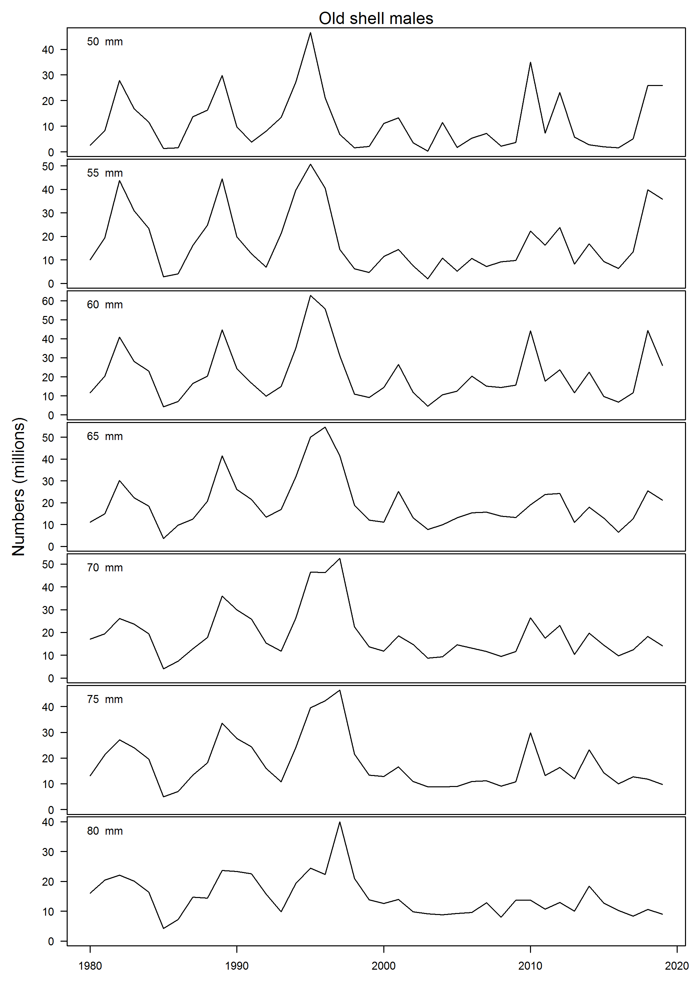
```

The median value of the priors used in this assessment is set equal to values resulting from assuming a maximum age of 20 years and applying Hamel's methodology (0.271). A standard error of 0.0054 was used for initial priors and was estimated using the 95% CI of +-1.7 years on maximum age estimates from dactyl wear and tag return analysis in Fonseca, et al. (2008). Mortality events in 2018 and 2019 are estimated as additional mortality parameters applied by sex and maturity state to allow the model to fit recent population trends.

## Maturity

Maturity of females collected during the NMFS summer survey was determined by the shape of the abdomen, by the presence of brooded eggs, or egg remnants. Maturity for males was determined by chela height measurements, which were available most years starting from the 1989 survey (Otto 1998; Figure \@ref(fig:maturity-facet) & Figure \@ref(fig:maturity-facet-all)). Unless stated otherwise, mature male biomass means the biomass of morphometrically mature (large-clawed) males; the >= 95 mm and > 101 mm currencies are reported alongside it in Section F. A maturity curve for males was estimated using the average fraction mature based on chela height data and applied to years of survey data to estimate mature survey numbers that do not have chela height data available (see Richar and Foy, 2022 for details).

```{r maturity-facet, echo=FALSE, out.width="100%", fig.cap="Observed probability of having undergone terminal molt at size for new-shell male crab, based on chela height. Blue lines are earlier in the time series; red lines are the most recent."}
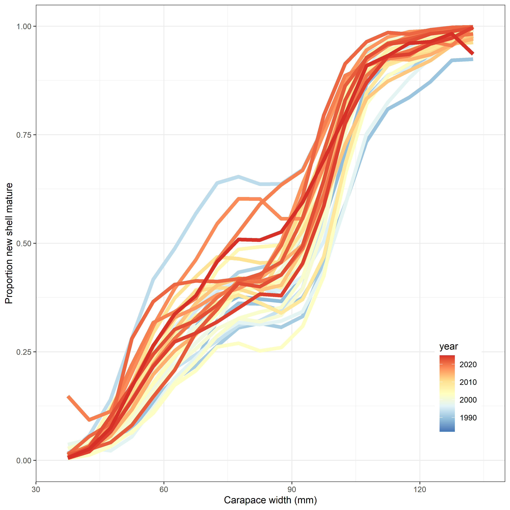
```

```{r maturity-facet-all, echo=FALSE, out.width="100%", fig.cap="Observed probability of having undergone terminal molt at size for new-shell male crab, based on chela height. The red line is the median over all years; blue lines are individual years."}
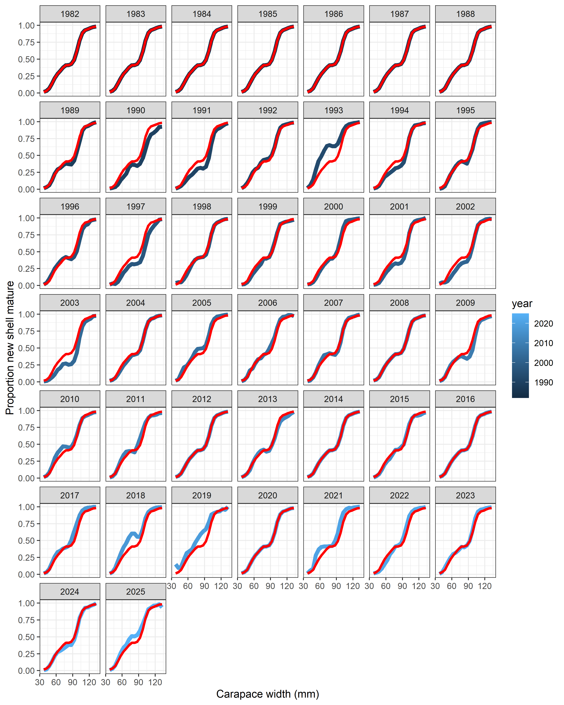
```

Bering Sea male snow crab appear to have a terminal molt to maturity based on hormone level data and findings from molt stage analysis via setagenesis (Tamone et al. 2005).  The models presented here assume a terminal molt for both males and females, which is supported by research on populations in the Bering Sea and the Atlantic Ocean (e.g. Dawe et al. 1991).

Mature male snow crab that do not molt may be important in reproduction.  Paul et al. (1995) found that old shell mature male Tanner crab out-competed new shell crab of the same size in breeding in a laboratory study.  Recently molted males did not breed even with no competition and may not breed until after ~100 days from molting (Paul et al. 1995).  Sainte-Marie et al. (2002) stated that only old shell males take part in mating for North Atlantic snow crab.

## Mating ratio and reproductive success

Bering Sea snow crab have historically been managed using morphometrically mature male biomass (MMB) as a proxy for reproductive potential. MMB is used as the currency for management because the fishery only retains large male crab, which are nearly 100% mature. Male snow crab are sperm conservers, using less than 4% of their sperm at each mating and females also can mate with more than one male. The amount of stored sperm and clutch fullness varies with sex ratio (Sainte-Marie 2002).  If mating with only one male is inadequate to fertilize a full clutch, then females would need to mate with more than one male, necessitating a sex ratio closer to 1:1 in the mature population, than if one male is assumed to be able to adequately fertilize multiple females. Although mature male biomass is currently the currency of management, some aspect of female reproduction is likely also an important indicator of reproductive potential of the stock.

 Clutch fullness is recorded for the females measured in the survey (see ESP; Fedewa et al., 2025). However, quantifying the reproductive potential of the female population from survey data can be difficult. For example, full clutches of unfertilized eggs may be extruded and appear normal to visual examination, and may be retained for several weeks or months by snow crab. Resorption of eggs may occur if not all eggs are extruded resulting in less than a full clutch.  Female snow crab at the time of the survey may have a full clutch of eggs that are unfertilized, resulting in overestimation of reproductive potential. Barren females may be a more obvious indication of low reproductive potential and increased in the early 1990s, decreased in the mid-1990s, then increased again in the late 1990s. The highest levels of barren females coincided with periods of high fishing mortality, but even then the proportion of barren females was low (see ESP; Fedewa et al., 2025). Biennial spawning is another confounding factor in determining the reproductive potential of snow crab. Laboratory analyses showed that female snow crab collected in waters colder than 1.5 degrees C from the Bering Sea spawn only every two years.

Further complicating the process of quantifying reproductive capacity, clutch fullness and fraction of unmated females may not account for the fraction of females that may have unfertilized eggs, since these cannot be detected by eye at the time of the survey.  The fraction of barren females observed in the survey may not be an accurate measure of fertilization success because females may retain unfertilized eggs for months after extrusion.  To examine this hypothesis, NMFS personnel sampled mature females from the Bering Sea in winter and held them in tanks until their eggs hatched in March of the same year (Rugolo et al. 2005).  All females then extruded a new clutch of eggs in the absence of males.  All eggs were retained until the crab were euthanized near the end of August.  Approximately 20% of the females had full clutches of unfertilized eggs.  The unfertilized eggs could not be distinguished from fertilized eggs by visual inspection at the time they were euthanized.  Indices of fertilized females based on the visual inspection method of assessing clutch fullness and percent unmated females may overestimate fertilized females.

## Growth

Several studies are available to estimate the growth per molt of male and female snow crab in the Bering Sea. These studies include:

1.  Transit study (2003); 14 crab
2.	Cooperative seasonality study; 6 crab
3.	Dutch Harbor holding study; 9 crab
4.	NMFS Kodiak holding study held less than 30 days;  6 crab
5.  NMFS Kodiak holding study 2016; 5 crab
6.  NMFS Kodiak holding study 2017; 70 crab.
7.  BSFRF/NMFS holding study 2018; 4 crab.
8.  BSFRF/NMFS holding study 2021; 177 crab.

In the "Transit study", pre- and post-molt measurements of 14 male crab that molted soon after being captured were collected.  The crab were measured when shells were still soft because all died after molting, so measurements may be underestimates of post-molt width (L. Rugolo, pers. com.). The holding studies include only data for crab held less than 30 days because growth of crab held until the next spring's molting was much lower. Crab missing more than two limbs were excluded due to other studies showing lower growth. Crab from the seasonal study were excluded that were measured less than 3 days after molting due to difficulty in measuring soft crab accurately (L. Rugolo, pers. comm.). In general, growth of snow crab in the Bering Sea appears to be greater than growth of some North Atlantic snow crab stocks (Sainte-Marie 1995).  Crab in their first few years of life may molt more than once per year, however, the smallest crab included in the model are approximately 4 years old and would be expected to molt annually.

## Management history

<!-- TODO 2026: this section was a header-only stub in the 2025 reference Rmd; fill with the management-history narrative or fold into ADF&G harvest strategy. -->

## ADF&G harvest strategy

Before the year 2000, the Guideline Harvest Level (GHL) for retained crab only was a 58% harvest rate of the number of male crab over 101 mm CW estimated from the survey.  The minimum legal size limit for snow crab is 78 mm, however, the snow crab market generally only accepts crab greater than 101 mm.  In 2000, due to the decline in abundance and the declaration of the stock as overfished, the harvest rate for calculation of the GHL was reduced to 20% of male crab over 101 mm.  After 2000, a rebuilding strategy was developed based on simulations by Zheng et al. (2002) using survey biomass estimates. The realized retained catch often exceeded the GHL historically.

The Alaska Department of Fish and Game (ADF&G) harvest strategy since 2000 sets harvest rate based on estimated mature biomass. The harvest rate scales with the status of the population relative to a proxy for B~*MSY*~, which is calculated as the average total mature biomass at the time of the survey from 1983 to present and MSST is one half the B~*MSY*~ proxy.  The harvest rate begins at 0.10 when total mature biomass exceeds 50% MSST (230 million lbs) and increases linearly to 0.225 when biomass is equal to or greater than the B~*MSY*~ proxy (Zheng et al. 2002).

\begin{equation}
 u =
 \begin{cases}
 Bycatch  & if \frac{TMB}{TMB_{MSY}} \leq 0.25 \\[3ex]
 \frac {0.225 ( \frac {TMB}{TMB_{MSY}} - \alpha)}{1-\alpha}  & if 0.25 < \frac {TMB}{TMB_{MSY}} < 1 \\[3ex]
 0.225 & if TMB >TMB_{MSY}
\end{cases}
\end{equation}

Where *TMB* is the total mature biomass and TMB~*BMSY*~ is the *TMB* associated with maximum sustainable yield. The maximum retained catch is set as the product of the exploitation rate, *u*, calculated from the above control rule and survey mature male biomass.  If the retained catch in numbers is greater than 58% of the estimated number of new shell crab greater than 101 mm plus 25% of the old shell crab greater than 101 mm, the catch is capped at 58%.

## History of BMSY

Prior to adoption of Amendment 24, B~*MSY*~ was defined as the average total mature biomass (males and females) estimated from the survey for the years 1983 to 1997 (921.6 million lbs; NPFMC 1998) and MSST was defined as 50% of B~*MSY*~. Currently, the biological reference point for biomass is calculated using a spawning biomass per recruit proxy, B~*35%*~ (Clark, 1993). B~*35%*~ is the biomass at which spawning biomass per recruit is 35% of unfished levels and has been shown to provide close to maximum sustainable yield for a range of stock productivities (Clark, 1993). [[author: Clark (1993) is cited here but has no entry in Section K; the September 2025 assessment has the same gap. Supply the reference.]] Consequently, it is an often used target when a stock recruit relationship is unknown or unreliable.  The range of years of recruitment used to calculate biomass reference points is from 1982 to the present assessment year, minus 1. However, recent analyses suggest SPR-based reference points do not provide a meaningful constraint on the snow crab fishery when the probability of having undergone terminal molt is specified to reflect observations in the survey. This is because a large fraction of the population matures (and ceases growing) at a size smaller than is harvested by the fishery.

## Fishery history

Snow crab were harvested in the Bering Sea by the Japanese from the 1960s until 1980 when the Magnuson Act prohibited foreign fishing. After the closure to foreign fleets, retained catches increased from relatively low levels in the early 1980s (e.g.  `r round(as.numeric(filter(reslst$repsLst[[accepted_model]]$Catch_fit_summary,year==1982)$obs[1]),2)` kt during 1982) to historical highs in the 1990s (retained catches during 1991, 1992, and 1998 were `r round(as.numeric(filter(reslst$repsLst[[accepted_model]]$Catch_fit_summary,year==1991)$obs[1]),2)`, `r round(as.numeric(filter(reslst$repsLst[[accepted_model]]$Catch_fit_summary,year==1992)$obs[1]),2)`, and `r round(as.numeric(filter(reslst$repsLst[[accepted_model]]$Catch_fit_summary,year==1998)$obs[1]),2)` kt, respectively).  The stock was declared overfished in 1999 at which time retained catches dropped to levels similar to the early 1980s (e.g. `r round(as.numeric(filter(reslst$repsLst[[accepted_model]]$Catch_fit_summary,year==2000)$obs[1]),2)` kt). Retained catches slowly increased after 1999 before dropping again in 2016. Total allowable catches were reduced with the collapse of the population in 2021, the fishery was closed for the first time in 2022, and the closure continued through 2023. A small fishery occurred in 2024, with 2.15 kt retained, and a larger one in 2025, when the State set a total allowable catch of 4.22 kt and 4.13 kt was retained. <!-- TODO 2026: extend to the 2025/26 fishery once characterized (ADF&G retained ~4.1 kt in crab_year 2025). -->

Discard mortality from the directed fishery is the next largest source of mortality after retained catch and approximately tracks the retained catch. The highest estimated discard mortality occurred during 1990 at `r round(as.numeric(filter(reslst$repsLst[[accepted_model]]$Catch_fit_summary,year==1990)$obs[2]),2)` kt which was `r round(100*as.numeric(filter(reslst$repsLst[[accepted_model]]$Catch_fit_summary,year==1990)$obs[2])/ as.numeric(filter(reslst$repsLst[[accepted_model]]$Catch_fit_summary,year==1990)$obs[1]),2)`% of the retained catch during that year. Discard mortality in 2024 was `r round(as.numeric(filter(reslst$repsLst[[accepted_model]]$Catch_fit_summary,year==2024)$obs[2]),2)` kt; the directed fishery was closed in 2022 and 2023, so no directed discards were recorded in those years. Non-directed mortality continues to be very small at `r round(as.numeric(filter(reslst$repsLst[[accepted_model]]$Catch_fit_summary,year==2024)$obs[4]),2)` kt in 2024.

Discards from the directed pot fishery have been estimated from observer data since 1992 and has ranged from 11-100% of the magnitude of retained catch by numbers. Discards reached 50-100% of the magnitude of retained catch in the lead up to the collapse after the 2018-2019 heatwave because of the large year class entering the population. Female discard catch has been very low compared to male discard catch and has not been a significant source of mortality. Discard mortality rates for the directed fishery are assumed to be 30%. Discard of snow crab in groundfish fisheries has been highest in the yellowfin sole trawl fishery, and decreases down through the flathead sole trawl fishery, Pacific cod bottom trawl fishery, rock sole trawl fishery, and the Pacific cod hook-and-line and pot fisheries, respectively (Figure \@ref(fig:bycatch)).  Bycatch in fisheries other than the groundfish trawl fishery has historically been relatively low. Discard mortality in the non-directed fisheries is taken as total in the models presented here: the trawl bycatch series enters the assessment with a discard mortality of 1, not the 0.8 applied when those removals are prepared. [[author: 01_prep_fishery_data.R applies 0.8 to trawl and 0.3 to other-crab bycatch before writing the series, and the model then applies 1 to it. Confirm that is intended and not a double or missing application.]] Size frequency data and catch per pot have been collected by observers on snow crab fishery vessels since 1992.  Observer coverage has been 10% on catcher vessels larger than 125 ft (since 2001), and 100% coverage on catcher processors (since 1992).

```{r bycatch, echo=FALSE, out.width="100%", fig.cap="Time series of non-directed bycatch from the groundfish fisheries by gear, in numbers of crab."}
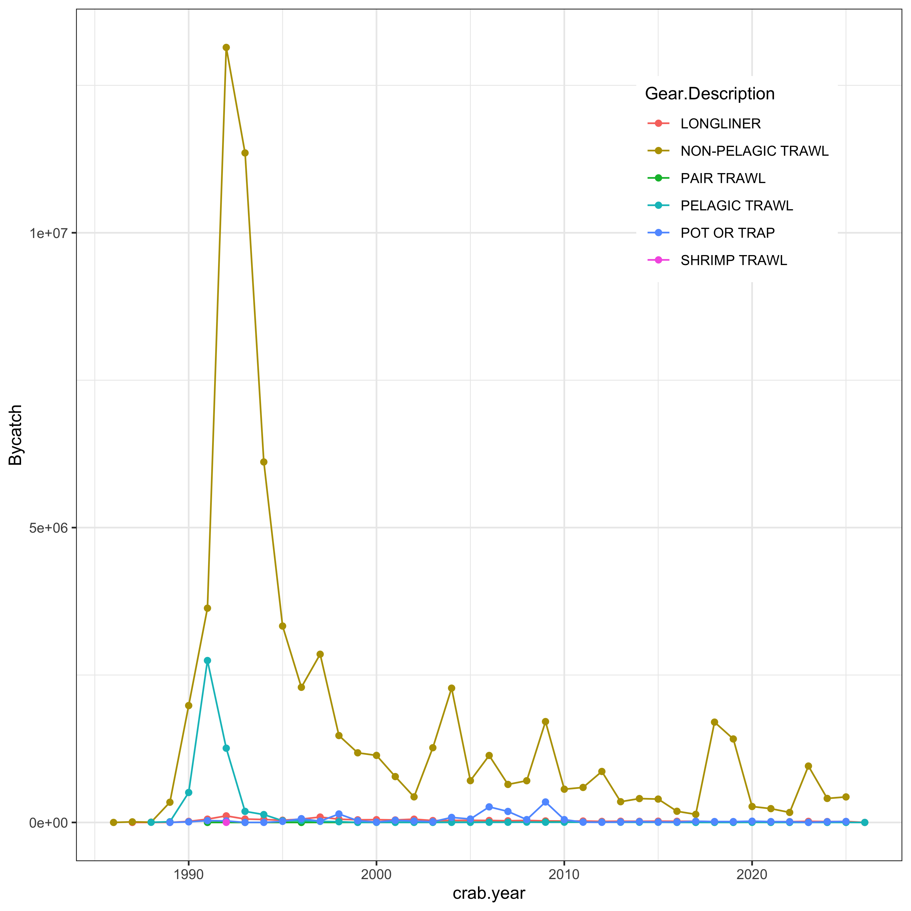
```

Several modifications to pot gear have been introduced to reduce bycatch mortality.  In the 1978/79 season, escape panels were required on pots used in the snow crab fishery to prevent ghost fishing.  Escape panels consist of an opening with one-half the perimeter of the tunnel eye laced with untreated cotton twine.  The size of the cotton laced panel was increased in 1991 to at least 18 inches in length.  No escape mechanisms for undersized crab were required until the 1997 season when at least one-third of one vertical surface of pots had to contain not less than 5 inches stretched mesh webbing or have no less than four circular rings of no less than 3 3/4 inches inside diameter.  In the 2001 season the escapement provisions for undersized crab were increased to at least eight escape rings of no less than 4 inches placed within one mesh measurement from the bottom of the pot, with four escape rings on each side of the two sides of a four-sided pot, or one-half of one side of the pot must have a side panel composed of not less than 5 1/4 inch stretched mesh webbing.

# D. Data

Updated time series of survey indices and size compositions were calculated from data downloaded from the AKFIN database. Bycatch data (biomass and size composition) were updated for the most recent year from the AKFIN database. Retained, total, and discarded catch (in numbers and biomass) and size composition data for each of these data sources were updated for the most recent year based on files provided by the State of Alaska.

## Catch data

Catch data and size composition of retained crab from the directed snow crab pot fishery for crab years 1982 to 2025 were used in this analysis (Table \@ref(tab:obscatch)). Time series of discarded catch from the directed fishery are fit, but size composition data are for total catch. The discard male catch was estimated for crab years 1982 to 1991 in the model using the estimated fishery selectivities based on the observer data for crab years 1992 to 2025. The discards prior to 1992 may be underestimated due to the lack of escape mechanisms for undersized crab in the pots before 1997. See \autoref{datayears} for a summary of catch data range.

```{r,echo=FALSE,warning=FALSE,message=F}
Data<-c("Retained male crab pot fishery size frequency by shell condition",
         "Discarded male and female crab pot fishery size frequency",
         "Trawl fishery bycatch size frequencies by sex",
         "Survey size frequencies by, maturity, sex and shell condition",
        "Retained catch estimates",
        "Discard catch estimates from crab pot fishery",
        "Trawl bycatch estimates",
        "Total survey abundance estimates and coefficients of variation",
        "Survey selectivity priors (BSFRF)")

DataYears<-c(paste("1982 -  ",last(as.numeric(filter(reslst$repsLst[[accepted_model]]$Catch_fit_summary)$year)),sep=""),
             paste("1992 - ",last(as.numeric(filter(reslst$repsLst[[accepted_model]]$Catch_fit_summary)$year)),sep=""),
             paste("1991 - ",last(as.numeric(filter(reslst$repsLst[[accepted_model]]$Catch_fit_summary)$year)),sep=""),
             paste("1982 - 2019, 2021 - ",last(as.numeric(filter(reslst$repsLst[[accepted_model]]$Catch_fit_summary)$year))+1,sep=""),
             paste("1982 - ",last(as.numeric(filter(reslst$repsLst[[accepted_model]]$Catch_fit_summary)$year)),sep=""),
             paste("1992 - ",last(as.numeric(filter(reslst$repsLst[[accepted_model]]$Catch_fit_summary)$year)),sep=""),
             paste("1993 - ",last(as.numeric(filter(reslst$repsLst[[accepted_model]]$Catch_fit_summary)$year)),sep=""),
             paste("1982 - 2019, 2021 - ",last(as.numeric(filter(reslst$repsLst[[accepted_model]]$Catch_fit_summary)$year))+1,sep=""),
             c("2009, 2010, 2016-2018"))

PlotTab<- data.frame(Data,DataYears)
colnames(PlotTab)<- c("Data component","Years")
rownames(PlotTab)<- NULL
pander(PlotTab,split.cells=c(50,30),justify=c("left","center"),caption="\\label{datayears}Data included in the assessment, and the years each series spans, for all models presented. Dates indicate survey year under the crab-year convention, in which end year N carries the fishery through N and the summer survey through N+1. The 2020 survey was cancelled due to the pandemic.")

```

## Survey biomass and size composition data
Estimates of the numbers of crab by sex and size from the annual eastern Bering Sea (EBS) bottom trawl survey conducted by NMFS (e.g. Figure \@ref(fig:n-at-len) & Figure \@ref(fig:n-at-len-f); see Lang et al., 2018 for materials and methods; see the most recent tech memo for detailed description) are used to calculate the primary indices of abundance used in this assessment. Additional survey stations were added in 1989, which could alter the interpretation of the catchability coefficient for the survey. Consequently, survey selectivity has been historically modeled in two 'eras' in the assessment (1982-1988, 1989-present). All survey data in this assessment used measured net widths instead of the fixed 50 ft net width based on Chilton et al.'s (2009) survey estimates. Carapace width and shell conditions were measured and reported for snow crab caught in the survey.

```{r n-at-len, echo=FALSE, out.width="86%", fig.cap="Raw total numbers at size of male crab observed in the survey. Blue are all numbers at size; green are males > 101 mm carapace width, the industry-preferred size."}
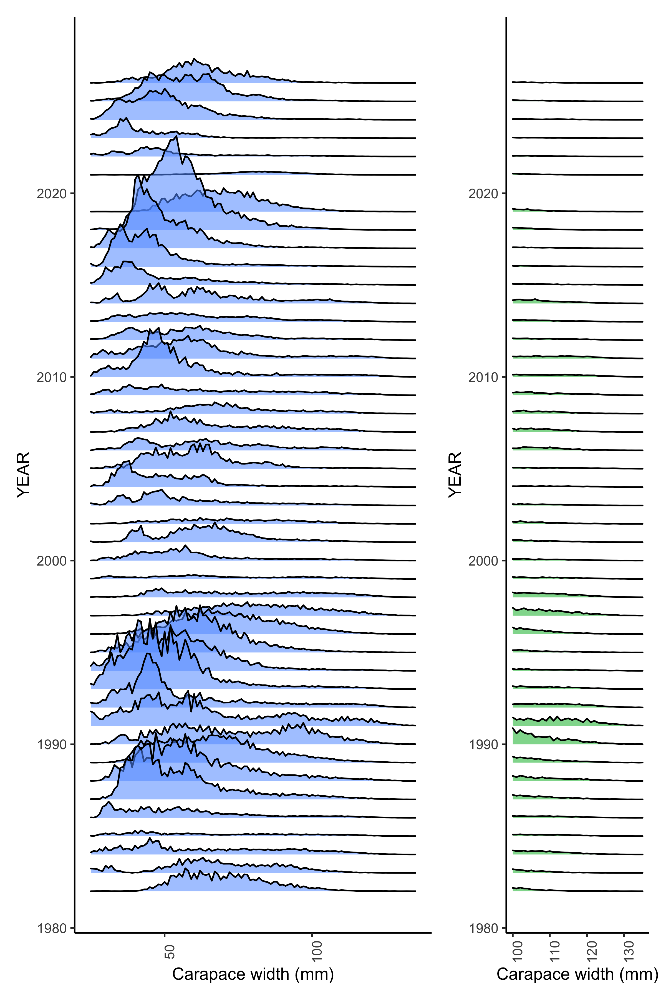
```

```{r n-at-len-f, echo=FALSE, out.width="100%", fig.cap="Raw total numbers at size of immature and mature female crab observed in the survey, binned at 5 mm intervals."}
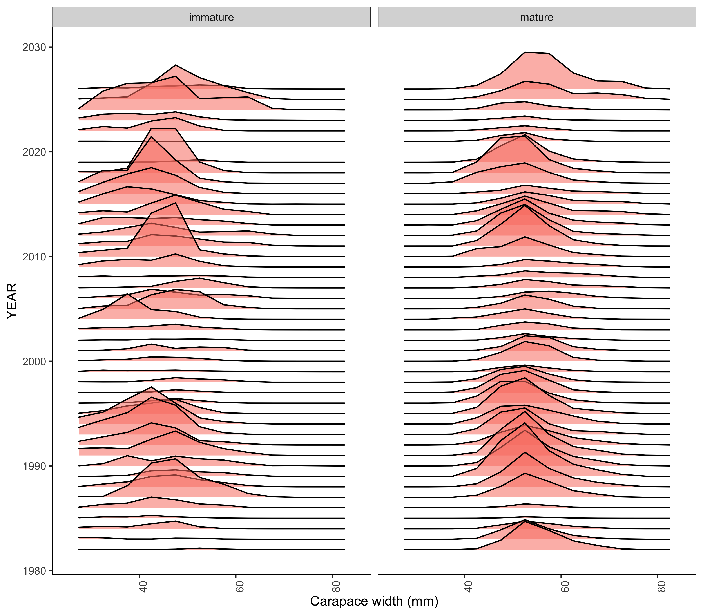
```

Mature male size composition data were calculated by multiplying the total numbers at length for new shell male crab by a vector of observed proportion of mature males at length. All old shell crab of both sexes were assumed to be mature.  New shell crab were demarcated as any crab with shell condition index <= 2. The biomass of new and old shell mature individuals was calculated by multiplying the vector of numbers at length by weight at length. These vectors were then summed by sex to provide the input for assessment (Table \@ref(tab:obsbio)).  Input sample sizes are specified as 100 for both sexes and maturity states for all years of survey size composition data.

```{r obsbio, echo=FALSE, warning=FALSE, message=FALSE}
## Observed survey biomass with its sampling CV -- a checklist requirement
## ("survey biomass estimates with measures of uncertainty") and the target of
## the obsbio reference, which pointed at a table in an eval = FALSE chunk until
## 2026-08-29. Read from the model's own input file, so the table cannot drift
## from what was fitted. 2020 is absent because the survey was cancelled.
##
## Each biomass carries its CV in the same cell, and the 44 survey years run in
## two blocks side by side. Kept apart and stacked, the table was ten columns
## and three pages, which both overflowed the line and made flextable repeat its
## caption and label on every continuation page (backlog 9b).
.si_path <- "data/derived/survey_indices.csv"
if (file.exists(.si_path)) {
  .si <- read.csv(.si_path, stringsAsFactors = FALSE)
  .cell <- function(b, cv) ifelse(is.na(b), "",
                                  sprintf("%.1f (%.2f)", b, cv))
  .mm <- .si[.si$sex == "male"   & .si$maturity == "mature", c("year","biomass","cv")]
  .mf <- .si[.si$sex == "female" & .si$maturity == "mature", c("year","biomass","cv")]
  .d  <- merge(.mm, .mf, by = "year", all = TRUE, suffixes = c(".m", ".f"))
  .d  <- .d[order(.d$year), ]
  stopifnot("survey_indices.csv should have no 2020 row (survey cancelled)" =
              !(2020 %in% .d$year))
  obsbio_df <- data.frame(
    Year   = as.character(.d$year),
    Male   = .cell(.d$biomass.m, .d$cv.m),
    Female = .cell(.d$biomass.f, .d$cv.f),
    stringsAsFactors = FALSE, check.names = FALSE)

  .n <- nrow(obsbio_df); .half <- ceiling(.n / 2)
  .a <- obsbio_df[seq_len(.half), ]
  .b <- obsbio_df[seq.int(.half + 1L, .n), ]
  if (nrow(.b) < nrow(.a)) .b[seq.int(nrow(.b) + 1L, nrow(.a)), ] <- ""
  names(.b) <- paste0(names(.b), " ")
  obsbio_df <- cbind(.a, .b); rownames(obsbio_df) <- NULL

  flextable::flextable(obsbio_df) |>
    flextable::fontsize(size = 8, part = "all") |>
    flextable::align(j = 2:6, align = "right", part = "all") |>
    flextable::autofit() |>
    flextable::set_caption(
      caption = paste("Observed mature male and mature female biomass at the time of the",
                      "NMFS summer survey (1,000 t), each followed by the coefficient of",
                      "variation of that estimate in parentheses. These are the survey",
                      "observations fitted by every model presented. Years run down the",
                      "left block and continue in the right. There is no 2020 row: the",
                      "survey was cancelled that year."),
      autonum = officer::run_autonum(seq_id = "tab", pre_label = "Table ", bkm = "obsbio")
    )
}
```


## Spatial distribution of survey abundance and catch
Snow crab are distributed widely over the eastern Bering Sea shelf, but their density and the extent of their distribution have changed over time (see tech memo). Spatial gradients exist in the survey data by maturity and size for both sexes.  For example, larger males have been more prevalent on the southwest portion of the shelf while smaller males have been more prevalent on the northern portion of the shelf. Centroids of mature female abundance early in the history of the survey were farther south, but moved north during the 1990s. Since the late 1990s and early 2000s, the centroids moved south again, but not to the extent seen in the early 1980s. This phenomenon was mirrored in centroids of abundance for large males.

Fishing effort has generally been south of 58.5 N, even when ice cover did not restrict the fishery from moving farther north (Figure \@ref(fig:effort-sp) & Figure \@ref(fig:recent-eff)).  This is possibly due to the proximity to port and practical constraints of meeting delivery schedules. Unstandardized CPUE (hereafter just 'CPUE') in the fishery has varied over time and an increase in average CPUE occurred after rationalization (Figure \@ref(fig:year-cpue)).  The change in CPUE in a given spatial area within a season can reflect the impact of the fishery on the population in that area. Declines in CPUE can be seen by spatial area over time within a season (Figure \@ref(fig:cpue-trend)).

```{r effort-sp, echo=FALSE, out.width="100%", fig.cap="Distribution of effort, in pot lifts, in the directed fishery on the Bering Sea shelf, summed from 1990 to present. Squares are statistical areas defined by the State."}
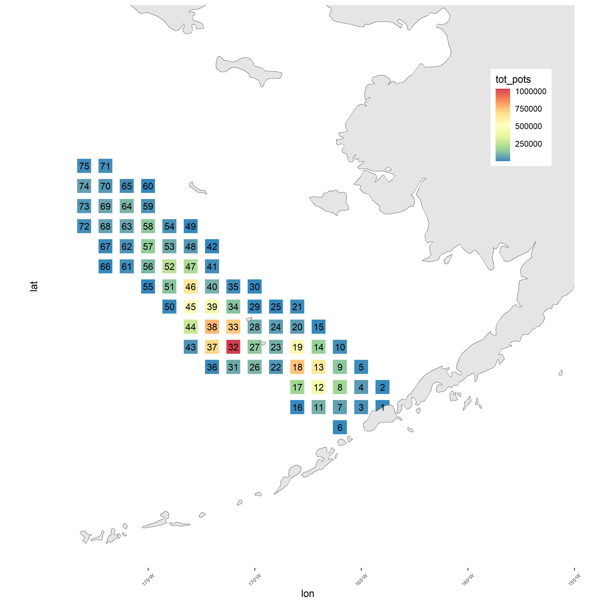
```

```{r recent-eff, echo=FALSE, out.width="100%", fig.cap="Yearly distribution of effort, in pot lifts, in the directed fishery on the Bering Sea shelf from 1990 to present. Only areas represented by three or more fishers and processors are shown."}
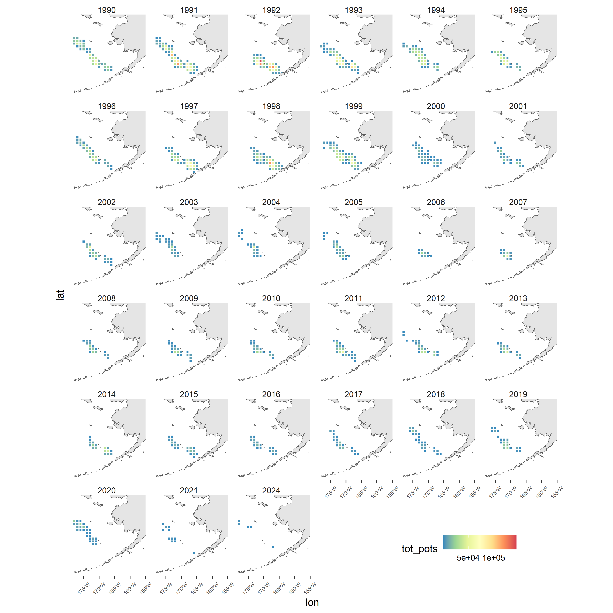
```

```{r year-cpue, echo=FALSE, out.width="100%", fig.cap="Yearly unstandardized catch per unit effort from 1990 to present, with the total number of crab captured (bottom)."}
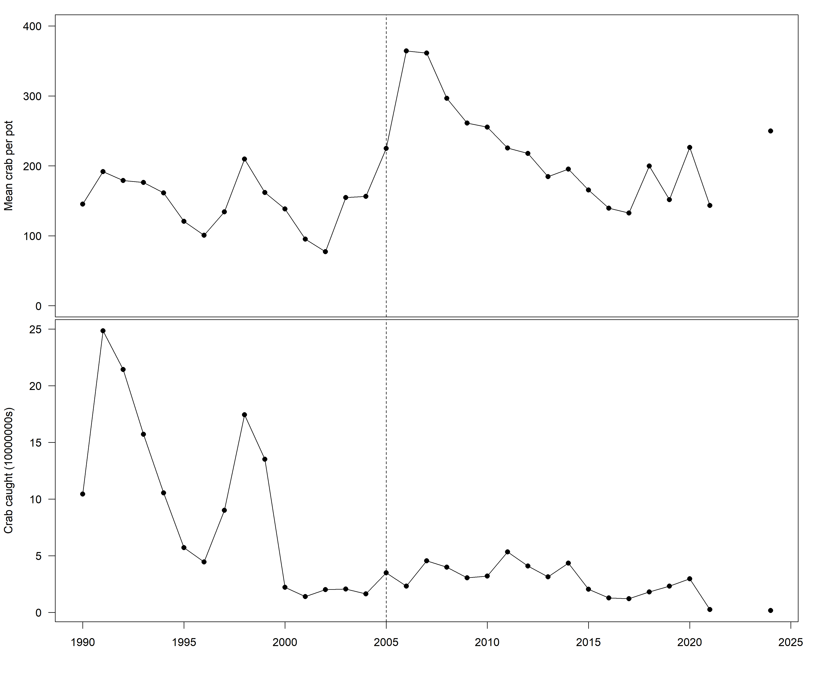
```

```{r cpue-trend, echo=FALSE, out.width="100%", fig.cap="Trends in unstandardized CPUE by statistical area. Each line is a linear model fit through observed CPUE in a given area in a given year; trends were fit only where an area was represented by three or more fishers and processors."}
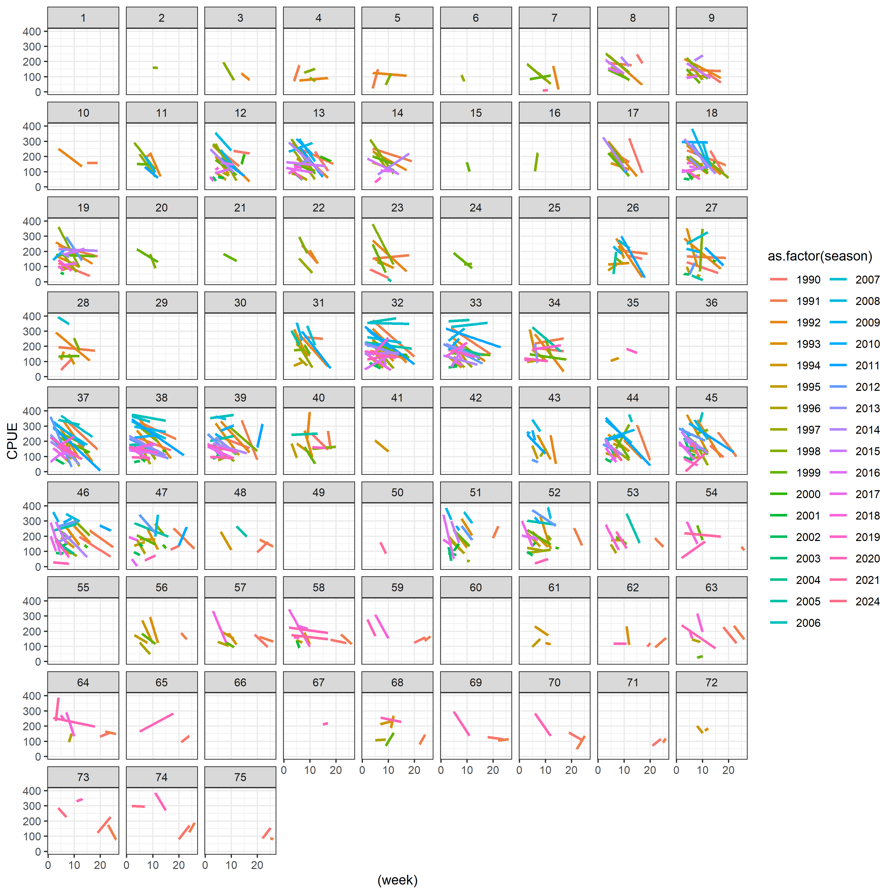
```

The observed distribution of large males during the summer survey and the fishery catch have historically differed, and the origin of this difference is unknown. It is possible that crab move between the fishery and the survey, but it is also possible that fishers do not target all portions of the distribution of large male crab equally. The underlying explanation of this phenomenon could hold implications for relative exploitation rates spatially and it has been suggested that high exploitation rates in the southern portion of the snow crab range may have resulted in a northward shift in snow crab distribution (Orensanz, 2004). Snow crab larvae likely drift north and east after hatching in spring. Snow crab appear to move south and west as they grow (Parada et al., 2010); however, little tagging data exists to fully characterize the ontogenetic or annual migration patterns of this stock (Murphy et al. 2010).

## Experimental study of survey selectivity

The Bering Sea Fisheries Research Foundation (BSFRF) has conducted supplementary surveys in the Bering Sea in which snow crab were caught during 2009, 2010, 2016, 2017, and 2018.  The location and extent of these surveys varied over the years as the survey goals changed. In 2009, the survey consisted of 108 tows around 27 survey stations and the goal was to improve understanding of snow crab densities and the selectivity of NMFS survey gear (Figure \@ref(fig:bsfrfmap)). Abundances estimated by the industry surveys were generally higher than the NMFS estimates, which suggests that the catchability of the NMFS survey gear is less than 1.

```{r bsfrfmap, echo=FALSE, out.width="100%", fig.cap="Location of the BSFRF survey selectivity experiments that provided data used in this assessment, over time."}
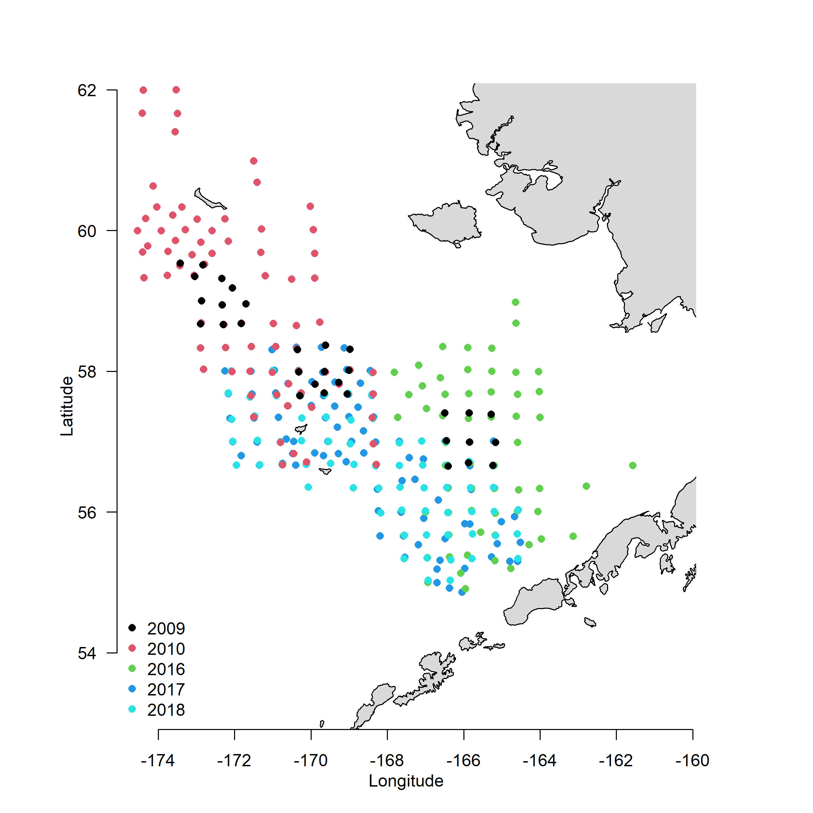
```

In 2016, 2017, and 2018, snow crab were not the focus of the BSFRF surveys, but were still caught in the BSFRF gear. Comparing the ratio of the number of crab caught at length in the BSFRF gear (which is assumed to have a catchability/selectivity of 1 over all size classes) to the number of crab caught at length within the same area in the NMFS survey gear (which is assumed to have a catchability/selectivity <= to 1 for at least some of the size classes) can provide an empirical estimate of catchability/selectivity (Figure \@ref(fig:bsfrf-sel)). Empirical estimates of catchability/selectivity vary by year and size class across the different BSFRF data sets (Figure \@ref(fig:bsfrf-sel-all) & Figure \@ref(fig:emp-sel)). The number of snow crab used to develop estimates of numbers at length likely contributes to these differences among years (Figure \@ref(fig:bsfrf-sampn)), but other factors may also influence catchability/selectivity at size of the NMFS survey gear (e.g. Somerton et al. 2013 show substrate type can influence selectivity). GAMs fit to the empirical estimates of selectivity are used as priors on estimated selectivity in the currently used assessment model. The standard errors from the GAMs are input as weighting factors for each prior of selectivity at size and sex derived from the BSFRF data.

```{r bsfrf-sel, echo=FALSE, out.width="89%", fig.cap="Observed numbers at length extrapolated from length-composition data and estimates of total numbers within the survey selectivity experimental areas, by year (left), and the inferred selectivity, the ratio of crab at length in the NMFS gear to that in the BSFRF gear (right)."}
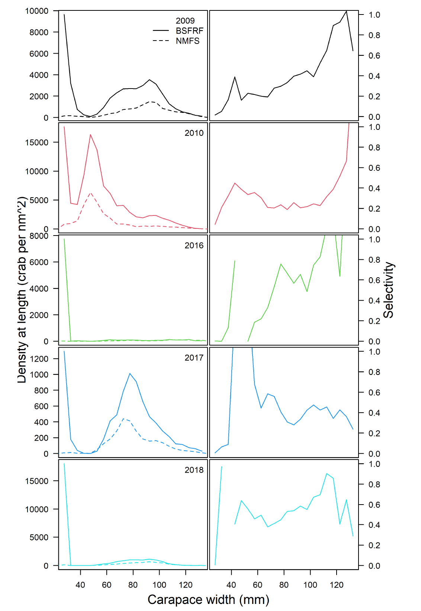
```

```{r bsfrf-sel-all, echo=FALSE, out.width="100%", fig.cap="Inferred survey selectivity for all available years of BSFRF data."}
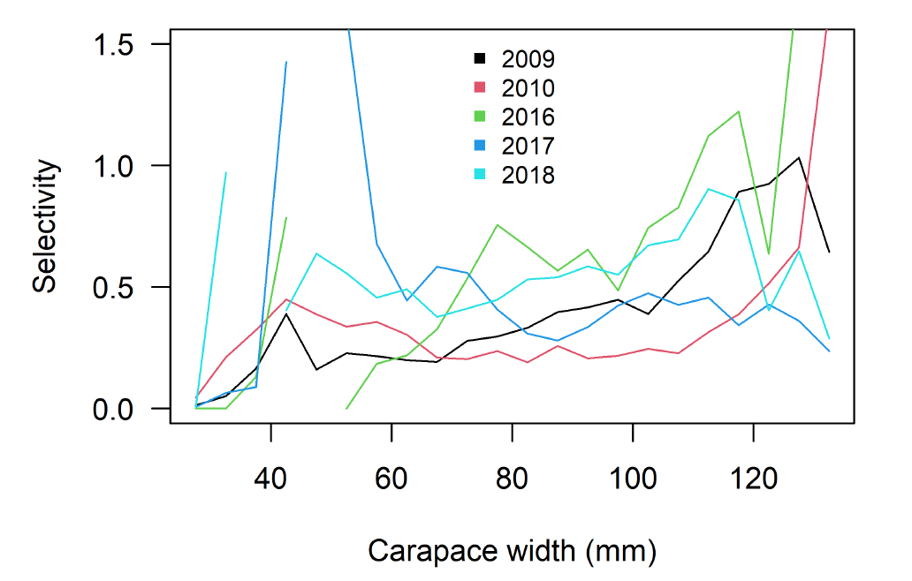
```

```{r emp-sel, echo=FALSE, out.width="64%", fig.cap="Inferred selectivity from the BSFRF experiments with selectivity at size class estimated by a generalized additive model (top), and by a sample-size-weighted average (bottom)."}
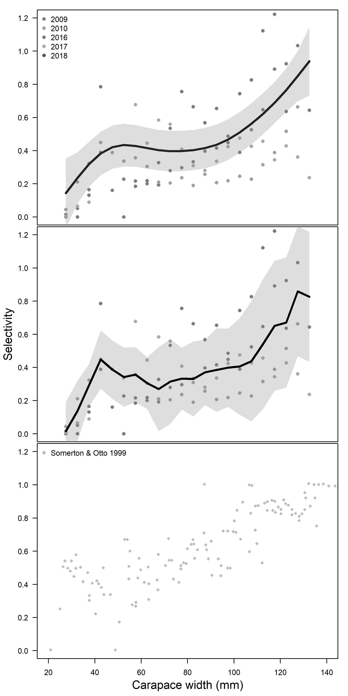
```

```{r bsfrf-sampn, echo=FALSE, out.width="100%", fig.cap="Number of crab collected in the BSFRF experimental areas by the NMFS survey and by the BSFRF survey."}
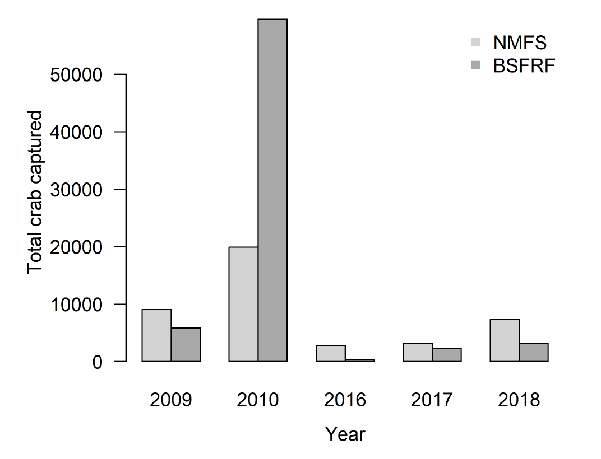
```

# E. Analytic approach


## Model description

The Generalized Model for Assessing Crustacean Stocks (GMACS) was adopted as the assessment platform for snow crab in 2022 after a demonstration that GMACS could effectively reproduce the dynamics of the status quo model and offered structural improvements. GMACS is an integrated, size-structured model developed using automatic differentiation software developed as a set of libraries under C++ (ADModel Builder).  ADModel Builder can estimate a large number of parameters in a non-linear model using automatic differentiation software extended from Griewank and Corliss (1991) and developed into C++ class libraries.  GMACS version 2.20.34 was used for the author-preferred software after the January 2026 CPT.

The snow crab population dynamics model tracks the number of crab of sex *s*,  maturity state *m*, during year *y* at width *w*, N~*s,m,y,w*~. A terminal molt was modeled in which crab move from an immature to a mature state, after which no further molting occurred. The mid-points of the size bins tracked in the model spanned from 27.5 to 132.5 mm carapace width, with 5 mm size classes. The number of estimated parameters differs among the models: 407 in `Model 25.3`, `Model 26.1` and `Model 26.1a`, 412 in `Model 26.1b`, 386 in `Model 26.1c`, and 234 in `Model 26.2`. Parameters estimated within the assessment included those associated with the population processes recruitment, growth, natural mortality (subject to an informative prior and two years of additional 'mortality events' estimated in 2018 and 2019), fishing mortality, selectivity (fisheries and survey), and catchability. The yearly probability of undergoing terminal molt, weight at size, discard mortality, bycatch mortality, variance in growth increment, and parameters associated with proportion of recruitment allocated to size bin were estimated outside of the model or specified. See the GMACS repo linked at the end of this document to peruse the control files that specify the population dynamics.

A lognormal distribution was assumed for all catch and index time-series, while a robust multinomial was assumed for all size composition data. No likelihood weights were used in the assessment.

A 'jittering' approach has been historically used to explore the impact of different starting values on the assessment output (Turnock, 2016). Parameter values were jittered based on a normal distribution centered on one with a standard deviation of `r jit_fmt(jit_sd, 2)` that was then translated to the parameter space defined by the initial value and its bounds. `r if (jit_have) sprintf("%s jitters were run for the author-recommended model (Table \\@ref(tab:model-overview)); each run was started from an independently perturbed parameter vector and re-fit to convergence.", jit_n)` Each jitter run used an explicitly recorded random seed, so the analysis is exactly reproducible; the seed used by every run is stored alongside its results. Four of the six models presented were jittered (Table \@ref(tab:model-overview)); `Model 25.3` and `Model 26.1a` were not.

## Model selection and evaluation
Models were evaluated based on their fit to the data, evidence of non-convergence, the credibility of the estimated population processes, and the strength of the influence of the assumptions of the model on the outcomes of the assessment. Note that for some of the model scenarios, data inputs are different and, therefore, model fits are not directly comparable.

### Model summaries

The key assumptions of these models include: 

* the probability of terminally molting at size varies over time and size and is specified as fixed inputs to the model based on observations from the survey data

* survey selectivity is estimated by era (1982-88; 1989-present) and sex as a non-parametric curve subject to priors based on the BSFRF survey efficiency experiment data

* growth is a linear function of pre-molt carapace width with a specified variability around post-molt size

* all immature crab molt

* natural mortality is estimated by sex and maturity state with additional mortality events estimated in 2018 and 2019 and subject to a prior based on an assumed longevity of 20 years

* total and retained fishery selectivity are estimated logistic curves

* all non-directed bycatch (e.g. snow crab caught in the Tanner crab fishery or crab caught in the non-pelagic trawl fisheries) is lumped into a single 'fishery' for which a single selectivity is estimated; these removals are recorded for both sexes combined, so in the male-only sensitivity they are fit by the male population alone and the bycatch fishing mortality estimated for males is correspondingly inflated (the affected removals average 0.48 kt against a mean retained catch of 37.1 kt, and the fit to the series is essentially unchanged)

* recruitment is estimated separately for females and males and is allocated in the first 3 size bins; the male-only sensitivity estimates male recruitment only


### Model scenarios

#### Model numbering and its correspondence with the May 2026 assessment {-}

The models presented here are numbered on the 2026 cycle, following the May 2026 Crab Plan Team report, which recorded that the 2025 accepted model had been mistakenly labeled `Model 25` in the preliminary assessment when its accepted number is `Model 25.3`, and that the runs introduced in May 2026 had been mistakenly numbered on the 2025 cycle rather than the 2026 one. The review guidelines distinguish major changes, which take a new integer, from minor ones, which take a letter; a change to the data alone is treated here as minor. Because the June 2026 SSC report refers to the configuration accepted in May by its May number, the correspondence is stated here in full.

| This document | May 2026 preliminary assessment | Terminal year | Role |
|---|---|---|---|
| Model 25.3 | Model 25 | 2024 | 2025 accepted assessment, rolled forward |
| **Model 26.1** | **Model 25.2c** | 2024 | Configuration accepted by the CPT in May 2026 |
| Model 26.1a | Model 25.2e | 2024 | 26.1 with the binning and growth-data corrections |
| **Model 26.1b** | Model 25.2e (new data) | 2025 | **Author-recommended**; 26.1a with the 2025 fishery and 2026 survey |
| Model 26.1c | Model 25.2e (2019 data) | 2019 | 26.1b truncated to 2019, convergence diagnostic |
| Model 26.2 | Model 26.1 | 2025 | 26.1b with the female population removed |

The configuration the June 2026 SSC report calls `Model 25.2c` is `Model 26.1` in this document, and the author-recommended run, `Model 26.1b`, is that same configuration with the two data corrections and a further year of data.

#### The models {-}

A total of `r n_models` models were explored (Table \@ref(tab:model-overview)). All models share the same structural assumptions described above and differ only in the version of GMACS, their data inputs, the specification of the maturity ogive, and the definition of the plus group. The one exception is `Model 26.2`, which removes the female population entirely and is therefore a structural change. The naming convention reflects an additive series of changes layered onto the September 2025 model (`Model 25.3`). 

The base ('rolled forward') model:

* **Model 25.3** -- the September 2025 author-recommended model, included for reference only. No data are updated and no structural changes are made. It was fitted under an earlier version of GMACS and is reported as originally fitted.

Models carried forward from the May 2026 assessment:

* **Model 26.1** -- the model accepted by the CPT in May 2026. `Model 25.3` updated to GMACS 2.20.34, with the total-male size composition corrected and the plus group enlarged to include all crab greater than 135 mm carapace width, and with the molting probability controls replaced by the array produced by the new maturity workflow developed by the Kodiak lab (E. Ryznar, in prep). That workflow fits an `sdmTMB` spatiotemporal model to chela-based maturity classifications to produce a smoothed probability of being mature at size and location, integrated to a population-level annual ogive; the updated series shows a weaker temporal trend in the probability of terminal molt at intermediate sizes. Data end in 2024, as in May.

* **Model 26.1a** -- as `Model 26.1`, but with the size-composition bin convention changed so that a crab falling exactly on a 5 mm cutoff is assigned to the upper bin, and with a transcription error in the growth data corrected (a 26.3 mm crab's molt increment recorded as 73 mm where the specimen master gives 7.3 mm). Data end in 2024. Presented to isolate the effect of the two data corrections against the May baseline.

The September 2026 models:

* **Model 26.1b** -- the author-recommended model. The `Model 26.1a` configuration advanced to end year 2025, so that the fishery data run through the 2025/26 season and the survey data through the 2026 summer survey. The data change; the model does not.

* **Model 26.1c** -- the same configuration with all data truncated to 2019, so that the fishery data end with the 2019/20 season and the survey with the 2019 summer survey. Requested by the CPT in May 2026 to test whether the convergence problems originate in estimating recruitment following the 2018-19 collapse and across the 2020 survey gap. The estimated parameter count is 386.

Sensitivity to the female data and dynamics:

* **Model 26.2** -- `Model 26.1b` with the female population removed entirely rather than merely down-weighted. The number of sexes is set to one, which removes the female size compositions, the female survey indices, the female discard catch, and the female growth observations from the data, and removes the female recruitment, natural mortality, growth, and selectivity parameters from the model. The estimated parameter count falls from 412 to 234. Fixing the female estimation phases alone would not accomplish this: a combined-sex catch observation is predicted by summing over both sexes, and the recruitment scale and deviations are not sex-specific, so the female population would continue to influence fishing mortality and recruitment. The non-directed bycatch is recorded for both sexes combined and is therefore fit by the male population alone in this run, as noted among the assumptions above. This is the only model presented here that differs structurally from `Model 26.1a`, which is why it takes a new number rather than a parenthetical. Requested by the CPT in May 2026 and presented as a sensitivity only; like every other model here it is not proposed for the 2026/27 specification.

The May 2026 preliminary assessment presented a bracket of fourteen candidate models exploring three axes of uncertainty: the treatment of *Chionoecetes* hybrids, the new maturity workflow, and a set of attempts to improve convergence by correcting the total-male composition, expanding the plus group, and adding an immature survey index. That bracket is not repeated here. The CPT and SSC concluded that hybrid catch and survey data should not be included in the assessment model at this time, and agreed that the immature survey index should not be treated as a convergence fix, so neither the hybrid nor the immature-index candidates are carried forward. The composition correction and the expanded plus group, which the SSC supported as clear technical improvements, are incorporated in every model presented above. The full May bracket and its results remain available in the May 2026 preliminary assessment document.

Time series of data used in the assessment are visualized in Figures \@ref(fig:indexdataplots), \@ref(fig:catchdataplots) and \@ref(fig:compdataplots). [[author: if a survey-biomass comparison across the September models is wanted, add it here.]]

<!-- ============================================================================
     SEPTEMBER 2026 PORT (narrative) — Introduction + Data ported from
     archive_2025/2026_snowcrab_safe_draft_2025_reference.Rmd (faithful to the 2025 SAFE).
     (1) DONE 2026-08-29: the 2025-dialect \autoref{} cross-references were wired
     to bookdown \@ref(fig:)/\@ref(tab:) and the sixteen figures they pointed at
     were ported from continuity/background/ and plots/. (2) inline catch values are repointed to reslst[[accepted_model]]
     and populate only once the 2026 results object exists. (3) verify terminal-year
     references (survey/crab-year convention) against the 2026 data pull.
     ============================================================================ -->

## Results
### Model convergence and comparison
The 2026 groundfish stock assessment guidelines set the convergence standard applied here: Newton steps taken with the inverse Hessian to reduce the maximum gradient below 1e-05, which the guidelines describe as stronger evidence of convergence than a maximum gradient or an invertible Hessian alone, while noting that it does not diagnose a local minimum. All `r n_models` models presented here inverted their Hessians (Table \@ref(tab:max-grad)). Every fit that could be polished was polished with Newton steps taken using the inverse Hessian, including the two that already met the conventional threshold of a maximum absolute gradient < 0.001, so that the set is treated consistently. Polishing reduces the gradient without moving the fit: across the models it changed the objective function by no more than 4 x 10^-7^ and moved B~MSY~ and the OFL by no more than 2 parts in 10^7^, the largest movement being in `Model 26.1c`. `Model 25.3`, which was fitted under an earlier version of GMACS and cannot be re-run with the current executable, is reported as originally fitted and retains a maximum gradient of 0.00134. Likelihood components by category for each candidate model are summarized in Tables \@ref(tab:like-index-tot), \@ref(tab:like-comp-tot), and \@ref(tab:like-other-tot).

A zero gradient should not be read as evidence that the parameters are well determined. It states that the fit sits at a stationary point of the likelihood, not that the likelihood is sharply peaked there, and it says nothing about how many other such points exist. The jitter analysis below speaks to the second question, and the near-zero Hessian eigenvalues discussed there to the first.

The practical cost of the multiple optima is visible in `Model 26.1`. The jitter analysis located a solution 1.27 negative log-likelihood units better than the fit obtained from the model's own starting values, a difference that would ordinarily be considered small. Adopting it moved B~MSY~ by less than one percent, but moved the total OFL from 50.27 to 43.83 kt, a change of approximately 13 percent. The choice among solutions that the data separate only weakly therefore carries more consequence for the management quantity than several of the structural choices examined in this assessment.

`r if (!jit_have) "*Jitter results not yet generated; run 05_run_jitter.R to produce them. The paragraphs below will populate from those runs.*"`

As in past cycles, jittering was used to evaluate sensitivity to starting values. `r if (jit_have) sprintf("Of the %s runs, %s produced a complete set of estimates and %s attained a maximum absolute gradient below %s. %s of the runs met the conventional threshold of %s. For comparison, the accepted fit attained %s before Newton polishing and reports a maximum gradient of zero after it (Table \\@ref(tab:max-grad)); the jitter runs above are reported on their unpolished gradients, which is what makes them comparable with one another.", jit_fmt(jit_n,0), jit_fmt(jit_complete,0), jit_fmt(jit_conv,0), format(jit_man$grad_usable), jit_fmt(.js('n_meets_conventional'),0), format(jit_man$grad_conventional), trimws(formatC(.js('base_max_grad'), format='g', digits=3)))`

`r if (jit_have && jit_multimodal) sprintf("The runs settled into %d distinct optima (Figure \\@ref(fig:jitter)), confirming that the multimodality reported in the 2025 preliminary and final assessments persists in the 2026 model. The largest cluster of solutions accounted for %s%% of the runs that reached an optimum, but that cluster is not the best fit: the solution adopted here was reached by only %s of them. Across all runs, the directed OFL ranged from %s to %s kt and mature male biomass in %s ranged from %s to %s kt, so the choice of starting values, not the data, moves the management quantities across that range. The same separation is visible in male recruitment (Figure \\@ref(fig:jitt-rec)) and in MMB (Figure \\@ref(fig:jitt-ssb)).", jit_nmodes, jit_fmt(jit_pct_best,1), jit_fmt(jit_n_at_base,0), jit_fmt(jit_ofl_min,2), jit_fmt(jit_ofl_max,2), jit_fmt(jit_term_yr,0), jit_fmt(jit_mmb_min,1), jit_fmt(jit_mmb_max,1))`
`r if (jit_have && !jit_multimodal) sprintf("The runs settled into a single optimum (Figure \\@ref(fig:jitter)); the multimodality reported in the 2025 preliminary and final assessments is not evident in the 2026 model. The directed OFL across the runs ranged from %s to %s kt and mature male biomass in %s from %s to %s kt, which is the residual spread within one optimum rather than a separation between optima.", jit_fmt(jit_ofl_min,2), jit_fmt(jit_ofl_max,2), jit_fmt(jit_term_yr,0), jit_fmt(jit_mmb_min,1), jit_fmt(jit_mmb_max,1))`

`r if (jit_have && jit_improve > 0.001 && jit_promoted) sprintf("One jitter run found a better fit than the starting solution, improving the negative log likelihood by %s units. Following the convention used in the 2025 assessment, that run was adopted as the reported model and re-fit with the Hessian; all quantities in this document derive from it. The provenance of that fit, including its random seed, is recorded with the model.", jit_fmt(jit_improve,3))`
`r if (jit_have && jit_improve > 0.001 && !jit_promoted) sprintf("One jitter run found a better fit than the reported model, improving the negative log likelihood by %s units. It has not been adopted. [[author: the 2025 assessment reported the lowest-likelihood run of 100 jitters; decide whether to do so here.]]", jit_fmt(jit_improve,3))`
`r if (jit_have && jit_improve <= 0.001) "No jitter run improved materially on the reported fit, which supports the reported solution being the global optimum rather than a local one."`

`r if (jit_have && !is.null(jitter$attribution)) sprintf("The parameters that separate the optima are summarized in Table \\@ref(tab:jitter-attribution) and Figure \\@ref(fig:jitt-attrib). Identifying which parameters differ between the clouds, rather than only observing that the clouds exist, was requested by the SSC and is intended to direct the structural work needed to resolve the multiple optima.")` [[author: interpret the attribution result -- which processes the separating parameters belong to, and what that implies for the structural changes to evaluate before the next cycle.]]

Removing the female population improves the numerical behavior of the model. `Model 26.2` estimates 234 parameters against 412 for `Model 26.1b`. Its accepted fit attains a maximum absolute gradient of zero to reported precision after Newton polishing, and a Hessian markedly better conditioned than that of `Model 26.1b` (condition number 3.3e05 against 1.4e06, smallest eigenvalue 120 against 35), with no non-positive eigenvalues. Jittering the male-only model over 100 runs recovered its accepted fit in `r .f(jit_mo_pct, 1)` percent of the runs that reached an optimum, against `r .f(jit_pct_at_base, 1)` percent for `Model 26.1b`; the multimodality that has characterized this assessment is therefore reduced but not removed by dropping the females. The retrospective pattern is also smaller: Mohn's rho for mature male biomass is -0.09, or -0.08 when the terminal survey year is withheld, against -0.11 for `Model 26.1b`, and both remain inside the Hurtado-Ferro et al. (2015) bounds. The terminal-year recruitment artifact is substantially reduced, with Mohn's rho for male recruitment falling from approximately 8 to 0.7. This is consistent with the expectation that removing the females reduces the confounding among growth, natural mortality, and selectivity. One caveat belongs with it. In `Model 26.2` the base natural mortality offset for immature males is estimated at its lower bound of -1, with a standard error of 2e-05; because M is specified as relative for that group, the bound puts immature-male M at exp(-1) times the mature-male rate, or 0.106 yr^-1^. The same parameter in the accepted two-sex model is estimated at -0.225 with a standard error of 0.117, well inside its range, giving 0.232 yr^-1^. Removing the females is what drives it to the bound, and the bound is binding: the fit is asking for immature males to die at about a third of the mature rate and is being stopped from going lower. That is a structural statement about the model, not a numerical detail. Two consequences follow. Part of the improvement in conditioning is a constraint removing a parameter from estimation rather than a better-determined likelihood, so the gain is smaller than the parameter count alone suggests. And the implied immature-male mortality should not be carried into a specification model without being examined on its own terms. The other parameters at bounds in `Model 26.2` are the three fully-selected trawl-survey size classes, which are at bounds in the two-sex model as well and are not diagnostic. Dropping the females also lowers the reference points: $B_{MSY}$ falls from 144.97 to 131.34 kt and the total-catch OFL from 85.65 to 77.00 kt, with terminal mature male biomass falling from 141.53 to 115.90 kt (Table \@ref(tab:stepchange)).

```{r jitter-summary, echo=FALSE, warning=FALSE, message=F}
# Summary of the jitter analysis. Values come from Models/rda_jitter.RData,
# written by 05_run_jitter.R; nothing here is recomputed locally.
if (jit_have) {
  jsum_df <- data.frame(
    Quantity = c(
      "Jitter runs",
      "Runs returning a complete fit",
      sprintf("Runs with max |gradient| < %s", format(jit_man$grad_usable)),
      sprintf("Runs meeting the conventional threshold of %s", format(jit_man$grad_conventional)),
      "Distinct optima identified",
      "Runs at the best lettered mode (%)",
      "Runs recovering the reported fit (%)",
      "Negative log likelihood, base fit",
      "Negative log likelihood, best jitter run",
      # 05_run_jitter.R:679 summarises ofl_directed, not ofl_tot. Labelled
      # accordingly: for the 2019-data model the two differ materially
      # (directed min is exactly 0, total min 0.054 kt).
      "Directed OFL, range across runs (1,000 t)",
      sprintf("MMB in %s, range across runs (1,000 t)", jit_fmt(jit_term_yr, 0))),
    Value = c(
      jit_fmt(jit_n, 0),
      jit_fmt(jit_complete, 0),
      jit_fmt(jit_conv, 0),
      jit_fmt(.js("n_meets_conventional"), 0),
      jit_fmt(jit_nmodes, 0),
      jit_fmt(jit_pct_best, 1),
      jit_fmt(jit_pct_at_base, 1),
      jit_fmt(jit_base_nll, 3),
      jit_fmt(jit_best_nll, 3),
      sprintf("%s - %s", jit_fmt(jit_ofl_min, 2), jit_fmt(jit_ofl_max, 2)),
      sprintf("%s - %s", jit_fmt(jit_mmb_min, 1), jit_fmt(jit_mmb_max, 1))),
    stringsAsFactors = FALSE)

  flextable::flextable(jsum_df) |>
    flextable::autofit() |>
    flextable::set_caption(
      caption = paste("Summary of the jitter analysis of the author-recommended model,",
                    "Model 26.1b. Objective function values are negative",
                    "log-likelihood and gradients are dimensionless; OFL and mature",
                    "male biomass are in 1,000 t."),
      autonum = officer::run_autonum(seq_id = "tab", pre_label = "Table ", bkm = "jitter-summary")
    )
}
```

```{r jitter-attribution, echo=FALSE, warning=FALSE, message=F}
# Parameters separating the jitter clouds. Present only when the runs settled
# into more than one optimum -- with a single optimum there is nothing to
# attribute, and the chunk emits nothing rather than an empty table.
if (jit_have && !is.null(jitter$attribution)) {
  # Top 10 of the 15 rows the attribution returns. The table is a ranking, so a
  # top-N is the natural presentation, and at 15 rows it broke across a page --
  # which makes flextable repeat the caption AND the label (backlog 9b).
  N_ATTRIB <- 10L
  jattr_df <- utils::head(jitter$attribution, N_ATTRIB)
  jattr_df <- data.frame(
    Parameter  = jattr_df$parameter,
    Comparison = paste0(jattr_df$mode_a, " vs ", jattr_df$mode_b),
    `Mean in A` = round(jattr_df$mean_a, 4),
    `Mean in B` = round(jattr_df$mean_b, 4),
    Difference = round(jattr_df$difference, 4),
    `Std. difference` = round(jattr_df$std_difference, 2),
    check.names = FALSE, stringsAsFactors = FALSE)

  flextable::flextable(jattr_df) |>
  # Long table, breaks across a page. Suppress the repeated caption in the
  # longtable continuation head -- it repeats the \label with it and makes
  # \@ref(tab:jitter-attribution) ambiguous (2026-08-30).
  flextable::set_table_properties(opts_pdf = list(caption_repeat = FALSE)) |>
    flextable::fontsize(size = 8, part = "all") |>
    flextable::autofit() |>
    flextable::set_caption(
      caption = sprintf(paste("The %d parameters that most separate the jitter clouds of",
                              "Model 26.1b, ranked by the standardized difference in fitted",
                              "value between the best-fitting optimum and each alternative",
                              "optimum. Parameter values are in the units of the estimated",
                              "parameter, which are log-scale for most blocks; the",
                              "standardized difference is dimensionless."),
                        nrow(jattr_df)),
      autonum = officer::run_autonum(seq_id = "tab", pre_label = "Table ", bkm = "jitter-attribution")
    )
}
```

```{r retro-setup, echo=FALSE, warning=FALSE, message=FALSE}
# Retrospective outputs, written by 06_run_retrospective.R. Every value quoted
# in the narrative below is pulled from these files at knit time so the text
# cannot drift from the runs.
# Follow the accepted model rather than naming a folder. Hardcoded, this would
# report a DIFFERENT model's retrospective without warning if accepted_model
# were repointed -- which it was on 2026-08-28 (see the note above).
retro_dir <- file.path(report_model, "retro")
stopifnot("retro_dir does not exist for the accepted model" = dir.exists(retro_dir))

.rd <- function(f) {
  p <- file.path(retro_dir, f)
  if (file.exists(p)) read.csv(p, stringsAsFactors = FALSE) else NULL
}
retro_rho  <- .rd("mohns_rho.csv")
retro_rel  <- .rd("retro_peel_relative.csv")
retro_diag <- .rd("retro_diagnostics.csv")
# The retrospective reports MMB and recruitment only. There is no
# retro_refpoints.csv: GMACS does not compute reference points for a peeled run
# (gmacsbase.TPL 2.20.34 gates both call sites on nyrRetroNo == 0, :5478 and
# :13625), so every peel returns them as exactly 0. Confirmed 2026-08-27; the
# peels run WITH the Hessian, so this was never a -nohess problem. The terminal
# fit's reference points are in the model directory and retro/base_run.csv.
#
# NOT read here: retro/prj_growth_year_diagnostic.csv. It is a developer
# diagnostic, not an assessment result, and its BMSY = OFL = 0 columns are that
# same peel behavior. Nothing in the SAFE should be able to reach those zeros.

retro_have <- !is.null(retro_rho)

# convenience accessors; return NA (not an error) when the runs are absent
.rho <- function(mode, quantity) {
  if (!retro_have) return(NA_real_)
  v <- retro_rho$mohns_rho[retro_rho$mode == mode & retro_rho$quantity == quantity]
  if (length(v)) v[1] else NA_real_
}
.fmt <- function(x, d = 3) if (is.na(x)) "NA" else formatC(x, format = "f", digits = d)

retro_npeel <- if (!is.null(retro_rel)) max(retro_rel$peel) else NA_integer_
retro_yr1   <- if (!is.null(retro_rel)) max(retro_rel$terminal_year) else NA_integer_
retro_yrN   <- if (!is.null(retro_rel)) min(retro_rel$terminal_year) else NA_integer_
```

The guidelines also ask whether any parameters were inestimable or reached their bounds. In the accepted fit no parameter reached a bound and the Hessian is well conditioned: its smallest eigenvalue is 34.6 and none is non-positive. Twenty-four of the 412 estimated parameters have a standard error larger than the absolute value of the estimate. Sixteen of those are estimated within 0.1 of zero, where a large ratio is arithmetic rather than diagnostic: four selectivity offsets, three fishing mortality deviations, two fishing mortality offsets, two recruitment deviations, three recruitment proportion parameters, one growth parameter, and one natural mortality parameter, `M_pars_est[10]`, estimated at 0.022 with a standard error of 0.84. That last one is near zero but is not well determined, and should be read as an identifiability question rather than as arithmetic. The remainder are three recruitment deviations, three recruitment proportion parameters, a fishing mortality deviation, and `M_pars_est[2]`, the natural mortality deviation for mature males in the first event block, estimated at 0.33 with a standard error of 0.59.

That is a property of this fit and not of the model. In cold starts the model can settle in an optimum where the second natural-mortality block for immature females, `M_pars_est[15]`, is unidentified: it drifts toward its upper bound of 10 with a standard error of order 5 x 10^3^, the smallest Hessian eigenvalue falls to 1.1 x 10^-6^ against a next-smallest of 19.8, and the likelihood acquires a single flat direction along which a cold start lands wherever floating-point noise takes it. In the accepted fit that same parameter is estimated at 1.83 with a standard error of 0.58, consistent with its block-one counterpart at 1.80, and the flat direction is absent. Whether an exponential time-varying natural mortality block on immature females is identifiable from these data at all is a question for the Plan Team; the alternative is to fix it, as the corresponding rows for the other sex and maturity combinations already are.

### Retrospective analysis
`r if (!retro_have) "*Retrospective results not yet generated; run 06_run_retrospective.R to produce them.*"`

Retrospective analyses were performed by sequentially removing the terminal year of data from the model, re-fitting, and comparing the resulting time series of estimated mature male biomass with the estimates from the model fit to the full data set. A retrospective pattern is a consistent directional change in an assessment estimate for a given year as additional years of data are added. `r if (retro_have) sprintf("Peels of one through %d years were run, giving terminal years from %d back to %d.", retro_npeel, retro_yr1, retro_yrN)` The peels were not Newton-polished, and none of them meets the maximum-gradient criterion of 0.001 that the accepted fit is held to: across the standard sweep the maximum absolute gradient runs from 0.0015 to 0.020. Mohn's rho below is therefore computed from fits that are at an optimum but not polished to it, which is the normal condition for a retrospective sweep and is stated here so the contrast with the convergence section is not read as an inconsistency.

Mohn's $\rho$ is reported here as the mean across peels of the relative difference between each peel's terminal-year estimate and the estimate for that same year from the model fit to all of the data,

$$\rho = \frac{1}{P}\sum_{p=1}^{P}\frac{X_{T_p,\,p}-X_{T_p,\,0}}{X_{T_p,\,0}},$$

where $T_p$ is the terminal year of peel $p$ and $X_{\cdot,0}$ is the unpeeled fit. A positive $\rho$ therefore means the peels sit *above* the full model, i.e. that terminal biomass is revised downward as data accumulate. Hurtado-Ferro et al. (2015) suggest that $\rho$ outside $[-0.22,\,0.30]$ for a short-lived stock indicates a retrospective pattern worth reporting.

Two retrospectives are presented. The **standard** retrospective removes the last $p$ years of all data streams. The **dropped-terminal-survey** retrospective additionally withholds the most recent survey year, which isolates the leverage of the single most recent survey observation on the terminal estimate. This distinction matters for this stock because, under the crab-year convention, an assessment with end year $N$ is fit to the summer survey from year $N+1$, so the terminal MMB estimate rests heavily on one very recent survey point.

`r if (retro_have) sprintf("For mature male biomass, the standard retrospective gave Mohn's $\\rho$ = %s and the dropped-terminal-survey retrospective gave $\\rho$ = %s (Table \\@ref(tab:retro-rho), Figures \\@ref(fig:retro-mmb) and \\@ref(fig:retro-drop-survey)). Male recruitment gave $\\rho$ = %s.", .fmt(.rho("standard","mature_male_biomass")), .fmt(.rho("drop_survey","mature_male_biomass")), .fmt(.rho("standard","recruitment_male")))`

Management quantities are not recomputed for each peel. GMACS calculates reference points only when the retrospective peel count is zero (`gmacsbase.TPL` 2.20.34 gates both call sites on `nyrRetroNo == 0`), so every peeled run returns $B_{MSY}$, $B/B_{MSY}$ and the OFL as exactly zero rather than as estimates. This is a property of GMACS and not of the runs presented here -- the peels were fit with the Hessian -- and it applies equally to the 2025 assessment. The retrospective therefore characterizes mature male biomass and recruitment only, and the movement in the management advice itself under each peel cannot be read from it. [[author: if the CPT wants the advice-level retrospective for a scientific-uncertainty buffer, it needs peel-by-peel reference points computed outside GMACS.]]

<!-- >>> REVIEW: once the peels are final, characterize the DIRECTION and PRACTICAL
     SIGNIFICANCE of the pattern here in words (the numbers above are pulled
     automatically, but the interpretation is an author judgement). Also state
     whether the retrospective motivates any change to the ABC buffer. -->

Each peel was re-fit with the Hessian, and each was started from the accepted fit's parameter vector rather than from a cold start. Seeding matters in a likelihood with this many optima: cold-started, a peel measures which optimum it happened to fall into as much as it measures the retrospective pattern. It does, however, compress the pattern relative to an unseeded sweep, and the values below should be read with that in mind. The projection file was left unmodified; GMACS shifts its reference-point averaging windows back by the number of peeled years internally.

### Historical analysis

The retrospective analysis above withholds data from a single model. A historical analysis asks a different question: how the perception of the stock has changed across successive assessments accepted for management. Figure \@ref(fig:historical-mmb) shows estimated mature male biomass at mating as each assessment from 2016 to 2025 saw it.

The revisions are large, and they are much larger than the within-model retrospective pattern. The clearest case is the collapse itself. The 2020 assessment put mature male biomass at the time of the survey in 2020 at 486.5 kt; the 2021 assessment, with the 2021 survey in hand, revised that same year to 40.95 kt, a downward revision of 92 percent. The revision then reversed: the 2022 assessment estimated 2020 biomass at mating at 19.1 kt, and the 2023 assessment revised the same year to 205.4 kt, an order-of-magnitude increase in the opposite direction. Terminal-year estimates across the ten vintages range from 26.7 kt (2021 assessment) to 207.2 kt (2020 assessment).

[[author: the guidelines ask for the cause of any obvious differences, and that cause cannot be established from the material in this repository -- `data/historical/` holds the published time series but not the configurations that produced them. The candidates worth checking against the 2021--2023 assessment documents are the treatment of the 2018--19 mortality event, changes in the maturity input, and any change in the initialization. Note that the time-varying probability of terminal molt is not itself new this cycle; what changed for 2026 is the workflow producing it.]]

The practical consequence for management advice is that terminal-year mature male biomass in this assessment has historically been revised by considerably more than the within-model retrospective analysis implies, and in both directions. [[author: the guidelines ask for uncertainty intervals on the vintages. The published series in `data/historical/` carry point estimates only, so the figure shows no intervals; either recover the intervals from the archived assessments or state here that they were not available.]]

```{r historical-mmb, echo=FALSE, out.width="100%", fig.cap="Estimated mature male biomass at mating (1,000 t) as seen by each assessment accepted for management from 2016 to 2025, against the current assessment. Point estimates only, without uncertainty intervals."}
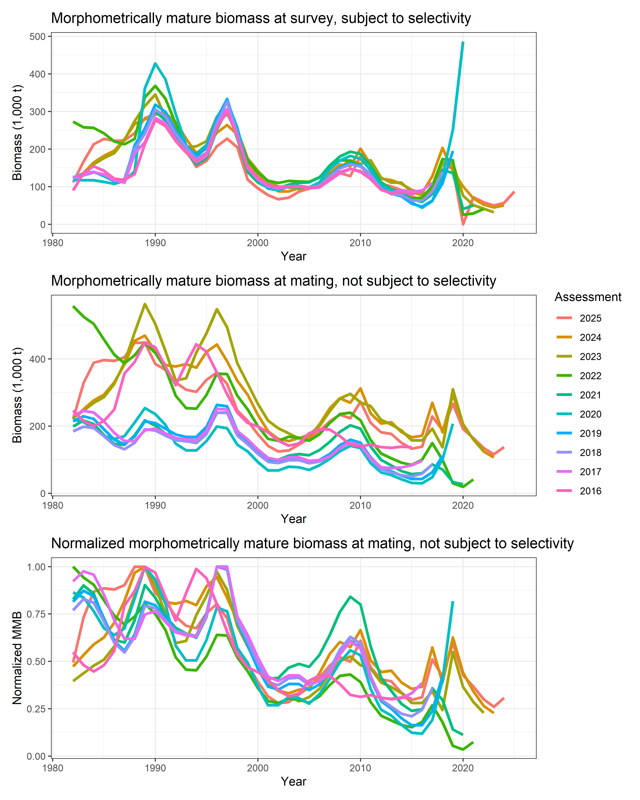
```

### Model fits
Fits to the survey indices of mature biomass were broadly similar across the models (Figure \@ref(fig:mmbfits)). `Model 26.1b`, the only two-sex model carrying the 2026 survey, continues to have difficulty fitting the terminal year of female biomass; `Model 26.2` estimates no female population, so the question does not arise for it. Inputting a yearly varying probability of terminal molt from the new maturity workflow, which every model other than `Model 25.3` carries, shifts the estimated population dynamics modestly but does not resolve the female terminal-year fit (Figure \@ref(fig:mmbfits)).

[[author: this paragraph described the hybrid-survey and `imm_surv` candidates, which are not in the September set -- the CPT and SSC advised against both in May and June 2026. Replace with a comparison across the six models actually presented, or drop it.]]

Fits to the non-directed fishery catches were good for all models (Figure \@ref(fig:catchfits)). Fits to the directed-fishery retained catch were also good across the model set. [[author: a sentence here compared discard fits in the hybrid-fishery models, which are not in the September set. Removed rather than left describing models the document does not present. The underlying observation -- that ADF&G reported roughly 18 kt of legal-male hybrid catch in 1997, with hybrid identification quality decreasing further back in the time series -- is still recorded in Table \@ref(tab:obscatch) and may be worth keeping somewhere.]] The models accommodate the additional discards primarily through changes in estimated discard fishing mortality rather than through major changes in selectivity.

Differences among models in the fits to size composition data for retained catch in the directed fishery are small (size composition figures, below). No visually discernible differences among models existed for female discards from the directed fishery. Fits to the non-directed fishery had some of the largest misfits of all data sources (particularly for male data), but this is unsurprising given a single estimated selectivity curve and changes in fishery behavior over time. Sample sizes are assumed to be 100 for all composition data except for female discards in 2021, 2024 and 2025 (sample size = 10).

Fits to the survey size composition data were broadly similar across models in most years (size composition figures, below). The plus-group change (extending the plus group to all crab > 135 mm) makes a small visual difference for retained males but improves the runtime of the model substantially. All models had difficulty fitting the size composition data for immature females in 2009 and 2019, which could suggest some unmodeled size-based mortality or time-varying probability of terminal molt. Estimates of mean growth are shown in Figure \@ref(fig:growthfits).

### Estimated population processes
The estimated abundance of commercially preferred male crab (> 101 mm carapace width) varied among models (Figure \@ref(fig:obs-101-vs-pred)). The early years during which differences in survey selectivity occurred were particularly different. All models agreed that the abundance in recent years has been the lowest in the time series (Figure \@ref(fig:obs-101-vs-pred-bio)). The estimates of the most recent era of survey selectivity were similar across models for both sexes (Figure \@ref(fig:select-prior)).

Estimated fisheries selectivities were similar across models (Figure \@ref(fig:predselectfish)). Estimated fully-selected fishing mortality for the directed fishery was highly variable and relatively high for most of the fishery history (Figure \@ref(fig:predfmort)). The total fishery selectivity curve is shifted far to the right, so only the largest crab experience the fully-selected fishing mortality. 

The probability of undergoing terminal molt is input as data (Figure \@ref(fig:predmat)); the status quo workflow produces a strong increasing trend through time at intermediate sizes (e.g., at 77 mm the probability rose from ~0.2 in the early 1990s to ~0.5 after 2010), while [[VERIFY: this comparison of the two maturity workflows -- the quoted probabilities at 77 mm and the characterization of one trend as strong and the other as weak -- could not be reproduced from the terminal-molt arrays in the control files. Check it against the workflow output directly before this goes out.]] the new maturity workflow produces a much weaker temporal trend (~0.35--0.45 throughout the time series). The new workflow uses a spatiotemporal `sdmTMB` model fit to chela-based maturity classifications and borrows information across years and locations for size bins with sparse chela data; it does not extrapolate the predicted spatial probability surface beyond stations with measured crab.

Trends in recruitment were very similar across models for the early time series, with some variability in scale and differences in timing between the sexes (Figure \@ref(fig:recruits)). Differences in estimated recruitment in the most recent years were observed among models for males and contribute to differences in OFLs across the model set.

Base estimates of natural mortality for mature animals of both sexes were broadly similar across the models presented (Figure \@ref(fig:nat-m), Table \@ref(tab:stepchange)). All models estimated additional mortality events that removed a large fraction of crab by sex and maturity state, except for mature females, at some point during the marine heatwave of 2018--19. In the inferior optima reached from cold starts the immature-female natural mortality deviation for the second event block is poorly determined, with a standard error far larger than the estimate itself; in the accepted fit it is not, as reported under model convergence, where whether it should be fixed rather than estimated is also discussed. [[author: the May document also reported an extreme immature-female M in one of the hybrid candidates; those models are not carried forward, so that observation has been removed rather than restated.]]

### MMB and management quantities
Estimated mature male biomass time series had similar trends across models but differed in scale (Figure \@ref(fig:predmmb)). Estimates of $B_{MSY}$, current MMB relative to $B_{MSY}$, $F_{MSY}$, $F_{OFL}$ and the Tier 3 OFL are summarized in Table \@ref(tab:stepchange). Across the models presented, the $B_{MSY}$ proxy ranged from 131.3 to 180.1 kt and terminal mature male biomass from 86.9 to 141.5 kt. The three models whose data end in 2024 place the stock below its $B_{MSY}$ proxy (status 0.81 to 0.96), while the two carrying the 2025 fishery and 2026 survey place it above (status 1.23 and 1.32); the additional year of data, rather than any structural change, accounts for that difference. `Model 26.1c`, whose data end in 2019, sits just above the proxy at 1.05, but its reference points are computed from a different span of data and are not comparable with the others.

[[author: a paragraph comparing the hybrid candidates' $B_{MSY}$ proxies stood here. Those models are not carried forward and the paragraph has been removed; the audit-trail note in Section E records that hybrids were evaluated in May and excluded on CPT and SSC advice.]]

# F. Calculation of the OFL
## Methodology for OFL 
### Tier 3
Historically, the Tier 3 OFL was calculated using proxies for biomass and fishing mortality reference points and a sloped control rule. Proxies for biomass and fishing mortality reference points were calculated using spawning-biomass-per-recruit methods (e.g. Clark, 1991). After fitting the assessment model to the data and estimating population parameters, the model was projected forward 100 years using the estimated parameters under no exploitation and constant recruitment to determine 'unfished' mature male biomass-per-recruit. Projections were repeated in which the bisection method was used to identify a fishing mortality that reduced the mature male biomass-per-recruit to 35% of the unfished level (i.e. F~35%~ and B~35%~). Calculations of F~*35%*~ were made under the assumption that bycatch fishing mortality was equal to the estimated average value over the last 10 years. 

Calculated values of F~35%~ and B~35%~ were used in conjunction with a Tier 3 control rule to adjust the proportion of F~35%~ that is applied to the stock based on the status of the population relative to B~35%~ (Amendment 24, NMFS). To determine the F~OFL~, the population is projected to the time of fishing for the upcoming fishery under no fishing. If the MMB at that time exceeds 25% of B~35%~, a fishery can occur and the F~OFL~ is calculated as:

$$\begin{equation}
F_{OFL} =
\begin{cases}
Bycatch  & if \frac{MMB}{B_{35}} \leq 0.25 \\[3ex]
\frac {F_{35} ( \frac {MMB}{B_{35}} - \alpha)}{1-\alpha}  & if 0.25 < \frac {MMB}{B_{35}} < 1 \\[3ex]
F_{35} & if MMB > B_{35}
\end{cases}
\end{equation}$$

Where MMB is the projected morphometrically mature male biomass in the current survey year after fishing at the F~*OFL*~, B~*35%*~ is the mature male biomass at the time of mating resulting from fishing at F~*35%*~, F~*35%*~ is the fishing mortality that reduces the morphometrically mature male biomass per recruit to 35% of unfished levels, and $\alpha$ determines the slope of the descending limb of the harvest control rule (set to 0.1 here).

Calculated total Tier 3 OFLs across the models presented ranged from 43.8 to 147.3 kt (Table \@ref(tab:stepchange)). For reference, the observed survey biomass of morphometrically mature males in 2025 was `r .f(survey_morph_2025, 1)` kt and of preferred males (> 101 mm) `r .f(survey_pref_2025, 1)` kt. Taking `Model 26.1`, the model accepted in May, as the comparison baseline at 43.8 kt: correcting the size-composition bin convention and the growth transcription error (`Model 26.1a`) lowered the $B_{MSY}$ proxy from 172.7 to 158.7 kt and raised the OFL to 53.7 kt; adding the 2025 fishery and 2026 survey (`Model 26.1b`) lowered the proxy further to 145.0 kt, raised status above one, and raised the OFL to 85.6 kt. The male-only sensitivity gives a lower OFL than the model it is derived from, 77.0 kt against 85.6 kt. The run truncated to 2019 is not comparable with the others, since its reference points are computed from a different span of data. [[author: interpret the direction of these changes -- in particular why the corrected bin convention and the additional year of data both lower the $B_{MSY}$ proxy.]]

### Tier 4

The Tier 4 calculation is the basis for the 2026 harvest specification. The SSC assigned this stock to **Tier 4b** when it set the 2025/26 specification (October 2025 SSC report, Table 2), and that subtier is carried here. [[author: confirm 4b still applies on this cycle's status.]] A random-effects model (REMA) is fitted to the observed survey biomass series, the B~MSY~ proxy is taken as the mean of the smoothed series, and stock status is the terminal smoothed biomass relative to that proxy. Target fishing mortality is F = M = `r .f(NAT_M, 2)` yr^-1^, the median of the prior on natural mortality.

The averaging period for the B~MSY~ proxy is the whole survey time series, `r .fy(BMSY_WINDOW_LAB)`. The proxy is intended to represent the long-term average productivity of the stock, and there is no basis for withholding the most recent observation from that average; the September 2025 assessment averaged 1982 to 2024, that is, every year but the terminal one. The average is taken over the smoothed series rather than the observations, which is what supplies a value for 2020, when the survey was cancelled. Recomputing this cycle's smoothed series on the narrower 1982--2024 window, for comparison, gives a B~MSY~ proxy of 148.18 kt and a status of 0.769 against the `r .f(bmsy_2026, 2)` kt and `r .f(status_2026, 3)` reported here. Those two comparison figures are this assessment's own REMA fit evaluated on the earlier window; they are not values the September 2025 assessment published, which reported the window and the resulting OFLs but no proxy or status. It does not change the recommended OFL, which applies a flat F = M to the terminal biomass and does not depend on the proxy. It moves only the quantities that do depend on it: the minimum stock size threshold falls from 74.09 to `r .f(msst_2026, 2)` kt, and the ramped alternative rises from 22.87 to `r .f(ofl_2026_ramp_linear, 2)` kt on the linear catch equation both figures were computed with. (The ramped OFL reported in Table \@ref(tab:tier4-currencies), `r .f(ofl_2026_ramp, 2)` kt, is lower again because it also carries the change to the Baranov equation described below.)

Three currencies are carried, as in the September 2025 assessment: morphometrically mature males, large males (>= 95 mm carapace width), and preferred males (> 101 mm). The observed survey biomass for each, in the terminal survey year and the year preceding it, is:

\Needspace{9\baselineskip}

```{r survey-currencies, echo=FALSE, warning=FALSE, message=FALSE}
svy_tab <- data.frame(
  Currency = c("Morphometrically mature males", "Large males (>= 95 mm)",
               "Preferred males (> 101 mm)"),
  `2025`   = c(survey_morph_2025, survey_large_2025, survey_pref_2025),
  `2026`   = c(survey_morph_2026, survey_large_2026, survey_pref_2026),
  `Change (%)` = 100 * (c(survey_morph_2026, survey_large_2026, survey_pref_2026) /
                        c(survey_morph_2025, survey_large_2025, survey_pref_2025) - 1),
  check.names = FALSE
)
flextable::flextable(svy_tab) |>
  flextable::colformat_double(digits = 2) |>
  flextable::autofit() |>
  flextable::set_caption(
    caption = paste("Observed NMFS summer survey male biomass (1,000 t) by currency,",
                    "for the terminal survey year and the one preceding it. These are",
                    "survey observations, not output of any assessment model; the Tier 4",
                    "calculation below is applied to the REMA-smoothed series."),
    autonum = officer::run_autonum(seq_id = "tab", pre_label = "Table ", bkm = "survey-currencies")
  )
```

The preferred-male estimate is reported in full here because it is the currency industry and the State track, and because it is the one that moved this year. The 2026 survey estimates `r .f(pref_abund_2026, 2)` million preferred males (survey CV `r .f(100*pref_abund_cv_2026, 1)` percent), a biomass of `r .f(survey_pref_2026, 2)` kt (CV `r .f(100*pref_biom_cv_2026, 1)` percent). That is a fall of `r .f(abs(pref_biom_chg), 1)` percent in biomass and `r .f(abs(pref_abund_chg), 1)` percent in abundance from 2025, and it leaves preferred-male biomass the `r if (!is.na(pref_rank_2026)) paste0(pref_rank_2026, if (pref_rank_2026 %% 10 == 1 && pref_rank_2026 != 11) 'st' else if (pref_rank_2026 %% 10 == 2 && pref_rank_2026 != 12) 'nd' else if (pref_rank_2026 %% 10 == 3 && pref_rank_2026 != 13) 'rd' else 'th') else 'NA'` lowest in the `r pref_n_yrs`-year series, at `r .f(pref_pct_mean, 0)` percent of its long-term mean. The 2025 value was itself a two-year recovery off the 2023 low, and that recovery has not held. The morphometric currency the control rule acts on is close to flat over the same year (Table \@ref(tab:survey-currencies)), so the choice of currency, not the survey, is what separates a stable stock from a declining one in this document.

Applying the Tier 4 rule to each currency gives:

\newpage

<!---BLOCK_LANDSCAPE_START--->
\blandscape

```{r tier4-currencies, echo=FALSE, warning=FALSE, message=FALSE}
t4 <- tier4_all
names(t4) <- c("Currency", "B_MSY", "B current", "Status", "M", "F_OFL", "OFL",
               "OFL (ramped HCR)", "OFL (linear eqn)")[seq_along(t4)]
# Measured 8.88 in at the default size against a 6.5 in portrait line, which put
# the two alternative-OFL columns and the right edge of the caption off the page
# entirely (found 2026-08-29). Landscape gives 9 in and 9pt brings it to 7.73 in.
flextable::flextable(t4) |>
  flextable::fontsize(size = 9, part = "all") |>
  flextable::colformat_double(digits = 3) |>
  flextable::autofit() |>
  flextable::set_caption(
    caption = paste("Tier 4 management quantities by currency (biomass and OFL in",
                    "1,000 t; F per year). Computed from the REMA-smoothed survey",
                    "series, not from a GMACS model.",
                    "F_OFL and OFL are the reported basis: flat F_OFL = M above the",
                    "closure threshold, with the Baranov catch equation. The final two",
                    "columns are alternatives, each changing one choice - the ramped",
                    "control rule, and the linear catch equation OFL = F_OFL x B used by",
                    "the other BSAI crab Tier 4 assessments."),
    autonum = officer::run_autonum(seq_id = "tab", pre_label = "Table ", bkm = "tier4-currencies")
  )
```

<!---BLOCK_LANDSCAPE_STOP--->
\elandscape


The recommended currency is morphometrically mature male biomass, giving an OFL of `r .f(ofl_2026)` kt and, after the `r sprintf("%.0f%%", 100*(1-ABC_buffer))` buffer, an ABC of `r .f(abc_2026)` kt. [[author: the September 2025 assessment recommended the >= 95 mm currency instead, on the grounds that morphometrically mature male biomass "results in reference points that allow for the complete removal of large males". The choice of currency moves the OFL by a factor of `r .f(ofl_curr_ratio, 0)` (Table \@ref(tab:tier4-currencies)) -- far more than either the control-rule or catch-equation choice, and enough that on either large-male currency the OFL would be below `r .f(max(tier4_by_currency$OFL[tier4_by_currency$currency != "morphometric"]), 1)` kt -- so the reversal needs an explicit justification here.]]

The biomass the control rule acts on carries real uncertainty, and the guidelines require it to be reported. The random-effects fit puts terminal morphometrically mature male biomass at `r .f(mmb_2026, 2)` kt with a 95 percent interval of `r .f(mmb_2026_lci, 2)` to `r .f(mmb_2026_uci, 2)` kt, a coefficient of variation of `r .f(100*mmb_2026_cv, 1)` percent. This is the prediction interval REMA returns for the smoothed series, which reflects the process error the random-effects model estimates. It is not the sampling uncertainty of the survey itself: the survey CVs are an input to the fit, not its output, and the two should not be quoted interchangeably. The interval is lognormal, so the log-scale standard deviation is recovered as (log of the upper bound minus log of the lower bound) divided by 2 x 1.96, and the coefficient of variation follows from it.

Propagating that interval through the control rule and the catch equation gives an OFL of `r .f(ofl_2026, 2)` kt with a range of `r .f(ofl_2026_lci, 2)` to `r .f(ofl_2026_uci, 2)` kt. That range is wider than the biomass interval alone would imply, because under the sloped rule F~OFL~ rises with status as well: at the lower bound the rate falls to `r .f(t4_rec$Fofl_lci, 3)` and at the upper bound it reaches M itself, `r .f(t4_rec$Fofl_uci, 3)`, so biomass and rate move together in both directions. The OFL is consequently more sensitive to the biomass estimate under this rule than under a flat rate. The corresponding stock status is `r .f(status_2026, 3)` with a range of `r .f(status_2026_lci, 3)` to `r .f(status_2026_uci, 3)`. Two features of that status range matter. The lower bound remains above the minimum stock size threshold of `r .f(msst_2026, 2)` kt, so the stock is not overfished at any point in the interval. But the upper bound reaches `r .f(status_2026_uci, 3)`, so on this measure the biomass at which the stock would be considered rebuilt lies inside the interval, even though the point estimate sits below it. The rebuilding determination in Section H should be read with that in mind.

[[author: this interval covers the random-effects smoothing only. It does not include uncertainty in the B~MSY~ proxy, which is the mean of the same smoothed series and is therefore correlated with the terminal estimate, nor uncertainty in the choice of currency or averaging window, both of which move the OFL by more than this interval does. Say so, or widen the treatment.]]

The recommended basis makes two choices, and each is reported here with its alternative so that the effect of either can be read directly.

**The control rule is the sloped Tier 4 rule from the crab FMP**, under which F~OFL~ ramps linearly from zero at the closure threshold to M at the B~MSY~ proxy: F~OFL~ = M (B/B~MSY~ - alpha) / (1 - alpha), with alpha = 0.10 and a closure threshold beta = 0.25. At the current status of `r .f(status_2026, 3)` this gives F~OFL~ = `r .f(fofl_2026, 4)` against M = `r .f(NAT_M, 2)`.

This is the FMP form, and adopting it resolves a divergence that has stood since last cycle. The September 2025 assessment applied a flat rate and stated that no kink exists in its harvest control rule. The October 2025 SSC identified that as an incomplete implementation --- "full implementation of a Tier 4 crab assessment as specified in the FMP requires application of a harvest control rule" --- and asked the author to recompute the OFL under the control rule during the meeting. The result of that recomputation, F~OFL~ = 0.19 and an OFL of 20.11 kt, is the specification the SSC adopted for 2025/26. The rule applied here is the same one, so this assessment and the specification the Council acted on now rest on the same control rule.

The flat alternative, F~OFL~ = M above the closure threshold with no ramp, is reported alongside: it raises F~OFL~ to `r .f(fofl_2026_flat, 4)` and the OFL from `r .f(ofl_2026, 2)` to `r .f(ofl_2026_flat, 2)` kt, a difference of `r .f(100*(ofl_2026_flat/ofl_2026 - 1), 0)` percent. It is not recommended. It should also be noted that the flat form has sometimes been defended by analogy with the groundfish Tier 5 rule, under which the target rate is the natural mortality rate itself with no ramp. That analogy is not available to this stock in any case: the crab and groundfish FMPs define separate and independent tier systems, and a crab stock assessed under crab Tier 4 takes the crab Tier 4 control rule.

**The catch equation is Baranov**, changed this cycle from the linear form used previously. F~OFL~ is an instantaneous rate --- it is set equal to M, which is itself instantaneous --- and natural mortality acts on the stock over the same year, so the yield taken by fishing is F's share of the total mortality Z = F + M rather than the whole of F applied to the biomass at the start of it. The linear form F~OFL~ x B is the first-order approximation to that and always overstates the catch; the overstatement is at its largest precisely here, because setting F~OFL~ = M makes fishing exactly half of Z. On this cycle's biomass, holding the rate at F~OFL~ = M so that only the equation changes, the linear form gives `r .f(ofl_2026_linear, 2)` kt against `r .f(ofl_2026_flat, 2)` kt on Baranov, a difference of `r .f(100*(ofl_2026_linear/ofl_2026_flat - 1), 0)` percent that is the effect of the catch equation alone. The linear form is retained in Table \@ref(tab:tier4-currencies) because the other BSAI crab Tier 4 assessments use it and the comparison across stocks is worth keeping visible.

Both choices differ from the basis the SSC used when it set the 2025/26 specification, and the difference runs in opposite directions, so it is worth setting out. At a stock status of 0.74 the SSC reported F~OFL~ = 0.19 (October 2025 SSC report, Table 2), where flat F = M would have given 0.27: the sloped rule at that status returns M x (0.74 - 0.10) / (1 - 0.10) = 0.192, and the specified OFL of 20.11 kt divided by the MMB of 105.213 kt implies 0.1911, so that specification was set on the **sloped** rule and the **linear** equation. This assessment applies that same sloped rule, so the control rule is no longer a point of divergence; the remaining difference is the catch equation, which lowers the OFL relative to the linear form the SSC used. [[author: the change of catch equation will still be asked about. The mortality argument for Baranov is recorded above; state in your own terms why it is the right basis for a stock that is below B~MSY~ and in a rebuilding plan.]]


## Parameters estimated independently of the assessment

The Tier 4 calculation does not estimate biological parameters. The quantities it takes as given, and their sources, are:

* **Natural mortality**, M = `r .f(NAT_M, 2)` yr^-1^ for mature males. This is the median of the prior on natural mortality used in the integrated assessment, and it is the target fishing mortality at the B~MSY~ proxy and the ceiling from which the Tier 4 control rule ramps down below it.
* **The probability of terminal molt at size**, supplied as a fixed input from the Kodiak laboratory's spatiotemporal `sdmTMB` maturity workflow rather than estimated within the model.
* **The variance in the growth increment**, specified rather than estimated. Mean growth per molt is estimated *within* the assessment, and the model is fit to the growth data (Figure \@ref(fig:growthfits)); it is only the variability about the predicted post-molt size that is fixed.
* **Weight at length**, specified from the published relationship.
* **Discard and bycatch mortality rates**, specified rather than estimated.

## Status determination

**Is the stock subject to overfishing?** No. Overfishing is determined by comparing the catch from the most recent complete crab year with the OFL specified for that year. Total catch in 2025/26 was 7.10 kt --- 4.13 kt retained, 2.52 kt of male and 0.03 kt of female discarded catch from the directed fishery, and 0.42 kt of non-directed bycatch, of which 0.04 kt was taken in the groundfish trawl fisheries and 0.38 kt in other crab fisheries. These are catches, not mortalities: the 30 percent handling mortality on directed discards is applied inside the assessment model rather than to its inputs. Total catch is compared against the OFL of 20.11 kt that the SSC specified for 2025/26 in October 2025. Catch was 35 percent of the specified OFL.

**Is the stock overfished?** The stock was determined to be overfished for 2024/25, with mature male biomass of 60.08 kt against a minimum stock size threshold of 71.40 kt (October 2025 SSC report, Table 1), and it remains in the rebuilding plan adopted under Amendment 53. On this cycle's estimate mature male biomass is `r .f(mmb_2026, 2)` kt against a minimum stock size threshold of `r .f(msst_2026, 2)` kt, so the stock is above the threshold on the current estimate and across the whole of its 95 percent interval (Section F).

**Is the stock approaching an overfished condition?** Unknown.

[[author: the two totals differ by exactly the non-directed bycatch. The SSC's Table 1 gives 2.81 kt for 2024/25; retained 2.145 + directed male discards 0.663 + female discards 0.00002 = 2.809, so the SSC's figure is directed-fishery catch only, while the 7.10 kt reported here for 2025/26 includes 0.42 kt of non-directed bycatch. The determination is unaffected --- catch is far below the OFL either way --- but Table 1 currently mixes the two conventions between its 2024/25 and 2025/26 rows. Settle which one the column carries.]]

\newpage

## F~limit~

Under the Tier 4 control rule the fishing mortality rate above which the stock is considered to be subject to overfishing is the natural mortality rate itself when biomass is at or above the B~MSY~ proxy; under the FMP form it is reduced along the ramp below that point. This document applies the FMP ramp (Section F), so at the current status of `r .f(status_2026, 3)` the stock's F~limit~ is `r .f(fofl_2026, 3)` yr^-1^ rather than M itself. Under the flat alternative it would be M = `r .f(NAT_M, 2)` yr^-1^ across the whole range above the closure threshold. This is a different quantity from the reverse-engineered F reported for Tier 1--3 stocks, which is the rate that would have produced a catch equal to the previous year's OFL, and that quantity is not computed here.

\newpage

# G. Calculation of the ABC

The recommended acceptable biological catch (ABC) is calculated by subtracting a buffer from the OFL to account for scientific uncertainty. The buffer applied here is `r sprintf("%.0f", 100*(1-ABC_buffer))` percent, giving an ABC of `r .f(abc_2026, 2)` kt against an OFL of `r .f(ofl_2026, 2)` kt.

[[author: the justification for the buffer goes here. Note that the sentence previously in this place --- that the buffer covers "retrospective patterns and model misspecification" --- is a Tier 3 rationale and does not apply: the recommended OFL is not output of an assessment model at all. The uncertainties this buffer is actually carrying are the ones set out in Section F: the random-effects process error on the smoothed biomass (a CV of `r .f(100*mmb_2026_cv, 1)` percent, giving a 95 percent interval of `r .f(mmb_2026_lci, 1)` to `r .f(mmb_2026_uci, 1)` kt), the choice of currency, which moves the OFL by a factor of `r .f(ofl_curr_ratio, 0)`, the choice of control rule, and the unattributed hybrid component of retained catch discussed in Section B.]]

The maximum permissible ABC is reported regardless of the author's recommendation (groundfish guidelines 4.11.2; the crab checklist requires the same). Under the ABC control rule it is the P\*-quantile of the OFL probability distribution presented in the Executive Summary, where P\* is the acceptable probability that the ABC-level catch exceeds the true OFL. At the June 2026 SSC's default of P\* = `r .f(PSTAR_CRAB, 2)` for crab stocks this gives a maximum permissible ABC of `r .f(maxabc_2026, 2)` kt, `r .f(100*(1 - maxabc_2026/ofl_2026), 1)` percent below the OFL of `r .f(ofl_2026, 2)` kt. That buffer is minimal, as the June 2026 SSC noted the default crab control rule returns, because a P\* just below one-half places the quantile just below the median of the distribution. The recommended ABC of `r .f(abc_2026, 2)` kt, carrying the `r sprintf("%.0f", 100*(1-ABC_buffer))` percent buffer justified below, is `r .f(100*(1 - abc_2026/maxabc_2026), 1)` percent below the maximum permissible value, so the recommendation is the more precautionary of the two. [[author: confirm P\* = 0.49 is the value to apply for this stock, and that the P\*-quantile of the OFL distribution is the intended maxABC construction rather than a fixed maximum buffer on the OFL.]]

The June 2026 SSC supported reporting a stock-specific history of the buffers applied to the OFL, and supported the CPT's suggestion that a historical buffer could initially be set at the average buffer from the previous five assessments (Table \@ref(tab:buffer-history)).

```{r buffer-history, echo=FALSE, warning=FALSE, message=F}
# Five years, 2021-2025: the checklist asks for a five-year buffer history and
# the June 2026 SSC proposes "the average buffer from the previous five
# assessments". 2021 as printed in the 2025 SAFE; 2022-2025 from Table 2 of each
# October SSC report -- the 2022 report was thought unavailable and its 25% was
# NA until it was located (2026-08-29).
buffer_hist <- data.frame(
  Year   = c(2021L, 2022L, 2023L, 2024L, 2025L),
  Buffer = c(25, 25, 50, 65, 40),
  Source = c("2025 SAFE, Section G",
             "October 2022 SSC report, Table 2",
             "October 2023 SSC report, Table 2",
             "October 2024 SSC report, Table 2",
             "October 2025 SSC report, Table 2"),
  stringsAsFactors = FALSE
)
.known <- buffer_hist$Buffer[!is.na(buffer_hist$Buffer)]
buffer_hist$Buffer <- ifelse(is.na(buffer_hist$Buffer), "NA",
                             sprintf("%.0f%%", buffer_hist$Buffer))
names(buffer_hist)[2] <- "SSC buffer (% of OFL)"

flextable::flextable(buffer_hist) |>
  # Crab years, not measurements: flextable's default integer formatting applies
  # big.mark and printed them "2,020" (fixed 2026-08-29).
  flextable::colformat_int(j = "Year", big.mark = "") |>
  flextable::autofit() |>
  flextable::set_caption(
    caption = sprintf(paste("History of the ABC buffer applied by the SSC, as a percentage of the",
                            "OFL, for the %d most recent assessments. The mean is %.0f%%.",
                            "Each value is read from Table 2 of the October SSC report for that",
                            "year, except 2021, which is as printed in the September",
                            "2025 assessment."),
                      length(.known), mean(.known)),
    autonum = officer::run_autonum(seq_id = "tab", pre_label = "Table ", bkm = "buffer-history")
  )
```

The `r sprintf("%.0f", 100*(1-ABC_buffer))` percent buffer recommended here is the figure the September 2025 assessment also recommended, and is the buffer historically applied to crab stocks whose data and model complexity are sufficient for Tier 3. It is lower than the buffer the SSC has applied to this stock in recent years. For the 2025/26 specification the SSC applied a 40 percent buffer, setting an ABC of 12.07 kt against an OFL of 20.11 kt (October 2025 SSC report, Table 2), and against the history in Table \@ref(tab:buffer-history) a 20 percent buffer would be the smallest applied to this stock in any of the five years shown, and a little over half the `r sprintf("%.0f", mean(.known))` percent average across them. The consequence is worth stating plainly, because it is the first comparison the record invites. The recommended OFL of `r .f(ofl_2026, 2)` kt is `r if (mp_have) sprintf("%.0f", abs(100*(ofl_2026/mp$ofl[mp$crab_year == "2025/26"] - 1))) else "NA"` percent **below** the `r if (mp_have) .f(mp$ofl[mp$crab_year == "2025/26"], 2) else "NA"` kt specified for 2025/26, yet the recommended ABC of `r .f(abc_2026, 2)` kt is `r if (mp_have) sprintf("%.0f", 100*(abc_2026/mp$abc[mp$crab_year == "2025/26"] - 1)) else "NA"` percent **above** the `r if (mp_have) .f(mp$abc[mp$crab_year == "2025/26"], 2) else "NA"` kt specified. The OFL and the ABC move in opposite directions because the buffer halves, from 40 percent to 20; the buffer is doing all of that work. Meanwhile the biomass the control rule acts on is close to unchanged --- the smoothed mature-male series rises about 4 percent and the survey observation behind it falls about 3 percent (Figure \@ref(fig:rema-fit)). The rise in the ABC is therefore entirely a consequence of the buffer rather than of a change in the stock or in the control rule, and should be presented as such. The contrast is sharper still against the industry currency: preferred-male biomass fell `r .f(abs(pref_biom_chg), 1)` percent over the same year, to the `r if (!is.na(pref_rank_2026)) paste0(pref_rank_2026, if (pref_rank_2026 %% 10 == 1 && pref_rank_2026 != 11) 'st' else if (pref_rank_2026 %% 10 == 2 && pref_rank_2026 != 12) 'nd' else if (pref_rank_2026 %% 10 == 3 && pref_rank_2026 != 13) 'rd' else 'th') else 'NA'` lowest value in `r pref_n_yrs` years (Table \@ref(tab:survey-currencies)). A recommendation that raises the ABC by `r if (mp_have) sprintf("%.0f", 100*(abc_2026/mp$abc[mp$crab_year == "2025/26"] - 1)) else "NA"` percent in a year when the marketable component of the stock fell by that much will be questioned, and with the control rule no longer in dispute the answer rests on the buffer and on the currency argument in Section F rather than on any claim about stock trend. Three of the four risk table categories score Level 1, Normal (Table \@ref(tab:risk-table)). [[author: with the sloped rule adopted, the buffer is now the single largest departure in this document from the last specification, and it is no longer offset by anything: the change to the Baranov catch equation moves the ABC the same way the OFL moves, down. The recommended ABC is `r .f(abc_2026, 2)` kt where the basis the SSC used for 2025/26 -- same sloped rule, linear equation, 40 percent buffer -- would give `r .f(0.6*ofl_2026_ramp_linear, 2)` kt on this cycle's biomass, a factor of `r .f(abc_2026/(0.6*ofl_2026_ramp_linear), 2)`. Essentially all of that gap is the buffer. That is the number the CPT will arrive at, so the document should reach it first. It needs your argument, and the assessment-related risk category -- still unscored -- is where the supporting evidence for it belongs. The June 2026 SSC cautioned against a predetermined direction in modifying any buffer.]]

\newpage

## Risk table

The risk table follows the four categories used for groundfish, in the tiered form the June 2026 SSC described: a long-term row capturing persistent uncertainty, which is what justifies a base or historical buffer, and a current-year row for year-specific risk. The SSC scopes the long-term row to the assessment and population-dynamics categories only, which is why the ecosystem and fishery cells in that row are not scored.

The population-dynamics, ecosystem and fishery-informed cells below are taken from the 2026 risk table summary prepared from the ESP (Fedewa and Shotwell 2026), the AFSC Spring Preview of Ecosystem and Economic Conditions Workshop, and the eastern Bering Sea Ecosystem Status Report (Siddon 2026, in press). The ESP is Appendix A to this assessment.

```{r risk-table, echo=FALSE, warning=FALSE, message=F}
# Grid transcribed from 'Snow Crab ESP-ESR Risk Table Summary 2026.docx'. The
# three assessment-related cells were left for the author there; the evidence
# is supplied here and the LEVEL is not, because the level drives the buffer.
risk_tab <- data.frame(
  Category = c("Assessment-related", "Population dynamics",
               "Ecosystem", "Fishery-informed stock"),
  `Long-term / persistent` = c(
    paste("[[author: assign a level. The evidence: multimodality has persisted across cycles and is",
          "the reason the stock moved from Tier 3 to Tier 4. Jittering the accepted model returns to",
          "the reported fit in only 1.3 percent of converged runs, and to the best lettered mode --- a",
          "different and inferior optimum --- in 5.1 percent. A likelihood improvement of 1.27 units moved the OFL",
          "of Model 26.1 by 12.8 percent. Successive assessments have revised the same historical",
          "years by up to an order of magnitude (Section E, Historical analysis), which is far larger",
          "than the within-model retrospective pattern. The base model estimates on the order of four",
          "hundred parameters, many highly correlated, which the June 2026 SSC identified as",
          "consistent with overparameterization.]]"),
    "[[author: assign a level and supporting evidence. Not scored in the ESP summary.]]",
    "Not scored (long-term row is scoped to the first two categories)",
    "Not scored (long-term row is scoped to the first two categories)"),
  `Current year` = c(
    paste("[[author: assign a level. The evidence: the OFL rests on a Tier 4 calculation whose terminal",
          "biomass carries a CV of 14.8 percent, a 95 percent interval of 85.4 to 152.1 kt, and a",
          "status interval of 0.58 to 1.04 that spans the rebuilt threshold. Three specification choices",
          sprintf("move the OFL by more than that interval does: the currency, by a factor of %.0f,",
                  ofl_curr_ratio),
          "the control rule, which lowers it from 23.8 to 18.4 kt, and the catch equation, on which the",
          "linear form used through 2025 would give 30.8 kt. Against that, every model that could be polished",
          "attains a zero maximum gradient and all Hessians inverted, and Mohn's rho for mature male",
          "biomass stays inside the Hurtado-Ferro bounds -- though the rho for recruitment does not,",
          "at 7.9 standard and 9.5 with the terminal survey withheld.]]"),
    paste("Level 1: Normal. Stock-specific indicators related to natural mortality, growth and",
          "recruitment suggest no apparent population dynamics concerns, although a highly",
          "female-skewed sex ratio combined with directional downward shifts in male maturity and",
          "depressed abundances of large males should continue to be monitored."),
    paste("Level 1: Normal. Thermal conditions from winter 2025 to summer 2026 have been favorable,",
          "with an extensive cold pool and high sea ice extent. Pelagic feeding conditions have",
          "remained favorable since 2023; benthic prey indicators were mixed in 2025. Competition for",
          "space remained high, competition for prey low. Predation pressure from Pacific cod was",
          "reduced in 2025. Spring 2026 offshelf transport moved crab away from suitable benthic",
          "habitat. Overall, ecosystem concerns are minor with uncertain impacts on the stock."),
    paste("Level 1: Normal. Fishery-informed indicators generally support stable stock condition.",
          "Shifts in fleet behavior appear motivated primarily by weather, sorting, fuel costs and",
          "TAC considerations rather than stock health or distribution. Many skippers noted increased",
          "hybrid abundance during the 2025/26 fishery, consistent with the dramatic increase in",
          "hybrid abundances observed on the 2025 EBS bottom trawl survey.")),
  check.names = FALSE, stringsAsFactors = FALSE)

flextable::flextable(risk_tab) |>
  # Four multi-line rows, so this table breaks across a page. Suppress the
  # repeated caption in the longtable continuation head -- it repeats the
  # \label with it and makes \@ref(tab:risk-table) ambiguous (2026-08-29).
  flextable::set_table_properties(opts_pdf = list(caption_repeat = FALSE)) |>
  # 1.0 + 2.7 + 2.7 = 6.4 in, inside the 6.5 in portrait line width. These were
  # 1.2 + 2.9 + 2.9 = 7.0 and ran off the page (fixed 2026-08-29).
  flextable::width(j = 1, width = 1.0) |>
  flextable::width(j = 2:3, width = 2.7) |>
  flextable::fontsize(size = 7, part = "all") |>
  flextable::valign(valign = "top", part = "body") |>
  flextable::padding(padding = 2, part = "all") |>
  flextable::set_caption(
    caption = paste("Risk table for eastern Bering Sea snow crab. Levels for the population",
                    "dynamics, ecosystem and fishery-informed categories are from the 2026 ESP/ESR",
                    "risk table summary; the assessment-related category is for the author to",
                    "score. The long-term row is scoped to the first two categories, following the",
                    "June 2026 SSC."),
    autonum = officer::run_autonum(seq_id = "tab", pre_label = "Table ", bkm = "risk-table")
  )
```

[[author: the risk table's purpose is to say whether the evidence supports reducing the ABC below the maximum permissible, and if so by how much -- either a specific reduction or a recommendation that the SSC determine it. Three of the four categories score Level 1 (Normal). The assessment-related category is the one carrying the weight for this stock, and it is unscored. Complete it, then state the conclusion the table supports for the buffer.]]

\newpage

## Author recommendations

The June 2026 SSC recommended that only the Tier 4 model be brought forward in October, to allow time for the development of a simpler and more stable Tier 3 model. The overfishing limit in this document is calculated on that basis. The Tier 3 models are presented to document progress and are not proposed for specification.

Three questions the May 2026 preliminary assessment put to the CPT and SSC have since been settled and are not reopened here. The composition correction and the expanded plus group were endorsed as technical corrections and are carried in every September model. The immature survey index was rejected as a convergence fix, on the grounds that it shifts the model toward higher natural mortality among mature males and raises a question of duplicative use of the same survey data. Hybrid catch data were judged premature for inclusion in the snow and Tanner crab assessment models, with hybrid-related uncertainty to be handled instead through the existing ABC buffer-setting process.

[[author: state the recommended Tier 4 configuration -- currency, control rule, and buffer -- and the reasoning. Three decisions are open and each moves the OFL materially: (a) the currency. Morphometric maturity gives `r .f(ofl_2026, 2)` kt against `r .f(tier4_by_currency$OFL[tier4_by_currency$currency == ">95 mm"], 2)` kt on >= 95 mm and `r .f(tier4_by_currency$OFL[tier4_by_currency$currency == ">101 mm"], 2)` kt on > 101 mm (Table \@ref(tab:tier4-currencies)). The 2025 assessment recommended >= 95 mm, arguing that morphometric reference points permit the removal of essentially all large males while the trend in large males is firmly negative. That argument has not been answered here; (b) the control rule --- SETTLED (Grant, 2026-08-30): the crab FMP Tier 4 sloped rule, giving F~OFL~ = `r .f(fofl_2026, 4)` at the current status. This is the FMP form and the rule the October 2025 SSC specified for this stock, so it needs no departure argument; the flat alternative is reported as the sensitivity; (c) the buffer. See the ABC section.]]

[[author: the September 2026 meeting notes call for a discussion of author priorities against SSC priorities and where they diverge. The SSC's stated priority is a simplified Tier 3 model -- fixing the recruitment sex ratio at 50:50, reducing confounding among growth, natural mortality and selectivity, estimating growth externally, and considering an earlier equilibrium start year -- in preference to further iterations of the current base model. The male-only model (`Model 26.2`) is a first step in that direction and is reported here. State where the author's priorities differ and why.]]

A yield-per-recruit analysis, requested by the SSC in June 2025 and again in June 2026 to inform development of an alternative harvest control rule, has not been completed for this cycle. [[author: give the reason and a date.]]

# H. Rebuilding analysis and update

[[author: this section is required both by the SAFE guidelines and by the rebuilding plan itself -- Amendment 53 states that the BSAI Crab Plan Team would report stock status and progress towards the rebuilt level in this document. The September 2025 assessment did not include it, which the SSC noted in October 2025. ]]

## Status of the rebuilding plan

On 19 October 2021 NMFS determined, and notified the Council, that the eastern Bering Sea snow crab stock was overfished, the estimated mature male biomass having fallen below the minimum stock size threshold specified in the fishery management plan. The Council developed a rebuilding plan under section 304(e) of the Magnuson-Stevens Act, adopted as **Amendment 53** to the Fishery Management Plan for Bering Sea/Aleutian Islands King and Tanner Crabs and implemented before the start of the 2023/24 fishing season.

The rebuilding analysis set the minimum time to rebuild in the absence of fishing (T~min~) at 6 years, which under the National Standard 1 guidelines sets a maximum time to rebuild (T~max~) of 10 years. **The stock is considered rebuilt when mature male biomass reaches B~MSY~.** Median projections placed rebuilding in 2029 under no fishing, under bycatch only, and under the State harvest strategy, and in 2030 under fishing at the ABC. The 5th inter-simulation percentile is 2027 across all scenarios. The 95th is 2034 under no fishing and under bycatch only; under the State harvest strategy and under fishing at the ABC the upper tail does not rebuild within the projection horizon. If mortality events of the kind observed in 2018--19 recur in roughly one year in seven, the projected rebuilding time under no fishing extends to 2034; under the State harvest strategy and under fishing at the ABC the stock does not rebuild within the projection horizon on that scenario. The analysis concluded that the main driver of the rate of rebuilding is recruitment and the ecosystem conditions that permit it, rather than fishing mortality.

## Relationship to previous rebuilding plans

This is the third rebuilding plan for the stock. Snow crab was first declared overfished on 24 September 1999, and a rebuilding plan was adopted as Amendment 14 in 2000. The Amendment 53 environmental assessment's reference list cites Amendment 15 for that plan, but the 2000 environmental assessment itself is titled for Amendment 14 (NPFMC, ADF&G and NMFS staff, December 2000), and Amendment 14 is the citation carried here. In 2009 the NMFS Alaska Region notified the Council that the stock would not be rebuilt by the end of that rebuilding period, 2009/10, and that a revised plan was required; Amendment 39 followed. Amendment 53 replaces those earlier provisions, which were removed from the fishery management plan when it was adopted.

## Progress toward rebuilding

[[author: state progress on the basis actually adopted for the specification. The quantities below are from the Tier 4 calculation on the recommended currency and will need to be restated if the currency or the control rule changes.]]

Mature male biomass is estimated at `r .f(mmb_2026, 2)` kt against a B~MSY~ proxy of `r .f(bmsy_2026, 2)` kt, or `r .f(100*status_2026, 0)` percent of the proxy, with a minimum stock size threshold of `r .f(msst_2026, 2)` kt. The stock is therefore above its minimum stock size threshold but has not, on the point estimate, reached the biomass at which it would be considered rebuilt. Accounting for the uncertainty in the random-effects fit (Section F), status is `r .f(status_2026, 3)` with a 95 percent range of `r .f(status_2026_lci, 3)` to `r .f(status_2026_uci, 3)`. The lower end remains above the threshold for an overfished determination; the upper end reaches the rebuilt threshold. On this basis the stock cannot be declared rebuilt, but neither can rebuilding be excluded on the terminal-year estimate alone.

## Recruitment

Because the rebuilding analysis identifies recruitment as the main driver of the rebuilding rate, recruitment is reported here directly. Estimated male recruitment collapsed to 0.088 and 0.065 billion crab in 2018 and 2019, among the lowest in the time series, before rising to 1.65, 2.36 and 4.28 billion in 2020, 2021 and 2022 and settling near 1.0 billion in 2024 and 2025. The mean over the last five years, 2.01 billion, is above the 1982--2019 mean of 1.22 billion.

That comparison should be treated with caution. Terminal-year recruitment is the least well determined quantity in the assessment: the retrospective analysis gives a Mohn's rho for male recruitment of `r .fmt(.rho("standard","recruitment_male"), 2)`, meaning that recent recruitment estimates revise substantially as data accumulate. The apparent post-collapse recruitment pulse is consistent with the survey observing small crab, but its magnitude in the terminal years should not be relied on. [[author: compare against the survey-derived recruit index produced by `04_plot_recruitment_comparison.R` (`plots/recruitment_survey_vs_model.png`), which is not yet included as a numbered figure; the correlation between the model's estimated recruitment and the survey recruit index over the overlapping period is negative, which deserves comment.]]

\newpage

# I. Data gaps and research priorities

Several data and structural issues identified warrant follow-up:

* **Hybrid identification consistency between ADF&G and NMFS.** ADF&G classifies hybrid crab into three categories (opilio-type, bairdi-type, and unspecified) using a hybrid identification key based on eye color, epistome shape, and secondary morphological characteristics. ADF&G and NMFS do not currently agree on the number of secondary characteristics required for a positive hybrid identification, and the unspecified-hybrid category is present in a non-trivial portion of the time series. Resolving identification criteria across agencies and propagating the resulting categorization back through the historical observer time series would improve the hybrid-data products available to the assessment. However, the value add to the snow crab assessment may be minimal given the low percentage of opilio-type hybrids in the data.

* **Apportionment of retained catch between snow crab and hybrids.** Hybrids are currently retained under either the snow-crab or the Tanner-crab IFQ depending on regulatory identification but are not separately tracked in the retained-catch data. ADF&G has indicated it does not yet have a method for partitioning historical retained catch into hybrid versus parent species. Developing such a partitioning would allow the hybrid sensitivity to be explored more fully (presently the retained time series is identical between the hybrid and non-hybrid configurations evaluated in May 2026 because retained catch already contains hybrids).

* **Quality control on early hybrid catch estimates.** The ADF&G hybrid total-catch estimates contain unexpectedly large values in 1997 (~18 kt of legal-male hybrid catch) and 1998 (~15 kt), with high-CPUE pots peppered around the fishery footprint rather than concentrated in obvious hot spots. ADF&G has flagged these years as requiring follow-up before the data should be considered reliable for regular assessment use.

* **Maturity workflow comparison.** The new spatiotemporal maturity workflow produces a much weaker temporal trend in the probability of terminal molt at size than the legacy workflow. Side-by-side documentation of the two workflows, an evaluation of the spatial sample sizes of chela measurements (which are sparse at many stations and many sizes), uncertainty, and quantification of the degrees of freedom consumed by the spatial process would help the CPT and SSC evaluate the two approaches.

* **Source of the multiple optima in the snow crab assessment.** The immature survey index removed the bimodal jitter signal seen in the May 2026 candidate models, but the underlying source of the multiple optima --- six in the author-recommended model this cycle --- is not understood. The jitter attribution in Section E identifies the parameters that most separate the six optima located this cycle, but not why those combinations are alternative solutions. Carrying that through to the correlation structure and to likelihood profiles would clarify whether the immature index solves a real problem or masks it.

* **Reproductive biology of large male snow crab.** As noted in 2024 and 2025 SSC comments, more research is needed on whether small males can and do mate with large females and produce progeny that will be large males under favorable environmental conditions. This question remains the main axis of uncertainty because the fishery cannot exist without large males and large males are at historical lows.

# J. Ecosystem considerations

See the ESP for snow crab specific indices of environmental variation that may be relevant to stock dynamics (Appendix A). See the risk table (Table \@ref(tab:risk-table)) for factors that may influence the choice of buffer. [[author: the crab checklist lists the buffer history and the risk table as an appendix; both currently sit in Section G, where the ABC reasoning uses them. Move them if the appendix placement is preferred.]] 

# Supplemental information

Input and output for the models described here can be found at https://github.com/szuwalski/snow_sept.

The new maturity workflow can be found at https://github.com/eryznar/Chionoecetes.maturity.workflow.

GMACS code and documentation can be found at: https://github.com/GMACS-project.

\newpage

# Acknowledgements

[[author: the guidelines ask for reviewers and their affiliations, together with the names and affiliations of everyone who contributed data, advice or information without being part of the assessment team. For this cycle that plausibly includes the Kodiak laboratory for the maturity workflow, ADF&G for the fishery removals and the hybrid identification caveats, the NMFS eastern Bering Sea bottom-trawl survey team, and the maintainers of GMACS and crabpack. Names and affiliations are yours to supply.]]

\newpage

# Auxiliary files

The following files accompany this assessment and are archived with it. All are in the native format of the assessment program.

* `26_snow_update_newmat_plus_group.dat` --- the model data file.
* `snow.ctl` --- the control file, naming the estimated parameters, their bounds and phases.
* `snow.prj` --- the projection file.
* `gmacs.dat` and `gmacs_files_in.dat` --- the run configuration and the file manifest GMACS reads.
* `gmacs.pin` --- the starting parameter vector. For the accepted fit this is the jitter winner's parameter vector rather than a cold start; its provenance is recorded in `jitter/PROMOTION.md`.
* `gmacs` --- the model executable (GMACS 2.20.34, macOS arm64). `gmacs.exe` is the corresponding Windows build.
* The six derived input files that form the interface between the data preparation scripts and the model: `directed_catch.csv`, `bycatch_catch.csv`, `fishery_size_comps.csv`, `survey_size_comps.csv`, `survey_indices.csv` and `male_maturity_ogive.csv`.

[[author: confirm this list against what is actually submitted for archiving, and add the equivalent files for any model other than the accepted one that is to be archived.]]

\newpage

# Appendices

**Appendix A. Ecosystem and Socioeconomic Profile.** The ESP is provided as a separate document: Fedewa, E. and Shotwell, K. 2026. *Ecosystem and Socioeconomic Profile of the eastern Bering Sea snow crab stock --- Update.* It is the source of the ecosystem and fishery-informed indicators summarized in the risk table (Table \@ref(tab:risk-table)) and of the indicator series referenced in Section J.

**Appendix B. Removals from sources other than commercial catch.** [[author: an appendix of non-commercial removals is required (groundfish guidelines 4.23; the internal review checklist asks for an appendix table of removals from sources other than official catch estimates). No such data exists anywhere in this repository --- `data/adfg_removals/` holds directed retained catch, directed discards, trawl bycatch and other-crab bycatch, all of which are commercial removals already carried in the model, and the September 2025 assessment does not report non-commercial removals either. Survey removals, and any research, subsistence or personal-use take, would need to be obtained before this table can be built. State the amounts, or state that they are negligible and on what basis.]]

**Appendix C. Convergence diagnostics.** Jitter results for every model that was jittered this cycle, including three structural experiments built to diagnose the multimodality and not proposed as assessment models. Given at the end of this document.

\newpage

# K. Literature cited

Fedewa, E., and Shotwell, K. 2026. Appendix A. Ecosystem and Socioeconomic Profile of the eastern Bering Sea snow crab stock - Update. In: Adams and Szuwalski 2026. An assessment for eastern Bering Sea snow crab. North Pacific Fishery Management Council, Anchorage, AK. [[author: the ESP cites this assessment as "An Assessment for eastern Bering Sea snow crab"; the title on this document is "The 2026 assessment for eastern Bering Sea snow crab". Reconcile the two. The 2025 ESP carried five authors and was cited as Fedewa et al.; confirm the 2026 author list.]]

AFSC Spring PEEC 2026. Preview of Ecosystem and Economic Conditions Workshop. May 25-28, 2026. NOAA Alaska Fisheries Science Center, Seattle, WA, USA.

Hurtado-Ferro, F., C.S. Szuwalski, J.L. Valero, S.C. Anderson, C.J. Cunningham, K.F. Johnson, R. Licandeo, C.R. McGilliard, C.C. Monnahan, M.L. Muradian, K. Ono, K.A. Vert-Pre, A.R. Whitten and A.E. Punt. 2015. Looking in the rear-view mirror: bias and retrospective patterns in integrated, age-structured stock assessment models. ICES Journal of Marine Science 72(1): 99-110. [[VERIFY: this entry was written from memory, not from a copy to hand. Check the author list, volume and pages before publication.]]

Siddon, E. 2026 (in press). Ecosystem Status Report 2026: Eastern Bering Sea. Stock Assessment and Fishery Evaluation Report, North Pacific Fishery Management Council, 1007 West 3rd Ave., Suite 400, Anchorage, AK 99501.

Chilton, E.A., C.E. Armisted and R.J. Foy.  2009.  Report to industry on the 2009 Eastern Bering Sea crab survey.  AFSC Processed Report 2009-XX.

Clark, W.G. 1991. Groundfish exploitation rates based on life history parameters. Can. J. fish. Aquat. Sci. 48: 734-750.

Conan, G.Y. and Comeau, M. 1986. Functional maturity and terminal molt of male snow crab. Can J. Fish Aqaut Sci. 43(9): 

Dawe, E.G., D.M. Taylor, J.M. Hoenig, W.G. Warren, and G.P. Ennis.  1991.  A critical look at the idea of terminal molt in male snow crab (Chionoecetes opilio).  Can. J. Fish. Aquat. Sci. 48: 2266-2275.

Ennis, G.P., Hooper, R.G. Taylor, D.M. 1988. functional maturity in smalle male snow crab. Can J Fish Aquat Sci. 45(12): 

Ernst, B, J.M.(Lobo) Orensanz and D.A. Armstrong.  2005.  Spatial dynamics of female snow crab (Chionoecetes opilio) in the eastern Bering Sea.  Can. J. Fish. Aquat. Sci. 62: 250-268.

Fonseca, D. B., B. Sainte-Marie, and F. Hazel. 2008. Longevity and change in shell condition of adult male snow crab Chionoecetes opilio inferred from dactyl wear and mark-recapture data. Transactions of the American Fisheries Society 137:1029-1043.

Fournier, D.A. and C.P. Archibald. 1982.  A general theory for analyzing catch-at-age data. Can.J.Fish.Aquat.Sci. 39:1195-1207.

Griewank, A. and G.F. Corliss(eds). 1991.  Automatic differentiation of algorithms:  theory, implementation and application.  Proceedings of the SIAM Workshop on the Automatic Differentiation of Algorithms, held Jan. 6-8, Breckenridge, CO. Soc. Indust. And Applied Mathematics, Philadelphia.

Hamel, O. 2015. A method for calculating a meta-analytical prior for the natural mortality rate using multiple life history correlates. ICES Journal of Marine Science. 72: 62-69.

Hoenig, J. 1983.  Empirical use of longevity data to estimate mortality rates.  Fish. Bull. 82: 898-903.

Lang, C. A., J. I. Richar, and R. J. Foy. 2019. The 2018 eastern Bering Sea continental shelf and northern Bering Sea trawl surveys: Results for commercial crab species. U.S. Dep. Commer., NOAA Tech. Memo. NMFS-AFSC-386, 220 p.

McAllister, M.K. and Ianelli, J.N. 1997. Bayesian stock assessment using catch-at-age data and the sampling importance resampling algorithm. Can. J. Fish. Aquat. Sci. 54(2): 284-300.

Mcbride (1982).  Tanner crab tag development and tagging experiments 1978-1982.  In Proceedings of the International Symposium of the Genus Chionoecetes.  Lowell Wakefield Fish. Symp. Ser., Alaska Sea Grant Rep. 82-10.  University of Alaska, Fairbanks, Alaska. Pp. 383-403.

Methot, R. D.  1990.  Synthesis model: An adaptable framework for analysis of diverse stock assessment data.  Int. N. Pac. Fish. Comm. Bull. 50:259-277.

Murphy, J.T. Rugolo, L.J., Turnock, B.J. 2018. Estimation of annual, time-varying natural mortality and survival for Eastern Bering Sea snow crab (Chionoecetes opilio) with state-space population models. Fish Res 205: 122-131.

Murphy, J.T. Rugolo, L.J., Turnock, B.J. 2017. Integrating demographic and environmental variables to calculate an egg production index for the Eastern Bering Sea snow crab (Chionoecetes opilio). Fisheries Research. 193: 143-157.

Murphy, J. T., A. B. Hollowed, J. J. Anderson.  2010.  Snow crab spatial distributions: examination of density-dependent and independent processes.  Pp. 49-79. In G. Kruse, G. Eckert, R. Foy, G. Kruse, R. Lipcius, B. St. Marie, D. Stram, D. Woodby (Eds.), Biology and management of Exploited Crab Populations Under Climate Change.  Alaska Sea Grant Program Report AK-SG-10-01, University of Alaska Fairbanks, AK. Doi:10.4027/bmecppc.2010.19

Myers, R.A. 1998. When do environment-recruitment correlations work? Reviews in Fish Biology and Fisheries. 8(3): 285-305.

Nevissi, A.E., J.M. Orensanz, A.J.Paul, and D.A. Armstrong. 1995.  Radiometric Estimation of shell age in Tanner Crab, Chionoecetes opilio and C. bairdi, from the eastern Bering Sea, and its use to interpret indices of shell age/condition.  Presented at the International symposium on biology, management and economics of crab from high latitude habitats October 11-13, 1995, Anchorage, Alaska.

NPFMC (North Pacific Fishery Management Council).  2007.  Environmental Assessment for Amendment 24.  Overfishing definitions for Bering Sea and Aleutian Islands King and Tanner crab stocks.  North Pacific Fishery Management Council,Anchorage, AK, USA..

NPFMC (North Pacific Fishery Management Council).  2000.  Bering Sea snow crab rebuilding plan.  Amendment 14.  Bering Sea Crab Plan Team, North Pacific Fishery Management Council,Anchorage, AK, USA..

NPFMC 1998. Bering Sea and Aleutian Islands Crab FMP.  Bering Sea Crab Plan Team, North Pacific Fishery Management Council, P. O. Box 103136, Anchorage, Ak 99510.

Orensanz, J.M., J. Armstrong, D. Armstrong and R. Hilborn. 1998.  Crustacean resources are vulnerable to serial depletion - the multifaceted decline of crab and shrimp fisheries in the Greater Gulf of Alaska.  Reviews in Fish Biology and Fisheries 8:117-176.

Otto, R.S. 1998.  Assessment of the eastern Bering Sea snow crab, Chionoecetes opilio, stock under the terminal molting hypothesis.  In Proceedings of the North Pacific Symposium on Invertebrate Stock Assessment and Management.  Edited by G.S. Jamieson and A. Campbell. Can. Spec. Publ. Fish. Aquat. Sci. 125.  pp. 109-124.

Parada, C., Armstrong, D.A., Ernst, B., Hinckley, S., and Orensanz, J.M. 2010. Spatial dynamics of snow crab (Chionoecetes opilio) in the eastern Bering Sea--Putting together the pieces of the puzzle. Bulletin of Marine Science. 86(2): 413-437.

Paul, A.J., J.M. Paul and W.E. Donaldson.  1995.  Shell condition and breeding success in Tanner crab.  Journal of  Crustacean Biology 15: 476-480.

Restrepo, V.R, G.G. Thompson, P.M. Mace, W.L. Gabriel, L.L. Low, A.D. MacCall, R.D. Methot, J E. Powers, B.L. Taylor, P.R. Wade, and J.F. Witzig.  1998.  Technical guidance on the use of precautionary approaches to implementing National Standard 1 of the Magnuson-Stevens Fishery Conservation and Management Act.  NOAA Technical Memorandum NMFS-F/SPO-31.

Rugolo, L.J., D. Pengilly, R. MacIntosh and K. Gravel.  2005.  Reproductive dynamics and life-history of snow crab (Chionoecetes opilio) in the eastern Bering Sea.  Final Completion Report to the NOAA, Award NA17FW1274, Bering Sea Snow Crab Fishery Restoration Research.

Rodionov, S. 2004. A sequential algorithm for testing climate regime shifts. Geophysical Research Letters 21: L09204.

Sainte-Marie, B., Raymond, S., and Brethes, J. 1995.  Growth and maturation of the male snow crab, Chionoecetes opilio (Brachyura: Majidae). Can.J.Fish.Aquat.Sci. 52:903-924.

Sainte-Marie, B., J. Sevigny and M. Carpentier.  2002.  Interannual variability of sperm reserves and fecundity of primiparous females of the snow crab (Chionoecetes opilio) in relation to sex ratio.  Can.J.Fish.Aquat.Sci. 59:1932-1940. 

Somerton, D.A. and Otto, R.S. 1999. Net efficiency of a survey trawl for snow crab and Tanner crab. Fish Bull 97: 617-625.

Somerton, D.A. Weinberg, K.L., Goodman, S.E. 2013. Catchability of snow crab by the eastern Bering Sea bottom trawl survey estimated using a catch comparison experiment.  Can.J.Fish.Aquat.Sci. 70: 1699-1708.

Szuwalski, C.S. 2022a. Stock assessment of Eastern Bering Sea snow crab. Stock Assessment and Fishery Evaluation Report for the King and Tanner Crab Fisheries of the Bering Sea and Aleutian Islands Regions. 2021 Crab SAFE. North Pacific Fishery Management Council,1007 West 3rd Ave., Suite 400, L92 Building, 4th floor. Anchorage, AK 99501

Szuwalski, C.S. 2021a. Stock assessment of Eastern Bering Sea snow crab. Stock Assessment and Fishery Evaluation Report for the King and Tanner Crab Fisheries of the Bering Sea and Aleutian Islands Regions. 2021 Crab SAFE. North Pacific Fishery Management Council,1007 West 3rd Ave., Suite 400, L92 Building, 4th floor. Anchorage, AK 99501

Szuwalski, C.S. 2021b. An exploration of assessment options for eastern Bering Sea snow crab that consider additional time-variation in population processes. North Pacific Fishery Management Council,1007 West 3rd Ave., Suite 400, L92 Building, 4th floor. Anchorage, AK 99501

Szuwalski, C.S. 2020a. Stock assessment of Eastern Bering Sea snow crab. Stock Assessment and Fishery Evaluation Report for the King and Tanner Crab Fisheries of the Bering Sea and Aleutian Islands Regions. 2021 Crab SAFE. North Pacific Fishery Management Council,1007 West 3rd Ave., Suite 400, L92 Building, 4th floor. Anchorage, AK 99501

Szuwalski, C.S., Cheng, W., Foy. R., Hermann. A.J., Hollowed, A.B., Holsman, K., Lee, J., Stockhausen, W., Zheng, J.  2020b. Climate change and the future productivity and distribution of crab in the eastern Bering Sea. ICES J. Mar. Sci. 78(2): 502-515.

Szuwalski, C.S. 2019a. Stock assessment of Eastern Bering Sea snow crab. Stock Assessment and Fishery Evaluation Report for the King and Tanner Crab Fisheries of the Bering Sea and Aleutian Islands Regions. 2021 Crab SAFE. North Pacific Fishery Management Council,1007 West 3rd Ave., Suite 400, L92 Building, 4th floor. Anchorage, AK 99501

Szuwalski, C.S. 2019b. A summary of model runs requested by the CPT. North Pacific Fishery Management Council,1007 West 3rd Ave., Suite 400, L92 Building, 4th floor. Anchorage, AK 99501

Szuwalski, C.S. 2018a. Stock assessment of Eastern Bering Sea snow crab. Stock Assessment and Fishery Evaluation Report for the King and Tanner Crab Fisheries of the Bering Sea and Aleutian Islands Regions. 2021 Crab SAFE. North Pacific Fishery Management Council,1007 West 3rd Ave., Suite 400, L92 Building, 4th floor. Anchorage, AK 99501

Szuwalski, C.S. 2018b. A summary of model runs requested by the CPT. North Pacific Fishery Management Council,1007 West 3rd Ave., Suite 400, L92 Building, 4th floor. Anchorage, AK 99501

Szuwalski, C.S. 2017a. Stock assessment of Eastern Bering Sea snow crab. Stock Assessment and Fishery Evaluation Report for the King and Tanner Crab Fisheries of the Bering Sea and Aleutian Islands Regions. 2021 Crab SAFE. North Pacific Fishery Management Council,1007 West 3rd Ave., Suite 400, L92 Building, 4th floor. Anchorage, AK 99501

Szuwalski, C.S. and Punt, A.E. 2013. Regime shifts and recruitment dynamics of snow crab, Chionoecetes opilio, in the eastern Bering Sea.  Fisheries Oceanography, 22: 345-354.

Szuwalski, C.S. and Punt, A.E. 2012. Fisheries management for regime-based ecosystems: a management strategy evaluation for the snow crab fishery in the eastern Bering Sea.  ICES Journal of Marine Science. 70: 955-967.

Szuwalski, C.S. and Punt, A.E. 2025. Spawning-biomass-per-recruit proxies for fisheries reference points under multiple axes of uncertainty. Fisheries Research. 289: 107494.

Tamone, S.L., M. Adams and J.M. Dutton.  2005.  Effect of eyestalk ablation on circulating ecdysteroids in hemolymph of snow crab Chionoecetes opilio:  physiological evidence for a terminal molt.  Integr. Comp. Biol., 45(120), p.166-171.

Then, A. Y., Hoenig, J. M., Hall, N. G., and Hewitt, D. A. 2015. Evaluating the predictive performance of empirical estimators of natural mortality rate using information on over 200 fish species. ICES Journal of Marine Science, 72: 82–92.

Turnock, B.J. 2016. Snow crab assessment model scenarios and convergence testing. Alaska Fishery Science Center.

watson, J. 1972. Mating behavior in the spider crab, Chionoecetes opilio. J Fish REs Boar Can 29: 447-449.

Zheng, J., S. Siddeek, D. Pengilly, and D. Woodby.  2002.  Overview of recommended harvest strategy for snow crab in the Eastern Bering Sea.  Regional Information Report No. 5J02-03. Alaska Department of Fish and Game.  Juneau, Alaska.

Zheng, J., G.H. Kruse, and D.R. Ackley.  2001. Spatial distribution and recruitment patterns of snow crab in the eastern Bering Sea.  Spatial Processes and management of marine populations. Alaska sea grant college program. AK-SG-01-02, 2001. 


\blandscape
<!---BLOCK_LANDSCAPE_START--->
# Tables
```{r model-overview, echo=FALSE, warning=FALSE, message=F}
# All three columns are keyed off the SAME names, so no positional list can
# drift out of step (model_jittered lives in 0-models.R beside the definitions).
# models_present, not model_defs, so a model that has not been built yet is
# absent from the table rather than present as a blank row.
# NO `Updates` column. It held names(models_present) -- the INTERNAL case keys
# ("26.1 gmacs (update + compfix + plus group + new_mat + male_only)"), which
# 0-models.R states must never reach a table or figure. Printing them put the
# join keys in front of the CPT and made this table 16 in wide, the single
# worst overfull box in the document. `Purpose` already says what each model
# changes (fixed 2026-08-29).
model_overview = data.frame(
  Model    = unname(model_shorts[names(models_present)]),
  Type     = unname(model_type[names(models_present)]),
  Jittered = c(Y = "Yes", n = "No")[unname(model_jittered[names(models_present)])],
  Purpose  = unname(model_purpose[names(models_present)]),
  stringsAsFactors = FALSE
)
model_overview <- model_overview[order(to_short(names(models_present))), ]
stopifnot("model-overview: Jittered failed to map to Yes/No" =
            !anyNA(model_overview$Jittered))

flextable::flextable(model_overview) |>
  flextable::fontsize(size = 9, part = "all") |>
  # Purpose is a sentence, so give it an explicit width and let it wrap rather
  # than letting autofit() set the table's width from the longest sentence.
  flextable::width(j = c("Model", "Type", "Jittered"), width = c(0.95, 0.85, 0.75)) |>
  flextable::width(j = "Purpose", width = 3.7) |>
  flextable::set_caption(
    caption = "Overview of the models presented in the September 2026 assessment, with the type and purpose of each. 'Jittered' records whether a jitter analysis was run for that model this cycle.",
    autonum = officer::run_autonum(seq_id = "tab", pre_label = "Table ", bkm = "model-overview")
  )


```

\newpage


```{r like-index-tot, echo=FALSE, warning=FALSE, message=F}

extract_likelihoods <- function(path) {
  out_file <- file.path(path, "Gmacsall.out")
  if (!file.exists(out_file)) return(NULL)

  tmp <- readLines(out_file)

  # Pull the Raw_likelihood vector for a labeled sub-block of
  # Likelihoods_by_type_and_fleet (e.g. "Catches", "Index", "Size_composition").
  get_raw <- function(label) {
    hdr <- grep(paste0("^--", label, ": list"), tmp)[1]
    if (is.na(hdr)) return(numeric(0))
    eol_offset <- grep("^>EOL<", tmp[(hdr + 1):length(tmp)])[1]
    block <- tmp[(hdr + 1):(hdr + eol_offset - 1)]
    raw <- block[grep("^Raw_likelihood", block)][1]
    parts <- strsplit(trimws(sub("^Raw_likelihood\\s*:?\\s*", "", raw)), "\\s+")[[1]]
    as.numeric(parts)
  }

  ## Component labels are DERIVED FROM EACH MODEL, not assumed.
  ##
  ## These were fixed vectors of length 4/4/13, applied positionally. GMACS
  ## emits one likelihood per component the model actually has, so the male-only
  ## model -- which has 3 catch, 2 index and 7 size components -- had every value
  ## after the first divergence shifted onto the wrong label, and the table
  ## showed a model with no female population fitting four female components
  ## while its male survey data read as 0.00 (found 2026-08-29).
  ##
  ## The fit summaries carry fleet, sex, type and maturity per series, in the
  ## same order as the likelihood vectors, so build the labels from them. For the
  ## two-sex models this reproduces the previous vectors exactly.
  .block <- function(header, keys) {
    st <- grep(paste0("^", header, ": dataframe"), tmp)[1]
    if (is.na(st)) return(character(0))
    hdr <- strsplit(trimws(tmp[st + 1]), " +")[[1]]
    rows <- character(0)
    for (ln in tmp[(st + 2):length(tmp)]) {
      if (!nzchar(trimws(ln)) || startsWith(ln, ">")) break
      rows <- c(rows, ln)
    }
    if (!length(rows)) return(character(0))
    m <- do.call(rbind, lapply(strsplit(trimws(rows), " +"), function(x) {
      length(x) <- length(hdr); x
    }))
    colnames(m) <- hdr
    if (!all(keys %in% hdr)) return(character(0))
    sig <- apply(m[, keys, drop = FALSE], 1, paste, collapse = "\u001f")
    unique(sig)
  }
  .fleet <- function(x) c(Pot_Fishery = "Pot", Trawl_Bycatch = "Trawl",
                          NMFS_Trawl_1982 = "NMFS 1982",
                          NMFS_Trawl_1989 = "NMFS 1989")[x]
  .sex   <- function(x) c(male = "M", Male = "M", female = "F", Female = "F",
                          Both = "", both = "")[x]

  catch_lbls <- vapply(strsplit(.block("Catch_fit_summary", c("Fleet","Sex","Type")), "\u001f"),
    function(v) {
      if (v[1] == "Trawl_Bycatch") "Catch: Trawl bycatch"
      else sprintf("Catch: %s %s %s", .fleet(v[1]), tolower(v[3]), .sex(v[2]))
    }, character(1))
  index_lbls <- vapply(strsplit(.block("Index_fit_summary", c("Fleet","Sex","Maturity")), "\u001f"),
    function(v) sprintf("Index: %s %s %s", .fleet(v[1]), .sex(v[2]), tolower(v[3])),
    character(1))
  size_lbls <- vapply(strsplit(.block("Size_fit_summary", c("Fleet","Sex","Type","Maturity")), "\u001f"),
    function(v) {
      if (grepl("^NMFS", v[1])) sprintf("Size: %s %s %s", .fleet(v[1]), .sex(v[2]), tolower(v[4]))
      else sprintf("Size: %s %s %s", .fleet(v[1]), .sex(v[2]), tolower(v[3]))
    }, character(1))

  catch_vals <- get_raw("Catches")
  index_vals <- get_raw("Index")
  size_vals  <- get_raw("Size_composition")

  ## If these ever disagree the labels are wrong, which is exactly the failure
  ## this replaced. Fail the knit rather than print a mislabelled table.
  stopifnot(
    "catch likelihoods do not match the catch fit summary" = length(catch_vals) == length(catch_lbls),
    "index likelihoods do not match the index fit summary" = length(index_vals) == length(index_lbls),
    "size likelihoods do not match the size fit summary"   = length(size_vals)  == length(size_lbls))

  # Other components (SRR, Tag, Growth, Penalties, Priors, ...) still come from
  # the aggregate Likelihoods_by_type block.
  st  <- grep("^Likelihoods_by_type: list", tmp)[1]
  eol_offset <- grep("^>EOL<", tmp[(st + 1):length(tmp)])[1]
  rows <- tmp[(st + 1):(st + eol_offset - 1)]
  clean_rows <- gsub(":", "", rows)
  parts <- strsplit(trimws(clean_rows), " +")
  vals <- sapply(parts, function(x) as.numeric(tail(x, 1)))
  names(vals) <- sapply(parts, function(x) x[1])

  other_keys <- c("Stock_recruitment", "Tagging_data", "Growth_data",
                  "Penalties", "Priors", "Positive_growth_penalty",
                  "Total", "Initial_size_structure")
  other_lbls <- c("SRR", "Tag", "Growth", "Penalties", "Priors",
                  "Positive_growth_penalty", "Total", "Initial_size_structure")
  other_vals <- unname(vals[other_keys])

  dat <- data.frame(
    Object = c(catch_lbls, index_lbls, size_lbls, other_lbls),
    Value  = c(catch_vals, index_vals, size_vals, other_vals)
  )
  colnames(dat)[2] <- path
  return(dat)
}

# models_present, not model_defs: a model that has not been built is absent
# from the table rather than present as a blank column.
tot_likes <- lapply(models_present, extract_likelihoods)

# extract_likelihoods() returns NULL when a model directory has no Gmacsall.out
# -- a fit that never finished writing, not a missing folder, so the dir.exists()
# guard above does not catch it. Left to purrr::reduce() that surfaces as
# `auto_copy(): x and y must share the same src ... y is NULL`, which names
# neither the chunk's real problem nor the model. Name it instead. Hit
# 2026-08-28: Model 26.1a had a complete fit but no Gmacsall.out, and it killed
# the whole render at chunk 18 of 93.
.bad <- names(models_present)[vapply(tot_likes, is.null, logical(1))]
if (length(.bad))
  stop("No Gmacsall.out for: ", paste(to_short(.bad), collapse = ", "),
       ". Re-fit the model, or run gmacs -binp gmacs.bar -hess_step 5 in its ",
       "directory to regenerate the outputs from the existing MLE.")

tot_likes <- tot_likes %>% purrr::reduce(dplyr::full_join)

# NA here means the model HAS NO SUCH COMPONENT (the male-only model has no
# female data), which is not the same as a component that was fitted and
# contributed zero. Filling with 0 conflated the two. Left as NA and rendered as
# a dash by the three table chunks below (2026-08-29).
rownames(tot_likes) <- tot_likes$Object
tot_likes <- tot_likes[,-1]
colnames(tot_likes) <- as.character(to_short(names(models_present)))
# Columns in model-number order, not folder order. models_present follows the
# directory listing, which since the 26.x renumbering puts the male-only model
# (26.2) ahead of the 2019 diagnostic (26.1c). model_order is defined once in
# 0-models.R and is what to_short() already uses for factor levels.
tot_likes <- tot_likes[, intersect(model_order, colnames(tot_likes)), drop = FALSE]

# Render with flextable so the caption produces a Word bookmark/sequence
# field that bookdown's \@ref(tab:like-comp-tot) can resolve. Transposed so
# that models are rows and likelihood components are columns to better fit
# the landscape page.
tot_likes_t <- as.data.frame(t(signif(tot_likes, 5)), check.names = FALSE)
tot_likes_df <- data.frame(
  Model       = rownames(tot_likes_t),
  tot_likes_t,
  check.names = FALSE
)

# Diagnostic dump of the likelihood components, one file per knit date. Nothing
# reads it back -- it exists so the components can be diffed between renders.
# Written to data/diagnostics/, not the repo root: the root is off limits, and
# data/derived/ is the six-file model interface, which this is not part of.
dir.create("data/diagnostics", showWarnings = FALSE, recursive = TRUE)
write.csv(tot_likes_t,
          file = file.path("data/diagnostics",
                           paste0("likelihood_components_", Sys.Date(), ".csv")))

# Components in ROWS, models in COLUMNS -- see the note in the composition
# chunk. Six models is a comfortable number of columns; eight long component
# names is not. The "Catch: "/"Index: " prefixes are the slicing keys and are
# kept in the row labels, where there is room for them.
.keep <- grepl("^(Catch|Index): ", rownames(tot_likes))
index_and_catch <- tot_likes[.keep, , drop = FALSE]
index_and_catch <- as.data.frame(lapply(index_and_catch, round, 2),
                                 check.names = FALSE)
index_and_catch <- cbind(
  data.frame(Component = rownames(tot_likes)[.keep], check.names = FALSE),
  index_and_catch)
rownames(index_and_catch) <- NULL

flextable::flextable(index_and_catch) |>
  # A dash marks a component the model does not have (see the NA note above);
  # it is not a fitted value of zero.
  flextable::colformat_double(na_str = "\u2013") |>
  # fontsize BEFORE autofit: autofit() measures the text at the CURRENT size, so
  # shrinking the font afterwards leaves the old, wider column widths in place.
  # set_table_properties(width=) does NOT constrain width in flextable 0.10.0 --
  # measured, it left these tables 13-22 in wide (2026-08-29).
  flextable::fontsize(size = 7, part = "all") |>
  flextable::autofit() |>
  flextable::set_caption(
    caption = "Catch and index likelihood components (negative log-likelihood, dimensionless), one row per component and one column per model. Row labels name the fleet and, where it applies, the sex: M is male, F is female. The two survey rows are the 1982-1988 and 1989-present selectivity eras.",
    autonum = officer::run_autonum(seq_id = "tab", pre_label = "Table ", bkm = "like-index-tot")
  )


```

\newpage

```{r like-comp-tot, echo=FALSE, warning=FALSE, message=F}
# Components in ROWS, models in COLUMNS -- the opposite of the other two
# likelihood tables. There are thirteen size-composition components and only six
# models, so models-as-rows put thirteen long headers across the page and the
# table measured 22 in wide. tot_likes is already component-by-model.
comp_like <- tot_likes[grepl("^Size: ", rownames(tot_likes)), , drop = FALSE]
comp_like <- as.data.frame(lapply(comp_like, function(x) signif(x, 4)),
                           check.names = FALSE)
rownames(comp_like) <- sub("^Size: ", "", rownames(tot_likes)[grepl("^Size: ", rownames(tot_likes))])
comp_like <- cbind(data.frame(Component = rownames(comp_like), check.names = FALSE),
                   comp_like)
rownames(comp_like) <- NULL

flextable::flextable(comp_like) |>
  # A dash marks a component the model does not have (see the NA note above);
  # it is not a fitted value of zero.
  flextable::colformat_double(na_str = "\u2013") |>
  # fontsize BEFORE autofit: autofit() measures the text at the CURRENT size, so
  # shrinking the font afterwards leaves the old, wider column widths in place.
  # set_table_properties(width=) does NOT constrain width in flextable 0.10.0 --
  # measured, it left these tables 13-22 in wide (2026-08-29).
  flextable::fontsize(size = 7, part = "all") |>
  flextable::autofit() |>
  flextable::set_caption(
    caption = "Size-composition likelihood components (negative log-likelihood, dimensionless), one row per component and one column per model. Row labels name the fleet, the survey era where it applies (NMFS 1982 is 1982-1988 and NMFS 1989 is 1989-present), the sex (M male, F female) and the maturity state.",
    autonum = officer::run_autonum(seq_id = "tab", pre_label = "Table ", bkm = "like-comp-tot")
  )
```
\newpage

```{r like-other-tot, echo=FALSE, warning=FALSE, message=F}
# Components in ROWS, models in COLUMNS, as in the other two likelihood tables.
.keep <- !grepl("^(Size|Catch|Index): ", rownames(tot_likes))
other_like <- tot_likes[.keep, , drop = FALSE]
other_like <- as.data.frame(lapply(other_like, function(x) signif(x, 4)),
                            check.names = FALSE)
other_like <- cbind(
  data.frame(Component = gsub("_", " ", rownames(tot_likes)[.keep]),
             check.names = FALSE),
  other_like)
rownames(other_like) <- NULL

flextable::flextable(other_like) |>
  # A dash marks a component the model does not have (see the NA note above);
  # it is not a fitted value of zero.
  flextable::colformat_double(na_str = "\u2013") |>
  # fontsize BEFORE autofit: autofit() measures the text at the CURRENT size, so
  # shrinking the font afterwards leaves the old, wider column widths in place.
  # set_table_properties(width=) does NOT constrain width in flextable 0.10.0 --
  # measured, it left these tables 13-22 in wide (2026-08-29).
  flextable::fontsize(size = 7, part = "all") |>
  flextable::autofit() |>
  flextable::set_caption(
    caption = "Remaining likelihood components (negative log-likelihood, dimensionless), one row per component and one column per model. These are the penalties, priors and data components that are not catch, index or size composition. Note that Model 25.3 was fitted under GMACS 2.20.22, which reports the growth-increment likelihood in the Tagging row; every model fitted under 2.20.34 reports it in the Growth row and carries zero for Tagging. The two are the same quantity under different version names -- Model 25.3's 7965.08 and Model 26.1's 7970.26 are the same fit to the same growth data -- and the row should not be read as Model 25.3 having a tagging likelihood the others lack. The fall to about 4881 from Model 26.1a onward is the correction of the growth transcription error, not a change of component.",
    autonum = officer::run_autonum(seq_id = "tab", pre_label = "Table ", bkm = "like-other-tot")
  )
```
\newpage

```{r max-grad, echo=FALSE, warning=FALSE, message=F}

## Turn a GMACS parameter name into something a reader can act on.
## "T_pars_est[3]" says nothing; the descriptive name GMACS carries for the same
## parameter is "Log(Rbar)". Expand the leading token and drop the underscores.
.pretty_par <- function(x) {
  if (is.na(x)) return(NA_character_)
  x <- sub("^Log\\(Rbar\\)$",     "log mean recruitment", x)
  x <- sub("^Log\\(R0\\)$",       "log unfished recruitment", x)
  x <- sub("^Log\\(Rinitial\\)$", "log initial recruitment", x)
  x <- sub("^Log\\((.*)\\)$",     "log \\1", x)
  x <- sub("^M_base_",  "base natural mortality, ", x)
  x <- sub("^M_",       "natural mortality, ", x)
  x <- sub("^Sel_",     "selectivity, ", x)
  x <- sub("^Initial_logN_for_sex_", "initial numbers at size, ", x)
  x <- sub("^Rec_",     "recruitment, ", x)
  x <- gsub("_", " ", x)
  x <- sub("block group 1 block ", "block ", x)
  x
}

extract_max_gradient <- function(path) {
  grad_file <- file.path(path, "gradient.dat")
  if (!file.exists(grad_file)) {
    return(data.frame(NPar = NA_integer_, Parameter = NA_character_,
                      Description = NA_character_, MaxAbsGradient = NA_real_))
  }
  grad <- read.table(grad_file, header = TRUE, stringsAsFactors = FALSE)
  idx <- which.max(abs(grad$Gradient))

  ## GMACS's own descriptive name for the same parameter. The "--Estimated
  ## parameters" block of Gmacsall.out lists every parameter with a trailing
  ## index that counts only the ESTIMATED ones, and that index is the row number
  ## in gradient.dat -- verified 2026-08-29: 412 estimated parameters against 412
  ## gradient rows, with M_pars_est[15] resolving to
  ## M_female_immature_block_group_1_block_2, the parameter the convergence
  ## section discusses.
  desc <- NA_character_
  out_file <- file.path(path, "Gmacsall.out")
  if (file.exists(out_file)) {
    tmp <- readLines(out_file, warn = FALSE)
    st  <- grep("^--Estimated parameters: dataframe", tmp)[1]
    if (!is.na(st)) {
      for (ln in tmp[(st + 2):length(tmp)]) {
        if (!nzchar(trimws(ln)) || startsWith(ln, ">")) break
        f <- strsplit(trimws(ln), " +")[[1]]
        if (length(f) >= 11 && suppressWarnings(!is.na(as.integer(tail(f, 1)))) &&
            as.integer(tail(f, 1)) == idx) { desc <- sub(":$", "", f[2]); break }
      }
    }
  }

  data.frame(
    NPar           = nrow(grad),
    Parameter      = grad$ParName[idx],
    Description    = .pretty_par(desc),
    MaxAbsGradient = abs(grad$Gradient[idx])
  )
}

# models_present, not model_defs: extract_max_gradient() returns an all-NA row
# for a folder that does not exist, which would render as a blank row here.
gradlist <- list()
for(i in seq_along(models_present)){

  out <- extract_max_gradient(models_present[i])
 gradlist[[i]] <- data.frame(
    Model          = to_short(names(models_present)[i]),
    NPar           = out$NPar,
    Parameter      = out$Parameter,
    Description    = out$Description,
    MaxAbsGradient = round(out$MaxAbsGradient, 5)
  )
}
max_grad_df <- do.call("rbind", gradlist)
# Rows in model-number order. gradlist follows models_present, i.e. folder order,
# which since the 26.x renumbering puts 26.2 ahead of 26.1c and disagreed with
# every other table in the document (2026-08-29).
max_grad_df <- max_grad_df[order(max_grad_df$Model), ]

colnames(max_grad_df) <- c("Model", "N parameters", "Parameter", "What it is", "Max |gradient|")

flextable::flextable(max_grad_df) |>
  flextable::autofit() |>
  flextable::set_caption(
    caption = "Maximum absolute gradient (dimensionless) for each model, and the parameter carrying it. The Parameter column gives GMACS's internal name and \"What it is\" the quantity that name refers to: the T_pars (theta) block holds the recruitment scale and the initial numbers at size, M_pars natural mortality, S_pars selectivity and G_pars growth. A gradient of zero is the result of the Newton polishing described in the text; Model 25.3 could not be polished and is reported as originally fitted.",
    autonum = officer::run_autonum(seq_id = "tab", pre_label = "Table ", bkm = "max-grad")
  )

```

```{r retro-rho, echo=FALSE, warning=FALSE, message=F}

# Mohn's rho, written by 06_run_retrospective.R (retro_rho loaded in retro-setup).
if (is.null(retro_rho)) {
  cat("*Retrospective results not yet generated; run `06_run_retrospective.R`.*")
} else {
  rho_tab <- data.frame(
    Quantity = c(mature_male_biomass = "Mature male biomass",
                 recruitment_male    = "Male recruitment")[retro_rho$quantity],
    Retrospective = c(standard    = "Standard",
                      drop_survey = "Terminal survey dropped")[retro_rho$mode],
    Peels          = retro_rho$n_peels,
    MohnsRho       = round(retro_rho$mohns_rho, 3),
    RalstonsSigma  = round(retro_rho$ralstons_sigma, 3),
    MinRel         = round(retro_rho$min_rel_diff, 3),
    MaxRel         = round(retro_rho$max_rel_diff, 3),
    stringsAsFactors = FALSE, row.names = NULL
  )
  colnames(rho_tab) <- c("Quantity", "Retrospective", "Peels", "Mohn's rho",
                         "Ralston's sigma", "Min rel. diff.", "Max rel. diff.")

  flextable::flextable(rho_tab) |>
    flextable::autofit() |>
    flextable::set_caption(
      caption = paste("Retrospective statistics by configuration and model.",
                      "Mohn's rho and Ralston's sigma are dimensionless.",
                      "Mohn's rho is the mean over peels of",
                      "(peel - full model) / full model at each peel's terminal year, so a",
                      "positive value means terminal estimates are revised downward as data",
                      "accumulate. Ralston's sigma is the log-scale RMSE of the same",
                      "terminal-year pairs. The dropped-terminal-survey peels are compared",
                      "against the full model fit to all data."),
      autonum = officer::run_autonum(seq_id = "tab", pre_label = "Table ", bkm = "retro-rho")
    )
}

```

<!---BLOCK_LANDSCAPE_STOP--->
\elandscape

```{r,echo=FALSE,warning=FALSE,message=F, eval = FALSE}


# NOTE: The legacy keep_like_big block (individual likelihood components by
# fleet) was removed during the May 2026 review. The aggregate likelihood table
# in the previous chunk (`like_comp_tot`) supersedes it for this cycle. If
# individual fleet-level likelihoods are needed for September, re-implement
# using `wtsGMACS::extractRep1Results(reslst, "Likelihoods_by_fleet")` so the
# extraction stays consistent with the rest of the document.


```


```{r,echo=FALSE,warning=FALSE,message=F, eval=FALSE}
# Turning off
# Extract and pivot estimated parameters
# 'estimate' is the standard column name for the parameter value in dfrPars.
# Convert long case labels to shortnames *before* pivoting so the column
# headers in the table are compact.
est_pars <- reslst$dfrPars %>%
  dplyr::select(param, case, value) %>%
  dplyr::mutate(case = as.character(to_short(case))) %>%
  tidyr::pivot_wider(names_from = case, values_from = value) %>%
  # Automatically round all columns to 2 decimal places
  dplyr::mutate(across(where(is.numeric), ~round(.x, 2)))

# Generate the table
kable(
  est_pars, 
  caption = "\\label{est_par} Parameters estimated in the assessment. 'Theta' parameters are primarily the values for initial numbers at size. See control file for more in depth descriptions."
)
```


\newpage

```{r obscatch, echo=FALSE, warning=FALSE, message=F}
# 1. Extract and combine data from multiple cases
catch_comparison <- case_for_data_table %>%
  purrr::map_dfr(function(case_name) {
    reslst$repsLst[[case_name]]$Catch_fit_summary %>%
      dplyr::transmute(
        Model = case_name,
        Year = as.numeric(year),
        # Create descriptive labels for the catch categories
        Category = dplyr::case_when(
          type == "retained" ~ "Retained (kt)",
          type == "discarded" & sex == "female" ~ "Discard Female",
          type == "discarded" & sex == "male" & fleet == "Pot_Fishery" ~ "Discard Male Pot",
          fleet == "Trawl_Bycatch" ~ "Non-directed Bycatch",
          TRUE ~ paste(type, sex, fleet)
        ),
        obs = as.numeric(obs)
      )
  })

# 2. Pivot so each catch category appears once per model.
# The two models in case_for_data_table are the 2025 rolled-forward reference and
# the author-recommended model. Until 2026-08-29 this block labeled the SECOND of
# them " + hybrids" -- a survival from the May bracket, where the pair really was
# base vs hybrid. Neither September model contains hybrid data, so the table was
# presenting the recommended model's discards to the reader as a hybrid run. The
# columns are now labeled with the models' own shortnames, which is also what
# makes the table informative: it shows how the observed catch inputs changed
# between the 2025 assessment and this one.
PlotTab <- catch_comparison %>%
  mutate(Model = as.character(to_short(Model))) %>%
  # Retained catch and non-directed bycatch are the same series in both models
  # for every year the earlier model covers, so carry them once, from the
  # recommended model, which also supplies the terminal year.
  dplyr::filter(!(Model == to_short(case_for_data_table[1]) &
                    Category %in% c("Retained (kt)", "Non-directed Bycatch"))) %>%
  tidyr::pivot_wider(
    names_from  = c(Category, Model),
    values_from = obs,
    names_sep   = ", "
  ) %>%
  dplyr::arrange(Year)

# A gap after the pivot means one of two different things, and they must not be
# printed the same way. Inside a model's own year span it means the fishery took
# nothing -- the 2022 and 2023 closures -- and belongs in the table as 0. Outside
# it, the model simply does not extend that far: Model 25.3 ends in 2024, so its
# 2025 cells are not zero catch, they are no data. A blanket is.na() <- 0 printed
# 0.00 for both (fixed 2026-08-29).
.span <- vapply(case_for_data_table, function(cs)
  max(as.numeric(reslst$repsLst[[cs]]$Catch_fit_summary$year), na.rm = TRUE),
  numeric(1))
names(.span) <- as.character(to_short(case_for_data_table))
for (nm in setdiff(names(PlotTab), "Year")) {
  .mdl <- sub("^.*, ", "", nm)                     # "" for the shared columns
  .end <- if (.mdl %in% names(.span)) .span[[.mdl]] else max(.span)
  .fill <- is.na(PlotTab[[nm]]) & PlotTab$Year <= .end
  PlotTab[[nm]][.fill] <- 0
}

# Retained catch and non-directed bycatch come from one model only, so drop the
# model suffix from those two columns; the four discard columns keep theirs.
.acc <- as.character(to_short(case_for_data_table[2]))
names(PlotTab)[names(PlotTab) == paste0("Retained (kt), ", .acc)]        <- "Retained"
names(PlotTab)[names(PlotTab) == paste0("Non-directed Bycatch, ", .acc)] <- "Non-directed bycatch"

# Column order: the shared series first, then each discard series with the
# reference model beside the recommended one.
.want <- c("Year", "Retained", "Non-directed bycatch",
           paste0("Discard Male Pot, ",   as.character(to_short(case_for_data_table))),
           paste0("Discard Female, ",     as.character(to_short(case_for_data_table))))
stopifnot("obscatch: expected columns are missing" = all(.want %in% names(PlotTab)))
PlotTab <- PlotTab[, .want]

# Compact headers. The table is 44 crab years, so it wants to stay PORTRAIT --
# landscape buys width but costs height and pushed it from two pages to three,
# which duplicated its caption a second time. Shortening the headers instead
# keeps it inside the portrait line width. The models are named in the caption.
names(PlotTab) <- sub("^Discard Male Pot, Model ",   "Male disc. ",   names(PlotTab))
names(PlotTab) <- sub("^Discard Female, Model ",     "Female disc. ", names(PlotTab))
names(PlotTab)[names(PlotTab) == "Non-directed bycatch"] <- "Bycatch"

# 3. Render with flextable + run_autonum so the Word caption carries a SEQ
#    field that \@ref(tab:obscatch) can target. Year is an integer, not a
#    measurement: colformat_int() stops flextable printing it as "1,982".
# Year must be an integer column before it reaches flextable. As a double it
# slips past colformat_int() and is then caught by colformat_double(), which
# printed the crab year as "2,013.00" (fixed 2026-08-29). Restrict the double
# formatter to the catch columns for the same reason.
PlotTab$Year <- as.integer(PlotTab$Year)
.numcols <- setdiff(names(PlotTab), "Year")

flextable::flextable(PlotTab) |>
  # 44 crab years, so this table always breaks across pages. flextable repeats
  # the caption in the longtable continuation head, which repeats the \label
  # with it and makes \@ref(tab:obscatch) ambiguous; caption_repeat = FALSE
  # keeps the caption (and the label) on the first page only (2026-08-29).
  flextable::set_table_properties(opts_pdf = list(caption_repeat = FALSE)) |>
  flextable::colformat_int(j = "Year", big.mark = "") |>
  flextable::colformat_double(j = .numcols, digits = 2, na_str = "–") |>
  flextable::fontsize(size = 8, part = "all") |>
  flextable::autofit() |>
  flextable::set_caption(
    caption = paste0(
      "Observed catch used in the assessment (1,000 t), by crab year. Retained ",
      "catch and non-directed bycatch are common to both models. Male and female ",
      "pot-fishery discards are shown for ", as.character(to_short(case_for_data_table[1])),
      " and ", as.character(to_short(case_for_data_table[2])),
      ", so that the effect of the revised ADF&G delivery on the discard series ",
      "is visible; the two models are otherwise fit to the same removals. A zero ",
      "is no catch -- the directed fishery was closed in 2022 and 2023 -- while a ",
      "dash means the model's data do not extend to that year."),
    autonum = officer::run_autonum(seq_id = "tab", pre_label = "Table ", bkm = "obscatch")
  )


```


\newpage

<!---BLOCK_LANDSCAPE_START--->
\blandscape

```{r stepchange, echo=FALSE, warning=FALSE, message=F}
# Define the target management parameters to extract
# We map the GMACS label to the column index based on your logic:
# BMSY, Status, FMSY usually in index 3; FOFL, OFL in index 4.
mgmt_targets <- list(
  "BMSY"   = 3,
  "Bcurr/BMSY" = 3,
  "Fmsy"   = 4,
  "Fofl"   = 4,
  "OFL"    = 3
)

# Helper function to extract management quantities from one model folder
extract_mgmt_quantities <- function(path, model_name) {
  out_file <- file.path(path, "Gmacsall.out")
  if (!file.exists(out_file)) return(NULL)

  tmp <- readLines(out_file)

  # Identify the summary block
  st  <- grep("BMSY", tmp)[1]
  end <- grep("Ofl", tmp) |> tail(1)
  mgmt_block <- tmp[st:end]

  # Extract values based on targets
  values <- lapply(names(mgmt_targets), function(target) {
    line <- mgmt_block[grep(target, mgmt_block)][1]
    if (is.na(line)) return(NA)

    # Split by one or more spaces
    parts <- unlist(strsplit(trimws(line), " "))
    idx   <- mgmt_targets[[target]]
    return(as.numeric(parts[idx]))
  })

  names(values) <- names(mgmt_targets)

  # Extract male natural mortality (immature and mature) for the most recent
  # year. M is constant across the 22 size classes, so the first size-class
  # column is sufficient.
  m_start <- grep("Natural_mortality-by-class: dataframe", tmp, fixed = TRUE)[1]
  m_imm <- NA_real_
  m_mat <- NA_real_
  if (!is.na(m_start)) {
    eod_rel <- grep(">EOD<", tmp[(m_start + 1):length(tmp)], fixed = TRUE)[1]
    m_end <- m_start + eod_rel - 1          # last DATA line, EOD is m_start + eod_rel
    # Was (m_end - 1), which dropped that last data line. In a two-sex model the
    # dropped row is the terminal year's immature FEMALE, so the male lookup
    # below still found what it wanted and the bug was invisible; in the
    # male-only model it is the terminal immature MALE, and the table rendered a
    # silent NA for M (imm males). Fixed 2026-08-29.
    m_block <- tmp[(m_start + 2):m_end]
    m_df <- utils::read.table(text = m_block, header = FALSE,
                              stringsAsFactors = FALSE)
    colnames(m_df)[1:4] <- c("Year", "Sex", "Maturity", "M")
    males <- m_df[m_df$Sex == "male", ]
    latest <- max(males$Year, na.rm = TRUE)
    m_imm <- males$M[males$Year == latest & males$Maturity == "immature"][1]
    m_mat <- males$M[males$Year == latest & males$Maturity == "mature"][1]
  }
  values[["M (imm males)"]] <- as.numeric(m_imm)
  values[["M (mat males)"]] <- as.numeric(m_mat)

  # Terminal-year MMB and average recruitment. The checklist requires both in
  # this table and the caption already described them, but neither was extracted
  # (added 2026-08-29).
  #
  # MMB is the SSB column of the Overall_summary block in its last year. That it
  # is biomass at MATING, not at the survey, is not merely assumed: Model 25.3's
  # terminal value, 137.4593369, is identical to the 2024 entry of the 2025
  # vintage in data/historical/historical_mmb_mating_by_assessment.csv.
  #
  # Average recruitment is GMACS's own `Male Spr_rbar`, i.e. the mean male
  # recruitment over the window the SPR reference points are computed on, so it
  # is the average that belongs beside B_MSY rather than one recomputed here.
  s_start <- grep("^Summary: dataframe", tmp)[1]
  term_yr <- NA_real_; mmb_term <- NA_real_
  if (!is.na(s_start)) {
    s_rows <- character(0)
    for (ln in tmp[(s_start + 2):length(tmp)]) {
      if (!nzchar(trimws(ln)) || startsWith(ln, ">")) break
      s_rows <- c(s_rows, ln)
    }
    if (length(s_rows)) {
      last <- strsplit(trimws(tail(s_rows, 1)), " +")[[1]]
      term_yr  <- as.numeric(last[1])
      mmb_term <- as.numeric(last[2])
    }
  }
  rbar_line <- grep("^Male Spr_rbar", tmp, value = TRUE)[1]
  rbar <- if (is.na(rbar_line)) NA_real_ else
    as.numeric(strsplit(trimws(rbar_line), " +")[[1]][4]) / 1e6

  values[["Terminal year"]]  <- term_yr
  values[["MMB (terminal)"]] <- mmb_term
  values[["Avg recruitment"]] <- rbar

  return(dplyr::as_tibble(values) |> dplyr::mutate(Model = model_name))
}

# Iterate over the models this cycle ran, not the retained May bracket -- this is
# the table the OFL/BMSY comparison is read from, so a row per non-existent model
# would put NA management quantities in front of the CPT.
ref_table <- names(models_present) |>
  purrr::map_dfr(~extract_mgmt_quantities(models_present[.x], .x)) |>
  dplyr::mutate(Model = to_short(Model)) |>
  dplyr::arrange(Model) |>          # model_order, not folder order (0-models.R)
  dplyr::select(Model, everything()) # Reorder to put Model first

# Render with flextable so \@ref(tab:stepchange) resolves in Word output.
# Terminal year is a year, not a measurement. Left as a double it is caught by
# colformat_double() and printed "2,024.00", so make it an integer and keep the
# double formatter off it -- the same trap as the Year column of Table
# \@ref(tab:obscatch).
ref_table$`Terminal year` <- as.integer(ref_table$`Terminal year`)

flextable::flextable(ref_table) |>
  flextable::colformat_int(j = "Terminal year", big.mark = "") |>
  flextable::colformat_double(j = setdiff(names(ref_table), c("Model", "Terminal year")),
                              digits = 2) |>
  flextable::fontsize(size = 7, part = "all") |>
  flextable::autofit() |>
  flextable::set_caption(
    caption = "Management quantities by model, derived from maximum likelihood estimates using Tier 3 reference points. Biomass and OFL in 1,000 t; natural mortality per year; average recruitment in billions of crab. Reported natural mortality is for immature and mature males in the terminal year of each model. Note that Model 26.1c terminates in 2019, which is itself a mortality-event year, so its M is an event value and not comparable with the post-event values reported for the other models. MMB is mature male biomass at mating in that terminal year, which differs across models and is given alongside it; status is Bcurr/BMSY, in which Bcurr is the projected mature male biomass the control rule acts on. Average recruitment is GMACS's Spr_rbar for males, the mean over the window the spawning-biomass-per-recruit reference points are computed on. [[author: the Fmsy and Fofl columns are GMACS's fleet-1 values and are not on the scale of an annual instantaneous fishing mortality -- the 2025 assessment reported the same quantity the same way (34.37 for the model carried here as 25.3). Confirm what they are and relabel or convert before this goes to the CPT.]]",
    autonum = officer::run_autonum(seq_id = "tab", pre_label = "Table ", bkm = "stepchange")
  )
```
<!---BLOCK_LANDSCAPE_STOP--->
\elandscape


```{r,echo=FALSE,warning=FALSE,message=F, eval = FALSE}
# --- 1. Extract Weight and Results ---
# Direct indexing instead of eval(parse)
rep_obj     <- reslst$repsLst[[names(report_model)]]
weight_data <- rep_obj$IndivWeightByXM

# Extract weight-at-length vectors (assuming 22 size classes)
male_wt   <- weight_data |> 
  dplyr::filter(Sex == "male", Year == 1982, Maturity == 'mature') |> 
  dplyr::select(matches("^[0-9]")) |> as.numeric()

female_wt <- weight_data |> 
  dplyr::filter(Sex == "female", Year == 1982, Maturity == 'mature') |> 
  dplyr::select(matches("^[0-9]")) |> as.numeric()

# --- 2. Extract Population Numbers (N) ---
# Helper to extract dataframe sections from Gmacsall.out without manual loops
extract_gmacs_df <- function(lines, header) {
  start <- grep(header, lines, fixed = TRUE) + 1
  end   <- grep("EOD", lines[start:length(lines)])[1] + start - 2
  read.table(text = lines[start:end])
}

gmacs_lines <- readLines(file.path(report_model, "/Gmacsall.out"))
n_males_mat <- extract_gmacs_df(gmacs_lines, "N(males_mature): dataframe")
n_females_mat <- extract_gmacs_df(gmacs_lines, "N(females_mature): dataframe")

# --- 3. Extract Selectivity ---
dfrSel <- wtsGMACS::extractRep1Results(reslst, "selfcns") |> 
  dplyr::filter(type == "capture", fleet == "NMFS_Trawl_1989", 
                case == names(report_model), sex == 'male', year == 2023)

# Ensure selectivity vector length matches size classes (22)
male_sel <- dfrSel |> 
  dplyr::select(matches("^[0-9]")) |> as.numeric()

# --- 4. Define Size Filters ---
# Logic for biomass/abundance tiers based on carapace width (CW)
sizes <- seq(27.5, 132.5, 5)
mask_95  <- ifelse(sizes >= 95, 1.0, 0.0)

# User-specific logic for >105mm: 
# Includes 50% of the 97.5 bin
# Standardizing to the logic in your snippet:
mask_101 <- dplyr::case_when(
  sizes > 105  ~ 1.0,
  sizes == 102.5 ~ 0.5, 
  TRUE         ~ 0.0
)


midpoints <- seq(27.5, 132.5, by = 5)

# --- 5. Vectorized Calculations ---
# Convert N dataframes to matrices (excluding Year column)
mat_males   <- as.matrix(n_males_mat[-1, -1])
mat_females <- as.matrix(n_females_mat[-1, -1])

# Calculate Biomass and Abundance (in 1,000 t or billions)
results_tab <- data.frame(
  Year = n_males_mat[-1, 1],
  MMB_95   = (mat_males %*% (male_wt * male_sel * mask_95)) / 1e6,
  MMB_101  = (mat_males %*% (male_wt * male_sel * mask_101)) / 1e6,
  Abund_101 = (mat_males %*% (male_sel * mask_101)) / 1e3,
  # Population (True Values)
  FMB_tot      = (mat_females %*% female_wt) / 1e6,
  MMB_tot      = (mat_males %*% male_wt) / 1e6,
  MMB_95_tot   = (mat_males %*% (male_wt * mask_95)) / 1e6,
  MMB_101_tot  = (mat_males %*% (male_wt * mask_101)) / 1e6,
  Abund_101_tot = (mat_males %*% mask_101) / 1e3
)

survey_results <- data.frame(
  # Predicted (Subject to Survey Selectivity)
  Year      = wtsGMACS::extractRep1Results(reslst, "Index_fit_summary") |> 
    filter(sex == 'female', case == names(report_model)) |> pull(year),
  FMB      = wtsGMACS::extractRep1Results(reslst, "Index_fit_summary") |> 
    filter(sex == 'female', case == names(report_model)) |> pull(prd),
  MMB      = wtsGMACS::extractRep1Results(reslst, "Index_fit_summary") |> 
    filter(sex == 'male', case == names(report_model)) |> pull(prd)
)

# --- 6. Final Table Formatting ---
PlotTab <- survey_results |> 
  full_join(results_tab) |> 
  mutate(across(everything(), as.numeric)) |>
  mutate(across(-Year, ~round(.x, 2))) %>%
  select(Year, FMB, MMB, MMB_95, MMB_101, Abund_101, FMB_tot, MMB_tot, MMB_95_tot, MMB_101_tot, Abund_101_tot) %>%
  arrange(Year)

pander::pander(
  PlotTab,
  split.cells = 10,
  split.table = Inf,
  caption = "\\label{predsurvbio}Maximum likelihood estimates of mature male (MMB) and female (FMB) biomass. Columns 2-6 are subject to survey selectivity; columns 7-11 are population values."
)

```


```{r predtotnum, echo=FALSE, warning=FALSE, message=FALSE, eval = FALSE}
# --- 0. Helper + load Gmacsall.out ---
# Inlined here so this chunk does not depend on the eval=FALSE chunk above.
extract_gmacs_df <- function(lines, header) {
  start <- grep(header, lines, fixed = TRUE) + 1
  end   <- grep("EOD", lines[start:length(lines)])[1] + start - 2
  read.table(text = lines[start:end])
}

gmacs_lines <- readLines(file.path(report_model, "/Gmacsall.out"))

# --- 1. Extract Data Using Helper ---
n_males   <- extract_gmacs_df(gmacs_lines, "N(males): dataframe")
n_females <- extract_gmacs_df(gmacs_lines, "N(females): dataframe")

# --- 2. Vectorized Calculation ---
# Convert to matrices and drop the first two metadata columns (Year, Season)
mat_m <- as.matrix(n_males[-1, -1])
mat_f <- as.matrix(n_females[-1, -1])

# Calculate row sums for both matrices and convert to billions
# (Assumes model units are in thousands)
total_n_billions <- (rowSums(mat_m) + rowSums(mat_f)) / 1e6

# --- 3. Final Table Assembly ---
tmp_mat <- data.frame(
  `Survey year`   = n_males[-1, 1],
  `Total numbers` = round(total_n_billions, 2),
  check.names     = FALSE
)

# --- 4. Render Table (kable for bookdown table cross-references in Word) ---
knitr::kable(
  tmp_mat,
  caption = "(\\#tab:predtotnum) Maximum likelihood estimates of total numbers of crab (billions), not subject to survey selectivity at the time of the survey."
)

```


```{r,echo=FALSE,warning=FALSE,message=F, eval = FALSE}

# --- 1. Extract Summary Data for all targeted cases ---
# extractRep1Results returns a tidy dataframe containing 'case'
summary_all <- wtsGMACS::extractRep1Results(reslst, "Summary") |> 
  dplyr::filter(case %in% case_for_data_table) |> 
  dplyr::select(case, year, SSB, rec_male) %>%
  dplyr::mutate(year = as.numeric(year))

# --- 2. Extract Fishing Mortality for all targeted cases ---
# We loop through the case vector to pull the internal list objects
fm_all <- case_for_data_table |> 
  purrr::map_dfr(function(c_name) {
    rep_obj <- reslst$repsLst[[c_name]]
    
    # Identify the correct dataframe name for this specific model
    # Checks for "capture_rate" first, then "FM"
    f_df_name <- intersect(names(rep_obj), 
                           c("Fully-selected_capture_rate_by_season_sex_and_fishery", 
                             "Fully-selected_FM_by_season_sex_and_fishery"))[1]
    
    if (is.na(f_df_name)) {
      message("Warning: No F-mortality data found for case: ", c_name)
      return(NULL)
    }
    
    rep_obj[[f_df_name]] |> 
      dplyr::filter(sex == 'male', fleet == "Pot_Fishery") |> 
      dplyr::transmute(
        case = c_name,
        year = as.numeric(year),
        f_mort = as.numeric(`2`) # Directed fishing season
      )
  })

# --- 3. Join and Format for Comparison ---
# Use a join to ensure the FM and MMB align correctly for every model
sum_mat <- summary_all |>
  dplyr::inner_join(fm_all, by = c("case", "year")) |>
  dplyr::transmute(
    Model                 = as.character(to_short(case)),
    `Survey Year`         = year,
    `Mature Male Biomass` = round(as.numeric(SSB), 2),
    `Male Recruits`       = round(as.numeric(rec_male) / 1e6, 2), # Billions
    `Fishing Mortality`   = round(f_mort, 2)
  ) |>
  dplyr::arrange(Model, `Survey Year`)

# --- 4. Render Table ---
pander::pander(
  sum_mat,
  split.cells = 10,
  caption = "\\label{predsurvbio_tot} Comparison of mature male biomass (MMB) at mating, male recruitment (billions), and fully-selected fishing mortality ($F$) across selected models."
)

```


\blandscape
<!---BLOCK_LANDSCAPE_START--->
# Figures
```{r indexdataplots, echo=FALSE, warning=FALSE, message=FALSE, fig.width = 14, fig.height = 6.5, out.width="100%", fig.cap="Time series of index data used in the assessment."}
index_data <- wtsGMACS::extractRep1Results(reslst, "Index_fit_summary")  %>%
  # representative case: this figure inventories WHICH data exist, not model fits
  dplyr::filter(case %in% c(accepted_model)) %>%
  distinct(year, fleet, season, sex, maturity) %>%
  mutate(Fleet_name = paste(fleet, sex, maturity, sep = " / "),
         Fleet_factor = factor(Fleet_name),
         Fleet_numeric = as.numeric(Fleet_factor),
         Data_type = "Index") %>%
  select(year, Fleet_name, Fleet_factor, Fleet_numeric, Data_type) %>%
  arrange(Fleet_numeric, year) 

comp_data <- wtsGMACS::extractRep1Results(reslst, "Size_fit_summary")  %>%
  # representative case: this figure inventories WHICH data exist, not model fits
  dplyr::filter(case %in% c(accepted_model)) %>%
  distinct(year, fleet, season, comp_type, sex, maturity) %>%
  mutate(Fleet_name = paste(fleet, comp_type, sex, maturity, sep = " / "),
         Fleet_factor = factor(Fleet_name),
         Fleet_numeric = as.numeric(Fleet_factor),
         Data_type = "Composition")  %>%
  select(year, Fleet_name, Fleet_factor, Fleet_numeric, Data_type) %>%
  arrange(Fleet_numeric, year)

catch_data <- wtsGMACS::extractRep1Results(reslst, "Catch_fit_summary")  %>%
  # representative case: this figure inventories WHICH data exist, not model fits
  dplyr::filter(case %in% c(accepted_model)) %>%
  distinct(year, fleet, season, sex, type) %>%
  mutate(Fleet_name = paste(fleet, type, sex, sep = " / "),
         Fleet_factor = factor(Fleet_name),
         Fleet_numeric = as.numeric(Fleet_factor),
         Data_type = "Catch") %>%
  select(year, Fleet_name, Fleet_factor, Fleet_numeric, Data_type) %>%
  arrange(Fleet_numeric, year) 

# Index
p1 <- index_data %>%
  mutate(year = as.numeric(year)) %>%
  ggplot(aes(x = year, y = Fleet_numeric, color = Fleet_factor)) +
  geom_point() +
  theme_bw() +
  theme(
    legend.position = "bottom",
    strip.background = element_rect(fill = "white"),
    axis.ticks.y = element_blank()
  ) +
  labs(
    x = "Year", 
    y = "",
    color = element_blank(),
    subtitle = paste(index_data$Data_type[1], "data")
  )
p1
```
\newpage

```{r catchdataplots, echo=FALSE, warning=FALSE, message=FALSE, fig.width = 14, fig.height = 6.5, out.width="100%", fig.cap="Time series of catch data used in the assessment."}
# Catch
p2 <- catch_data %>%
  mutate(year = as.numeric(year)) %>%
  ggplot(aes(x = year, y = Fleet_numeric, color = Fleet_factor)) +
  geom_point() +
  theme_bw() +
  theme(
    legend.position = "bottom",
    strip.background = element_rect(fill = "white"),
    axis.ticks.y = element_blank()
  ) +
  labs(
    x = "Year", 
    y = "",
    color = element_blank(),
    subtitle = paste(catch_data$Data_type[1], "data")
  )
p2
```

\newpage

```{r compdataplots, echo=FALSE, warning=FALSE, message=FALSE, fig.width = 14, fig.height = 6.5, out.width="100%", fig.cap="Time series of composition data used in the assessment."}

# Comp
p3 <- comp_data %>%
  mutate(year = as.numeric(year)) %>%
  ggplot(aes(x = year, y = Fleet_numeric, color = Fleet_factor)) +
  geom_point() +
  theme_bw() +
  theme(
    legend.position = "bottom",
    strip.background = element_rect(fill = "white"),
    axis.ticks.y = element_blank()
  ) +
  labs(
    x = "Year", 
    y = "",
    color = element_blank(),
    subtitle = paste(comp_data$Data_type[1], "data")
  ) +
  guides(color = guide_legend(nrow = 5))
p3
```

\newpage

<!--
DISABLED 2026-08-28. This figure compares four MAY candidates -- the immature-index
and hybrid scenarios -- and every one of them was pruned from model_defs with the
September set. The hardcoded case filter therefore returns zero rows and the chunk
died with "Faceting variables must have at least one value", killing the render.

It is not repointed because its subject no longer exists: the CPT and SSC both
concluded hybrids should not enter the assessment model, and
SEPT2026_SNOW_CRAB_BUILD_PLAN.md:107 says to REMOVE the hybrid scenarios while
keeping a short audit-trail note. Kept as code, not deleted, so the comparison can
be reconstructed if the CPT asks for it.

[[author: delete this chunk outright, or replace it with a survey-biomass figure
across the SEPTEMBER model set, and add the audit-trail note the build plan asks
for.]]
-->
```{r surveyplots, echo=FALSE, eval=FALSE, warning=FALSE, message=FALSE, width = 12, height = 7, out.width="100%", fig.cap="Observed male survey biomass for models across hybrid and maturity workflow scenarios."}
dfrIndxFit_plot <- wtsGMACS::extractRep1Results(reslst, "Index_fit_summary")  %>%
  dplyr::filter(case %in% c("25.1 gmacs (update + compfix + imm_surv)", # base
                            "25.1 gmacs (update + compfix + plus group + hyb_surv)", # base + hybrid
                            "25.1 gmacs (update + compfix + plus group + new_mat + imm_surv)", # base with newmat
                            "25.1 gmacs (update + compfix + plus group + hyb_both + new_mat)") & # base + hybrid + newmat
             sex == "male" )   %>%
  dplyr::mutate(
    # Categorize index
    Index_category = case_when(
      case == "25.1 gmacs (update + compfix + imm_surv)" ~ "Base",
      case ==  "25.1 gmacs (update + compfix + plus group + hyb_surv)" ~ "Base + hybrid",
      case ==  "25.1 gmacs (update + compfix + plus group + new_mat + imm_surv)" ~ "Base + newmat",
      case ==  "25.1 gmacs (update + compfix + plus group + hyb_both + new_mat)" ~ "Base + hybrid + newmat",
      .default = NA
    )) %>%
  dplyr::mutate(
    
    # Confidence interval calculations
    sd_log = sqrt(log(1 + as.numeric(actual_CV)^2)),
    obs = as.numeric(obs),
    lba    = qlnorm(0.05, log(obs), sd_log),
    uba    = qlnorm(0.95, log(obs), sd_log),
    year = as.numeric(year)
  )

# --- Generate the 4-Panel Plot ---
p_idx_final <- ggplot() +
  # Observations (Single black error bar per year/sex/panel)
  geom_errorbar(
    data = dfrIndxFit_plot,
    aes(x = year, ymin = lba, ymax = uba, color = Index_category), 
    width = 0.3, 
    position = position_dodge(width=0.5),
    alpha = 0.6
  ) +
  # Observations (Single black point per year/sex/panel)
  geom_point(
    data = dfrIndxFit_plot,
    position = position_dodge(width=0.5),
    aes(x = year, y = obs, color = Index_category), 
    size = 1.2
  ) +
  # Formatting and Scales
  scale_y_continuous(limits = c(0, NA), expand = expansion(mult = c(0, 0.1))) +
  labs(
    x = "Year", 
    y = "NMFS Survey Biomass (1,000 t)",
    color = "Scenario",
    subtitle = "Points/Bars: Shared Observations",
    caption = "Error bars represent 95% log-normal confidence intervals on observations."
  ) +
  theme_bw() +
  facet_wrap(~maturity, ncol = 1) +
  theme(
    legend.position = "bottom",
    legend.text = element_text(size = 8),
    strip.background = element_rect(fill = "white"),
    panel.spacing = unit(1, "lines")
  )

print(p_idx_final)
```

\newpage 

```{r jitter, echo=FALSE, warning=FALSE, message=F, out.width="46%", fig.cap=sprintf("Directed OFL (1,000 t) resulting from %s jitter runs of the author-recommended model, Model 26.1b. Each point is one run, plotted against its negative log likelihood; the upper panel shows the full spread and the lower panel the runs within 10 likelihood units of the best fit. The dashed line marks the base fit. Points separated horizontally into distinct clouds reflect alternative local optima.", jit_fmt(jit_n, 0))}

# Written by 05_run_jitter.R. If the runs have not been made the chunk renders a
# visible note rather than breaking the build -- and rather than silently
# omitting the figure, which would leave the surrounding text referring to
# something that is not there.
jitter_ofl_png <- "plots/jittered_results_ofl.png"
if (file.exists(jitter_ofl_png)) {
  knitr::include_graphics(jitter_ofl_png)
} else {
  cat("*Jitter OFL figure not yet generated; run `05_run_jitter.R` to produce `plots/jittered_results_ofl.png`.*")
}
```

\newpage


```{r jitt-rec, echo=FALSE, warning=FALSE, message=F, out.width="46%", fig.cap=sprintf("Estimated male recruitment in %s resulting from %s jitter runs of the author-recommended model, plotted against the negative log likelihood of each run. The dashed line marks the base fit.", jit_fmt(jit_term_yr, 0), jit_fmt(jit_n, 0))}

jitter_rec_png <- "plots/jittered_results_rec.png"
if (file.exists(jitter_rec_png)) {
  knitr::include_graphics(jitter_rec_png)
} else {
  cat("*Jitter recruitment figure not yet generated; run `05_run_jitter.R` to produce `plots/jittered_results_rec.png`.*")
}
```

\newpage


```{r jitt-ssb, echo=FALSE, warning=FALSE, message=F, out.width="46%", fig.cap=sprintf("Estimated mature male biomass in %s resulting from %s jitter runs of the author-recommended model, plotted against the negative log likelihood of each run. The dashed line marks the base fit.", jit_fmt(jit_term_yr, 0), jit_fmt(jit_n, 0))}

jitter_ssb_png <- "plots/jittered_results_ssb.png"
if (file.exists(jitter_ssb_png)) {
  knitr::include_graphics(jitter_ssb_png)
} else {
  cat("*Jitter MMB figure not yet generated; run `05_run_jitter.R` to produce `plots/jittered_results_ssb.png`.*")
}
```

\newpage


```{r jitt-converge, echo=FALSE, warning=FALSE, message=F, out.width="100%", fig.cap=sprintf("Maximum absolute gradient against negative log likelihood for %s jitter runs. The dashed line is the conventional convergence threshold of 0.001; the dotted line is the base fit's maximum gradient.", jit_fmt(jit_n, 0))}

jitter_conv_png <- "plots/jitter_convergence.png"
if (file.exists(jitter_conv_png)) {
  knitr::include_graphics(jitter_conv_png)
} else {
  cat("*Jitter convergence figure not yet generated; run `05_run_jitter.R` to produce `plots/jitter_convergence.png`.*")
}
```

\newpage


```{r jitt-attrib, echo=FALSE, warning=FALSE, message=F, out.width="46%", fig.cap="Parameters that most separate the jitter clouds, ranked by the standardized difference in fitted value between the best-fitting mode and each alternative mode. A large value means the two optima disagree about that parameter."}

jitter_attr_png <- "plots/jitter_param_attribution.png"
if (file.exists(jitter_attr_png)) {
  knitr::include_graphics(jitter_attr_png)
} else {
  cat("*Jitter parameter-attribution figure not generated. This figure exists only when the runs settle into more than one optimum; run `05_run_jitter.R` to produce `plots/jitter_param_attribution.png`.*")
}
```

\newpage


```{r retro-mmb, echo=FALSE, warning=FALSE, message=F, out.width="100%", fig.cap="Standard retrospective analysis of Model 26.1b, the accepted 2026 model. Mature male biomass in 1,000 t. Each line is a fit with the terminal years of data sequentially removed; color denotes the terminal year of the peel and the point marks each peel's terminal estimate."}

retro_mmb_png <- "plots/retro_mmb.png"
if (file.exists(retro_mmb_png)) {
  knitr::include_graphics(retro_mmb_png)
} else {
  cat("*Retrospective MMB figure not yet generated; see `06_run_retrospective.R` to produce `plots/retro_mmb.png`.*")
}
```

\newpage


One rung of this sweep carries no additional survey information. The peels withhold the survey through `END_YEAR` minus the peel count, so peel five ends the survey in 2020 and peel six in 2019; the 2020 survey was cancelled, and the two peels are therefore fit to the same survey series and differ only in the fishery years GMACS truncates. Their data files are byte-identical. The step between those two points on the figure should not be read as the effect of removing a survey year.

```{r rema-fit, echo=FALSE, out.width="72%", fig.cap="Random-effects (REMA) fit to the survey biomass series for each of the three Tier 4 currencies -- morphometrically mature males (top), males >= 95 mm (middle) and males > 101 mm (bottom). Points are the survey observations with their sampling intervals; the line and shaded band are the smoothed series and its 95 percent prediction interval. The smoothed terminal value is the biomass the control rule acts on, and the average of the smoothed series over the full time series is the B~MSY~ proxy. 2020 carries no observation because the survey was cancelled; the random-effects model supplies a value for it, which is why the average is taken over the smoothed series rather than the observations."}
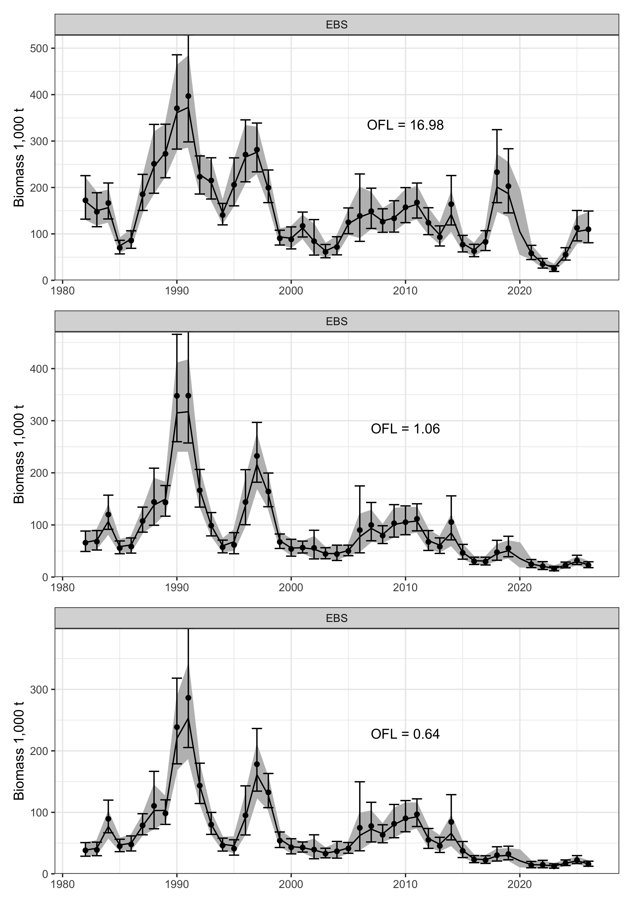
```

```{r tier4-status-series, echo=FALSE, out.width="88%", fig.cap="Tier 4 stock status (biomass relative to the B~MSY~ proxy) computed on the raw survey series for the two large-male currencies. The red line is the closure threshold beta, below which the OFL is zero; the green line is half the proxy, the minimum stock size threshold. The series is shown on the raw observations rather than the smoothed fit, so it is more variable than the status reported for the specification, which is computed from the REMA fit in Figure \\@ref(fig:rema-fit)."}
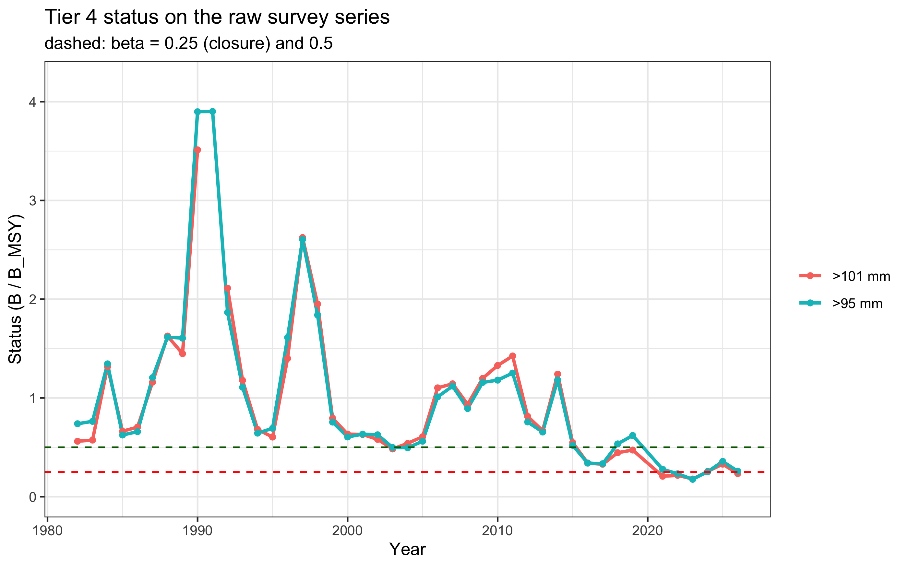
```

```{r retro-drop-survey, echo=FALSE, warning=FALSE, message=F, out.width="100%", fig.cap="Retrospective analysis with the terminal survey year withheld in addition to the peeled years, isolating the leverage of the most recent survey observation on the terminal biomass estimate. Peels are compared against the model fit to all data."}

retro_drop_png <- "plots/retro_mmb_drop_survey.png"
if (file.exists(retro_drop_png)) {
  knitr::include_graphics(retro_drop_png)
} else {
  cat("*Dropped-terminal-survey retrospective figure not yet generated; see `06_run_retrospective.R` to produce `plots/retro_mmb_drop_survey.png`.*")
}
```

\newpage


```{r retro-terminal, echo=FALSE, warning=FALSE, message=F, out.width="100%", fig.cap="Terminal-year mature male biomass from each retrospective peel (colored) against the mature male biomass time series estimated by the model fit to all data (black). Systematic separation between the colored and black series is the retrospective pattern."}

retro_term_png <- "plots/retro_terminal_mmb.png"
if (file.exists(retro_term_png)) {
  knitr::include_graphics(retro_term_png)
} else {
  cat("*Terminal-year retrospective figure not yet generated; see `06_run_retrospective.R` to produce `plots/retro_terminal_mmb.png`.*")
}
```

\newpage


<!--
The retrospective reference-point figure was REMOVED on 2026-08-27, not
temporarily disabled. GMACS does not compute reference points for a peeled run
(gmacsbase.TPL 2.20.34 gates both call sites on nyrRetroNo == 0, :5478 and
:13625), so every peel returns BMSY, OFL and B/BMSY as exactly 0.

The chunk that stood here read plots/retro_refpoints.png if present. On any
working copy still carrying a pre-2026-08-27 copy of that file, it embedded a
plot of zeros under the caption "Management quantities recomputed for each
retrospective peel" -- a plausible-looking figure of nothing, which is the
failure CLAUDE.md rule 1 exists to prevent. Do not reinstate it.

The retrospective reports MMB and recruitment; the terminal fit's reference
points are in the model directory and retro/base_run.csv.
-->

```{r mmbfits, echo=FALSE, warning=FALSE, message=F, fig.width=9, fig.height=5.5, fig.cap="Model fits to the observed mature biomass at survey (1,000 t), for the five models fitted under GMACS 2.20.34. Model 25.3, which was fitted under GMACS 2.20.22 to a survey series ending in 2025, is not plotted. [[author: the chunk has excluded this model since the May cycle; confirm that is still intended and that this is the reason.]]"}

# --- 1. Process Prediction Data and Add Hybrid Status ---
dfrIndxFit_plot <- wtsGMACS::extractRep1Results(reslst, "Index_fit_summary") |> 
  dplyr::filter(case != "25.1 gmacs" & maturity != "immature") %>%
  dplyr::mutate(
    across(c(year, obs, base_CV, actual_CV, q, prd, prsn_res), as.numeric)
  ) |> 
  dplyr::rename(
    predicted = prd,
    residuals = prsn_res,
    model     = case
  ) |> 
  dplyr::mutate(
    # Categorize models based on the long label *before* shortening it
    hybrid_status = ifelse(grepl("hyb_surv|hyb_both", model, ignore.case = TRUE),
                           "Hybrid Included",
                           "Standard Survey"),
    maturity_status = ifelse(grepl("new_mat", model, ignore.case = TRUE),
                           "New maturity",
                           "Old maturity"),
    # Compact shortname for the legend
    model = to_short(model),
    # Confidence interval calculations
    sd_log = sqrt(log(1 + actual_CV^2)),
    lba    = qlnorm(0.05, log(obs), sd_log),
    uba    = qlnorm(0.95, log(obs), sd_log)
  )

check <- dfrIndxFit_plot %>%
  filter(year == 2019 & sex == "male") %>%
  select(sex, hybrid_status, maturity_status, obs, model)

# --- 2. Extract Unique Observations ---
# This ensures we only plot a single set of points and black error bars
dfrObs <- dfrIndxFit_plot |> 
  dplyr::distinct(year, sex, hybrid_status, maturity_status, obs, lba, uba)

# --- 3. Generate the 4-Panel Plot ---
p_idx_final <- ggplot() +
  # Model Predictions (Colored lines, plotted first so they sit behind points)
  geom_line(
    data = dfrIndxFit_plot, 
    aes(x = year, y = predicted, color = model), 
    lwd = 0.9, 
    alpha = 0.8
  ) +
  # Observations (Single black error bar per year/sex/panel)
  geom_errorbar(
    data = dfrObs,
    aes(x = year, ymin = lba, ymax = uba), 
    width = 0.3, 
    color = "black",
    alpha = 0.6
  ) +
  # Observations (Single black point per year/sex/panel)
  geom_point(
    data = dfrObs,
    aes(x = year, y = obs), 
    size = 1.2,
    color = "black"
  ) +
  # Formatting and Scales
  scale_y_continuous(limits = c(0, NA), expand = expansion(mult = c(0, 0.1))) +
  labs(
    x = "Year", 
    y = "NMFS Survey Biomass (1,000 t)",
    color = "Model Prediction",
    subtitle = "Points/Bars: Shared Observations | Lines: Model Fits",
    caption = "Error bars represent 95% log-normal confidence intervals on observations."
  ) +
  facet_grid(sex ~ hybrid_status + maturity_status, scales = "free_y") + 
  theme_bw() +
  theme(
    legend.position = "bottom",
    legend.text = element_text(size = 8),
    strip.background = element_rect(fill = "white"),
    panel.spacing = unit(1, "lines")
  )

print(p_idx_final)

```

\newpage


<!--
DISABLED 2026-08-28, same cause as `surveyplots` above. This figure filters
Index_fit_summary on maturity == "immature", and NO model in the September set
carries an immature survey index -- that index existed only in the pruned
`imm_surv` candidates, and the CPT and SSC both agreed it should not be treated
as a convergence fix. Index_fit_summary now contains only maturity == "mature",
so the filter returns zero rows and the chunk died with "Faceting variables must
have at least one value".

Nothing cross-references fig:immfits, so disabling it leaves no dangling link.
Kept as code rather than deleted, in case an immature index returns.

[[author: delete outright if the immature index is not coming back.]]
-->
```{r immfits, eval=FALSE, echo=FALSE, warning=FALSE, message=F, fig.width=9, fig.height=5.5, fig.cap="Model fits to the observed immature survey biomass for models that include the immature survey index. Panels separate models by maturity workflow (old vs. new) and hybrid treatment."}

# --- 1. Process Immature Index Data and Add Hybrid / Maturity Status ---
dfrImmFit_plot <- wtsGMACS::extractRep1Results(reslst, "Index_fit_summary") |>
  dplyr::filter(case != "25.1 gmacs" & maturity == "immature") %>%
  dplyr::mutate(
    across(c(year, obs, base_CV, actual_CV, q, prd, prsn_res), as.numeric)
  ) |>
  dplyr::rename(
    predicted = prd,
    residuals = prsn_res,
    model     = case
  ) |>
  dplyr::mutate(
    hybrid_status = ifelse(grepl("hyb_surv|hyb_both", model, ignore.case = TRUE),
                           "Hybrid Included",
                           "Standard Survey"),
    maturity_status = ifelse(grepl("new_mat", model, ignore.case = TRUE),
                           "New maturity",
                           "Old maturity"),
    model = to_short(model),
    sd_log = sqrt(log(1 + actual_CV^2)),
    lba    = qlnorm(0.05, log(obs), sd_log),
    uba    = qlnorm(0.95, log(obs), sd_log)
  )

# --- 2. Extract Unique Observations ---
dfrObs <- dfrImmFit_plot |>
  dplyr::distinct(year, sex, hybrid_status, maturity_status, obs, lba, uba)

# --- 3. Generate the Plot ---
p_imm_final <- dfrImmFit_plot %>% 
  ggplot() +
  geom_line(
    aes(x = year, y = predicted, color = model),
    lwd = 0.9,
    alpha = 0.8
  ) +
  geom_errorbar(
    aes(x = year, ymin = lba, ymax = uba),
    width = 0.3,
    color = "black",
    alpha = 0.6
  ) +
  geom_point(
    aes(x = year, y = obs),
    size = 1.2,
    color = "black"
  ) +
  scale_y_continuous(limits = c(0, NA), expand = expansion(mult = c(0, 0.1))) +
  labs(
    x = "Year",
    y = "NMFS Immature Survey Biomass (1,000 t)",
    color = "Model Prediction",
    subtitle = "Points/Bars: Shared Observations | Lines: Model Fits",
    caption = "Error bars represent 95% log-normal confidence intervals on observations."
  ) +
  facet_grid(sex ~ hybrid_status + maturity_status, scales = "free_y") +
  theme_bw() +
  theme(
    legend.position = "bottom",
    legend.text = element_text(size = 8),
    strip.background = element_rect(fill = "white"),
    panel.spacing = unit(1, "lines")
  )

print(p_imm_final)

```
<!---BLOCK_LANDSCAPE_STOP--->
\elandscape
\newpage


```{r catchfits, echo=FALSE, warning=FALSE, message=F, fig.width=8, fig.height=8, fig.cap="Model fits to catch data (1,000 t), for all models presented."}

# --- 1. Process Catch Fit Data and Add Hybrid Status ---
dfrCatFit_plot <- wtsGMACS::extractRep1Results(reslst, "Catch_fit_summary") |> 
  dplyr::mutate(
    # Ensure numeric types
    across(c(year, obs, cv, effort, HM, prd, rsd), as.numeric)
  ) |> 
  dplyr::rename(
    predicted = prd,
    residuals = rsd,
    model     = case
  ) |> 
  dplyr::mutate(
    # Identify if a model includes hybrid discards based on its long name
    hybrid_status = ifelse(grepl("hyb_both|hyb_fishery", model, ignore.case = TRUE),
                           "Hybrid Included",
                           "Standard Data"),
    # Compact shortname for the legend
    model = to_short(model),
    # Create descriptive row labels for faceting
    series = dplyr::case_when(
      fleet == "Trawl_Bycatch" ~ "Non-directed Bycatch",
      type == "retained" ~ "Directed Retained (Male)",
      type == "discard" & sex == "male"   ~ "Directed Discard (Male)",
      type == "discard" & sex == "female" ~ "Directed Discard (Female)",
      TRUE ~ paste(fleet, type, sex)
    )
  )

# --- 2. Extract Unique Observations ---
# This ensures that for models sharing the same data, only one point is plotted
dfrObs <- dfrCatFit_plot |> 
  dplyr::distinct(year, series, hybrid_status, obs)

# --- 3. Generate the 2-Column Comparison Plot ---
p_catch <- ggplot() +
  # 1. Model Predictions (Lines)
  geom_line(
    data = dfrCatFit_plot, 
    aes(x = year, y = predicted, color = model), 
    lwd = 0.8, 
    alpha = 0.8
  ) +
  # 2. Observations (Points)
  geom_point(
    data = dfrObs,
    aes(x = year, y = obs), 
    size = 1.2,
    color = "black"
  ) +
  # 3. Formatting and Scales
  scale_y_continuous(limits = c(0, NA), expand = expansion(mult = c(0, 0.1))) +
  labs(
    x = "Year", 
    y = "Catch (1,000 t)",
    color = "Model Scenario",
    title = "Fishery Catch and Bycatch Fits",
    subtitle = "Black points: Observations | Colored lines: Model predictions",
    caption = "Observations in the 'Hybrid Included' column contain hybrid crab discards (1,000 t). [[author: the hybrid cases are not in the September model set; drop this panel or label it as a May-cycle record.]]"
  ) +
  # Grid: Series (Rows) x Hybrid Status (Columns)
  facet_grid(series ~ hybrid_status, scales = "free_y") + 
  theme_bw() +
  theme(
    legend.title=element_blank(),
    legend.position = "bottom",
    strip.text.y = element_text(size = 8, angle = 0), # Keep labels readable
    strip.background = element_rect(fill = "white"),
    panel.spacing = unit(1, "lines")
  )

print(p_catch)

```
\newpage

```{r growthfits, echo=FALSE, warning=FALSE, message=F, fig.width=8, fig.height=6, fig.cap="Model fits (colored lines) to the growth data (dots). Black dots are historical observations; red dots are new data for 2025."}


dfrMnGr = wtsGMACS::extractRep1Results(reslst,"Mean growth") |>
  dplyr::mutate(dplyr::across(3:5,as.numeric)) |>
  dplyr::mutate(case = to_short(case));

grow_dat<-read.csv("data/growth/growth_increments.csv")
grow_dat$sex<-ifelse(grow_dat$sex==1,'male','female')   # numeric 1/2 -> facet label

ggplot()+
  geom_line(data=dfrMnGr,aes(x=premolt_size,y=mean_increment,col=case))+
  geom_point(data=grow_dat,aes(x=premolt,y=increment),alpha=.4)+
  facet_wrap(~sex)+
  theme_bw() + 
  theme(legend.title=element_blank())
#==add data
```

\newpage


```{r obs-101-vs-pred, echo=FALSE, warning=FALSE, message=F, out.width="100%", fig.width=6.5, fig.height=7, fig.cap="Estimated abundance of male crab >101mm carapace width from the survey (black line and dots with gray 95% CI) and from each model in the assessment (colored lines). [[author: the plotted quantity is the crabpack ABUNDANCE field divided by 1,000; state the resulting unit (thousands or millions of crab) -- it could not be established from the source.]]"}
EBSdata	<-read.csv("data/survey/survey_large_male_index_derived.csv")
EBSdata	<-EBSdata[EBSdata$CATEGORY=="preferred_male",]
#==make upper and lower CIs
EBSdata$upper_bio_ci<-exp(log(EBSdata$BIOMASS_MT)+1.96*(sqrt(log(1+EBSdata$BIOMASS_MT_CV^2))))
EBSdata$lower_bio_ci<-exp(log(EBSdata$BIOMASS_MT)-1.96*(sqrt(log(1+EBSdata$BIOMASS_MT_CV^2))))
EBSdata$upper_abn_ci<-exp(log(EBSdata$ABUNDANCE)+1.96*(sqrt(log(1+EBSdata$ABUNDANCE_CV^2))))
EBSdata$lower_abn_ci<-exp(log(EBSdata$ABUNDANCE)-1.96*(sqrt(log(1+EBSdata$ABUNDANCE_CV^2))))

#==take predicted survey
dfrN_YXMSZ = wtsGMACS::extractRep1Results(reslst,"N_YXMSZ") |> 
  tidyr::pivot_longer(cols=!c(case,year,sex,maturity,shell_con),
                      names_to="size",
                      values_to="est") |> 
  dplyr::mutate(dplyr::across(c(year,size,est),
                              as.numeric),
                xm=paste(maturity,sex)
  );

pred_101_n2<-filter(dfrN_YXMSZ,sex=='male'&size>101)%>%
  group_by(year,case)%>%
  dplyr::summarize(ABN=sum(est))

pred_101_n3<-filter(dfrN_YXMSZ,sex=='male'&size==97.5)%>%
  group_by(year,case)%>%
  dplyr::summarize(ABN=3/5*sum(est))

pred_101_n2$tot_ABN<-(pred_101_n2$ABN+pred_101_n3$ABN)

# Shortnames for the color legend
pred_101_n2$case <- to_short(pred_101_n2$case)


male_101<-EBSdata
div_n<-1000
large_males2<-ggplot()+
  geom_ribbon(data=male_101,aes(x=YEAR,ymin=lower_abn_ci/div_n,ymax=upper_abn_ci /div_n),fill='light grey')+
  geom_line(data=male_101,aes(x=YEAR,y=ABUNDANCE/div_n))+
  geom_point(data=male_101,aes(x=YEAR,y=ABUNDANCE/div_n))+
  geom_line(data=pred_101_n2,aes(x=year,y=tot_ABN,color=case),lwd=1.1,alpha=0.6)+
  theme_bw()+
  theme(legend.position='bottom',
    legend.title=element_blank())+
  expand_limits(y=0)+
  xlab("")+
  scale_y_continuous(name="Abundance (1,0000,000s)",position='left',limits=c(0,650000))

print(large_males2)


```

\newpage

```{r obs-101-vs-pred-bio, echo=FALSE, warning=FALSE, message=F, out.width="100%", fig.width=6.5, fig.height=7,  fig.cap="Estimated biomass (1,000 t) of male crab >101mm carapace width from the survey (black line and dots with gray 95% CI) and from each model in the assessment (colored lines)."}

# Weight-at-size for mature males (kg per crab) from the report model.
# Weight-at-size is fixed input data, so a single year is representative.
wt_row <- reslst$repsLst[[names(report_model)]]$IndivWeightByXM |>
  dplyr::filter(Sex == "male", Year == 1982, Maturity == "mature")
male_wt_lookup <- data.frame(
  size = as.numeric(names(wt_row |> dplyr::select(matches("^[0-9]")))),
  wt   = as.numeric(wt_row |> dplyr::select(matches("^[0-9]")))
)

pred_101_b2 <- filter(dfrN_YXMSZ, sex == 'male' & size > 101) |>
  dplyr::left_join(male_wt_lookup, by = "size") |>
  dplyr::group_by(year, case) |>
  dplyr::summarize(BIO = sum(est * wt), .groups = "drop")

pred_101_b3 <- filter(dfrN_YXMSZ, sex == 'male' & size == 97.5) |>
  dplyr::left_join(male_wt_lookup, by = "size") |>
  dplyr::group_by(year, case) |>
  dplyr::summarize(BIO = 3/5 * sum(est * wt), .groups = "drop")

pred_101_b2$tot_BIO <- pred_101_b2$BIO + pred_101_b3$BIO
pred_101_b2$case <- to_short(pred_101_b2$case)

div_b <- 1000
large_males_bio <- ggplot() +
  geom_ribbon(data = male_101,
              aes(x = YEAR,
                  ymin = lower_bio_ci / div_b,
                  ymax = upper_bio_ci / div_b),
              fill = 'light grey') +
  geom_line(data=male_101,aes(x=YEAR,y=BIOMASS_MT /div_b))+
  geom_point(data=male_101,aes(x=YEAR,y=BIOMASS_MT /div_b))+
  geom_line(data = pred_101_b2,
            aes(x = year, y = tot_BIO/1e6, color = case),
            lwd = 1.1, alpha = 0.6) +
  theme_bw() +
  theme(legend.position = 'bottom',
    legend.title=element_blank()) +
  expand_limits(y = 0) +
  xlab("") +
  scale_y_continuous(name = "Biomass (1,000 mt)", position = 'left')

print(large_males_bio)

```

\newpage


```{r select-prior, echo=FALSE, warning=FALSE, message=F, fig.height=5, fig.width=6.5, fig.cap="Estimated survey selectivity (lines) with normal priors derived from BSFRF selectivity experiment data. Points are the mean of the prior at a given size; intervals are 95th quantiles based on input CVs."}


#--selectivity----
zBs = wtsGMACS::extractRep1Results(reslst,"size_midpoints")[[1]];
nZBs = length(zBs);
dfrSel = wtsGMACS::extractRep1Results(reslst,"selfcns") |> 
  dplyr::filter(type=="capture",
                fleet %in% c("NMFS_Trawl_1982", "NMFS_Trawl_1989")) |>
  tidyr::pivot_longer(cols=4+(1:nZBs),names_to="size",values_to="est") |>
  dplyr::mutate(dplyr::across(c(2,6,7),as.numeric)); 

colnames(dfrSel)[c(5,7)]<-c("model","probability")
plot_dat<-dfrSel[,c(5,1,2,3,4,6,7)]
plot_dat$type[plot_dat$type=="capture"]<-"Capture"
plot_dat$model <- to_short(plot_dat$model)
use_sel<-filter(plot_dat,type%in%c('capture','Capture')&fleet=="NMFS_Trawl_1989")
p <- ggplot() + expand_limits(y = c(0,1))+
  geom_line(data=use_sel,aes(x=size,y=probability,col=model,linetype=type),lwd=1.1)+
  #geom_pointrange(data=sel_prior,aes(x=size, y=mu, ymax = upper, ymin = lower), col = "black")+
  facet_wrap(~fleet+sex,ncol=1)+theme_bw()+
  theme(legend.position='bottom',
        legend.title=element_blank()) +
  labs(
    x = "Carapace width (mm)", 
    y = "Selectivity",
    linetype = element_blank(),
    color = element_blank()
  )


print(p)     


```

\blandscape
<!---BLOCK_LANDSCAPE_START--->

```{r predselectfish, echo=FALSE, warning=FALSE, message=F, fig.height=6.5, fig.width=10, fig.cap="Estimated selectivities by fishing fleet and sex for capture and retained catches."}

zBs = wtsGMACS::extractRep1Results(reslst,"size_midpoints")[[1]];
nZBs = length(zBs);
dfrSel = wtsGMACS::extractRep1Results(reslst,"selfcns") |> 
  dplyr::filter(type!="discard",
                fleet %in% c("Pot_Fishery","Trawl_Bycatch")) |>
  tidyr::pivot_longer(cols=4+(1:nZBs),names_to="size",values_to="est") |>
  dplyr::mutate(dplyr::across(c(2,6,7),as.numeric)); 


colnames(dfrSel)[c(5,7)]<-c("model","probability")
plot_dat<-dfrSel
plot_dat$type[plot_dat$type=="capture"]<-"Capture"
plot_dat$model <- to_short(plot_dat$model)
fish_mdf<-filter(plot_dat,fleet%in%c("Pot_Fishery","Trawl_Bycatch"))
levels(fish_mdf$fleet)[2]<-"Non-directed bycatch"
fish_mdf$type[fish_mdf$type=="retained"]<-"Retained"
p <- ggplot(fish_mdf) + 
  expand_limits(y = c(0,1))+
  geom_line(aes(x=size,y=probability,col=model,linetype=type),lwd=1.15,alpha=.75)+
  facet_wrap(~fleet+sex)+
  theme_bw()+
  theme(legend.position='bottom',
    color = element_blank(),
    legend.title=element_blank())

print(p)
```
<!---BLOCK_LANDSCAPE_STOP--->
\elandscape
\newpage

```{r predfmort, echo=FALSE, warning=FALSE, message=F, fig.height=8, fig.width=8, fig.cap="Estimated fishing mortalities (per year) for the directed and non-directed fisheries."}

# --- 1. Robust Data Extraction across Models ---
# We loop through all models in reslst to find the correctly named F-dataframe
dfrF_plot <- names(reslst$repsLst) |> 
  purrr::map_dfr(function(c_name) {
    rep_obj <- reslst$repsLst[[c_name]]
    
    # Identify which name this specific model run used
    f_df_name <- intersect(
      names(rep_obj), 
      c("Fully-selected_capture_rate_by_season_sex_and_fishery", 
        "Fully-selected_FM_by_season_sex_and_fishery")
    )[1]
    
    if (is.na(f_df_name)) return(NULL)
    
    # Extract and clean
    rep_obj[[f_df_name]] |> 
      dplyr::mutate(
        Model = c_name,
        # Ensure consistency across versions (some use 'year', others 'Year')
        Year = as.numeric(year)
      )
  })

# --- 2. Clean and Filter Data for Plotting ---
plot_dat <- dfrF_plot |>
  dplyr::mutate(
    # Rename fleets for the report
    Fleet = dplyr::case_when(
      fleet == "Pot_Fishery" ~ "Directed Pot Fishery",
      fleet == "Trawl_Bycatch" ~ "Non-directed Bycatch",
      TRUE ~ fleet
    ),
    # Capitalize sex for headers
    Sex = stringr::str_to_title(sex),
    # Ensure mortality values are numeric (assuming season 2 is the primary fishery)
    F_value = as.numeric(`2`),
    # Compact shortname for the legend
    Model   = to_short(Model)
  ) |>
  # Filter only for the primary fishing fleets
  dplyr::filter(Fleet %in% c("Directed Pot Fishery", "Non-directed Bycatch"))

# --- 3. Generate the Comparison Plot ---
p_f_mort <- ggplot(plot_dat, aes(x = Year, y = F_value, color = Model, group = Model)) +
  # Model estimates
  geom_line(lwd = 1.1, alpha = 0.7) +
  # Layout and Scales
  facet_grid(Fleet ~ Sex, scales = "free_y") +
  scale_y_continuous(limits = c(0, NA), expand = expansion(mult = c(0, 0.1))) +
  theme_bw() +
  labs(
    title = "Estimated Fully-Selected Fishing Mortality",
    subtitle = "Calculated for the primary fishing season (Season 2)",
    x = "Year",
    y = "Fishing Mortality (F)",
    color = element_blank()
  ) +
  theme(
    legend.position = "bottom",
    strip.background = element_rect(fill = "white"),
    panel.spacing = unit(1, "lines")
  )

print(p_f_mort)

```


\newpage

```{r predmat, echo=FALSE, warning=FALSE, message=F, fig.height=8, fig.width=6.5, fig.cap="Estimated (black line) or specified (colored lines) probabilities of maturing."}
# --- 1. Extract and Process Maturity Data ---
# case_for_data_table can be a single string or a vector of strings
plotdat_all <- case_for_mat_plot %>%
  purrr::map_dfr(function(case_name) {
    # Access the output list directly
    dat <- reslst$outsLst[[case_name]]$mature_probability
    
    if (is.null(dat)) {
      message("Warning: No mature_probability data for ", case_name)
      return(NULL)
    }
    
    # Pivot from wide to long format
    dat %>%
      tidyr::pivot_longer(
        cols = -c(Sex, Year),
        names_to = "width",
        values_to = "prob"
      ) %>%
      dplyr::mutate(
        # Compact shortname for the legend
        Model = as.character(to_short(case_name)),
        # Logic to separate models with "newmat" (uses long label for the test)
        Maturity_Source = ifelse(grepl("new_mat", case_name, ignore.case = TRUE),
                                 "New Maturity Workflow",
                                 "Standard Maturity Data"),
        width = as.numeric(as.character(width)),
        prob = as.numeric(prob),
        # Ensure Year is a factor for discrete coloring if desired,
        # or keep numeric for a gradient
        Year_Fact = as.factor(Year)
      )
  })

# --- 2. Generate the Split Plot ---
p_molt <- plotdat_all %>%
  mutate(Year = as.numeric(Year)) %>%
 ggplot(aes(x = width, y = prob, color = Year_Fact)) +
  # Use group to ensure lines are drawn per Year/Model combination
  geom_line(lwd = 1.1, alpha = 0.7) +
  # Force y-axis from 0 to 1
  scale_y_continuous(limits = c(0, 1), expand = c(0, 0)) +
  theme_bw() +
  labs(
    x = "Carapace Width (mm)", 
    y = "Probability of Terminal Molt",
    col = "Year",
    title = "Probability of Maturing / Terminal Molt",
    subtitle = "Separated by Maturity Data Specification"
  ) +
  # Facet rows by Data Source (Standard vs Newmat) and columns by Sex
  facet_grid(Maturity_Source ~ Sex) + 
  theme(
    legend.position = "bottom",
    strip.background = element_rect(fill = "white"),
    panel.spacing = unit(1, "lines")
  )

# Render the plot
print(p_molt)

```


\newpage

```{r recruits, echo=FALSE, warning=FALSE, message=F, fig.height=8, fig.width=6.5, fig.cap="Estimated recruitment by sex (billions of crab), for all models presented."}


dfr_m = wtsGMACS::extractRep1Results(reslst,"Summary") |> 
  dplyr::select(case,year,rec_male)
dfr_f = wtsGMACS::extractRep1Results(reslst,"Summary") |> 
  dplyr::select(case,year,rec_female) 

dfr_m$sex<-"Male"
colnames(dfr_m)<-c("model","Year","Recruits","sex")
dfr_f$sex<-"Female"
colnames(dfr_f)<-c("model","Year","Recruits","sex")

plot_dat<-rbind(dfr_f[,c(3,4,2,1)],dfr_m[,c(3,4,2,1)])

plot_dat$Recruits<-as.numeric(plot_dat$Recruits)
plot_dat$Year<-as.numeric(plot_dat$Year)
plot_dat$model<-to_short(plot_dat$model)
ggplot(plot_dat)+
  geom_line(aes(x=Year,y=Recruits,col=model),lwd=1.15)+
  labs(col="Model")+
  theme_bw()+facet_wrap(~sex,ncol=1,scales='free_y')


``` 


\newpage

```{r nat-m, echo=FALSE, warning=FALSE, message=F, fig.height=7.5, fig.width=6.5, fig.cap="Estimated natural mortality (per year) by sex and maturity state. Natural mortality in all years previous to 2018 and after 2019 are equal to the estimated M in 2017. Note that the y-axis is capped at 5."}


# --- 1. Extract and Process Natural Mortality Data ---
dfrMbyXM_plot <- wtsGMACS::extractRep1Results(reslst, "Natural_mortality-by-class") |> 
  tidyr::pivot_longer(
    cols = -c(case, year, sex, maturity),
    names_to = "size", 
    values_to = "M_value"
  ) |> 
  dplyr::mutate(
    year = as.numeric(year),
    size = as.numeric(size),
    M_value = as.numeric(M_value)
  ) |> 
  # Filter for selected models and the base size class
  # (M is typically constant across sizes in these models)
  dplyr::filter(size == 27.5) |> 
  dplyr::mutate(
    # Clean up labels for the report
    Sex = stringr::str_to_title(sex),
    Maturity = stringr::str_to_title(maturity),
    # Compact shortname for the legend
    Model = to_short(case)
  )

# --- 2. Generate the Comparison Plot ---
p_nat_m <- ggplot(dfrMbyXM_plot, aes(x = year, y = M_value, color = Model, group = Model)) +
  # Model Estimates
  geom_line(lwd = 1.1, alpha = 0.7) +
  geom_point(size = 2, alpha = 0.8) +
  # Focus on the 2018-2019 mortality event window; allow the immature-index
  # model's elevated mature-male M to be visible (let ggplot pick the upper
  # limit from the data rather than clipping at 5).
  coord_cartesian(xlim = c(2015, 2022)) +
  scale_y_continuous(limits = c(0, NA), expand = expansion(mult = c(0, 0.1))) +
  theme_bw() +
  labs(
    title = "Estimated Natural Mortality (M)",
    subtitle = "Focusing on 2018-2019 Mortality Events",
    x = "Year",
    y = "Natural Mortality (M)",
    color = element_blank()
  ) +
  ylim(0, 5) +
  # 2x2 grid by Sex and Maturity
  facet_wrap(~Sex + Maturity) +
  theme(
    legend.position = "bottom",
    strip.background = element_rect(fill = "white"),
    panel.spacing = unit(1, "lines")
  )

# Render the plot
print(p_nat_m)

```

\newpage

```{r predmmb, echo=FALSE, warning=FALSE, message=FALSE, eval = TRUE, fig.height=8, fig.width=8, fig.cap="Model predicted mature male abundance (MMA; 1,000s) and biomass (MMB; 1,000 tonnes) and abundance at mating time."}
#=========================================================
#  Plot derived quantities
#=========================================================

dfr = wtsGMACS::extractRep1Results(reslst,"Summary") |>
  dplyr::select(case, year, SSB, SSA) |>
  dplyr::rename(MMB = SSB,
                MMA = SSA) |>
  # Coerce only the numeric columns (the previous `across(everything())`
  # silently turned `case` into NA via as.numeric on the model labels).
  dplyr::mutate(across(c(year, MMB, MMA), as.numeric)) |>
  dplyr::mutate(case = to_short(case)) |>
  tidyr::pivot_longer(cols = c(MMB, MMA),
                       names_to = "metric",
                       values_to = "value") |>
   dplyr::mutate(metric = dplyr::recode(metric,
                                        BIO = "Biomass (1,000 t)",
                                        ABN = "Abundance"))

#==add reference points back in
ggplot(dfr)+
  geom_line(aes(x = year,y = value, col = case)) +
  labs(col="Model", x="Year", y="MMB (1,000 t)") +
  facet_wrap(~ metric, ncol = 1, scales = "free_y") +
  theme(legend.position = 'bottom',
         strip.background = element_rect(fill = "white")) +
  theme_bw() +
  labs(x = "Year", y = NULL, color = "Model") +
  expand_limits(y=0)

```


\newpage

# Size composition fits

```{r size-comp-plots, results='asis', echo=FALSE, warning=FALSE, message=FALSE, out.width="100%"}

# Order comp plots by base fleet, comp_type, sex, maturity so that fits across
# model variants (hybrid/compfix/plus_group; new vs. old maturity ogive) for
# the same data block sit next to each other.
img_folder <- "plots"
img_files  <- list.files(path = img_folder, pattern = "^size_comp_plot_", full.names = TRUE)

parse_meta <- function(f) {
  base  <- tools::file_path_sans_ext(basename(f))
  desc  <- sub("^size_comp_plot_\\d+_", "", base)
  parts <- strsplit(desc, "_")[[1]]
  sex_idx <- which(parts %in% c("male", "female"))[1]
  if (is.na(sex_idx)) {
    return(data.frame(file = f, fleet_full = NA_character_, base_fleet = NA_character_,
                      comp_type = NA_character_, sex = NA_character_,
                      maturity = NA_character_, ogive = NA_character_,
                      stringsAsFactors = FALSE))
  }
  fleet_full <- paste(parts[seq_len(sex_idx - 1)], collapse = "_")
  sex        <- parts[sex_idx]
  comp_type  <- parts[sex_idx + 1]
  maturity   <- parts[sex_idx + 2]
  ogive      <- if (sex_idx + 3 <= length(parts))
                  paste(parts[seq(sex_idx + 3, length(parts))], collapse = "_") else NA_character_
  base_fleet <- tolower(fleet_full)
  base_fleet <- sub("_(hybrid|compfix|plus_group)$", "", base_fleet)
  data.frame(file = f, fleet_full = fleet_full, base_fleet = base_fleet,
             comp_type = comp_type, sex = sex, maturity = maturity, ogive = ogive,
             stringsAsFactors = FALSE)
}

meta <- do.call(rbind, lapply(img_files, parse_meta))

meta$comp_type <- factor(meta$comp_type, levels = c("retained", "total", "discarded"))
meta$sex       <- factor(meta$sex,       levels = c("female", "male"))
meta$maturity  <- factor(meta$maturity,  levels = c("immature", "mature", "undetermined"))

meta <- meta[order(meta$base_fleet, meta$comp_type, meta$sex, meta$maturity,
                   meta$fleet_full, meta$ogive), ]

make_caption <- function(f) {
  base <- tools::file_path_sans_ext(basename(f))
  desc <- sub("^size_comp_plot_\\d+_", "", base)
  desc <- gsub("_", " ", desc)
  # "compfix" and "plus group" are internal configuration shorthands from the
  # fleet-splitting in the setup chunk; they read as if they were separate
  # fleets. Name what they mean, and say which models are plotted -- the caption
  # previously identified the panel only by maturity workflow (2026-08-29).
  desc <- sub("Pot fishery compfix", "Pot Fishery (corrected composition)", desc)
  desc <- sub("Pot fishery plus group", "Pot Fishery (expanded plus group)", desc)
  desc <- sub("NMFS Trawl", "NMFS trawl survey", desc)
  paste0("Model fits (lines) to size composition data (grey bars), all models ",
         "presented: ", desc, ". Proportions by 5 mm carapace-width bin.")
}

# Initialize trackers with empty strings
last_fleet <- ""
last_sex_mat <- ""

for (i in 1:nrow(meta)) {
  row <- meta[i, ]
  
  # 1. Check for Fleet change (## Header)
  if (row$base_fleet != last_fleet) {
    # Print the header (cleaning up underscores for readability)
    cat("\n## Fleet: ", tools::toTitleCase(gsub("_", " ", row$base_fleet)), "\n\n")
    
    # Update tracker
    last_fleet <- row$base_fleet
    # Reset sex_mat tracker so it prints for the new fleet section 
    # even if it's the same category as the end of the last fleet
    last_sex_mat <- "" 
  }
  
  # 2. Check for Sex/Maturity change (### Header)
  current_sex_mat <- paste(row$sex, "and", row$maturity)
  if (current_sex_mat != last_sex_mat) {
    cat("\n### ", tools::toTitleCase(current_sex_mat), "\n\n")
    last_sex_mat <- current_sex_mat
  }
  
  # 3. Print the Plot
  # {width=100%} is required. These are raw markdown images emitted with cat(),
  # so the chunk's out.width does NOT apply to them -- knitr only sizes figures
  # it generates itself. The size-comp PNGs are 8 x 8 in at 300 dpi against a
  # 6.5 in text width, so without this they ran off the page (2026-08-29).
  cat(", "){width=100%}\n\n", sep = "")
  
  # Optional: Add page break after every plot, or move this inside the header 
  # logic if you only want page breaks between fleets.
  cat("\\newpage\n\n")
}


```


\newpage

# Appendix C. Convergence diagnostics

```{r conv-appendix-setup, echo=FALSE, warning=FALSE, message=FALSE}
## Appendix C reads the PER-MODEL jitter files. 05_run_jitter.R writes
## Models/rda_jitter.RData at a fixed path whatever --model is given, so each run
## overwrites the last; the per-model copies below are what survives. Absent
## files drop out with a visible note rather than a plausible blank row.
##
## Only WITHIN-model statistics are tabulated -- how often a model finds its own
## best optimum. Likelihoods are NOT compared across these rows: two of the three
## experiments run on forked TPLs whose objective functions carry terms stock
## 2.20.34 does not have (see diagnostic_models in 0-models.R).
conv_files <- c(
  "Model 26.1b (accepted)" = "Models/rda_jitter.RData",
  "Model 26.2 (male-only)" = "Models/rda_jitter_male_only.RData",
  "Model 26.1c (2019 data)" = "Models/rda_jitter_data2019.RData",
  "Model 26.1 (2025 base)"  = "Models/rda_jitter_25.2c.RData",
  "26.d1 stability"         = "Models/rda_jitter_stability.RData",
  "26.d3 eqmdevs"           = "Models/rda_jitter_eqmdevs.RData",
  "26.d4 combined"          = "Models/rda_jitter_combined.RData",
  "26.d5 male-only+eqmdevs" = "Models/rda_jitter_male_only_eqmdevs.RData"
)

conv_row <- function(lab, path) {
  if (!file.exists(path)) return(NULL)
  e <- new.env(); load(path, envir = e); j <- e$jitter
  sm <- j$summary; rs <- j$results
  ok <- !is.na(rs$mode)                       # runs that reached an optimum
  ## The recovery rate that matters is for the model's OWN BEST fit, which is not
  ## what pct_at_best_mode reports. classify_modes() (R/gmacs_jitter.R:604) orders
  ## clusters by their MINIMUM nll and letters them A, B, C best-first, but only
  ## once a cluster holds >= 3 runs; smaller ones are bucketed "minor" whatever
  ## their likelihood. So mode A is the best LETTERED cluster, not the best
  ## solution found: when the true best fit is reached by one or two runs it is
  ## bucketed minor and A is a worse optimum entirely. That is the accepted
  ## model's case exactly. Computed directly here for every model.
  best <- min(rs$objFun[ok], na.rm = TRUE)
  n_at_best <- sum(abs(rs$objFun[ok] - best) < 0.01)
  nmodes <- length(setdiff(unique(rs$mode[ok]), "minor"))
  ## OFL spread across NEAR-OPTIMAL runs (within 2 nll of the best), not across
  ## all usable ones. The all-runs spread answers "how bad can a converged but
  ## wrong run be", which is not the question here and inverts the ranking: on
  ## all usable runs the male-only model looks the WORST of the four despite
  ## having by far the best recovery rate, because its poor runs are further
  ## away. Conditioning on near-optimal runs asks how much the OFL moves among
  ## solutions the data cannot separate, which is the management-relevant spread.
  near <- ok & (rs$objFun - best) <= 2
  n_near <- sum(near)
  ofl_sp <- if (n_near > 1)
    100 * (max(rs$ofl_tot[near]) - min(rs$ofl_tot[near])) / min(rs$ofl_tot[near]) else NA_real_
  data.frame(
    Model = lab,
    Converged = sprintf("%d/%d", sm$n_converged[1], sm$n_runs[1]),
    `Meets 1e-3` = sprintf("%d/%d", sm$n_meets_conventional[1], sm$n_runs[1]),
    Optima = nmodes,
    `Best fit found` = sprintf("%d (%.1f%%)", n_at_best, 100 * n_at_best / sum(ok)),
    `Best lettered mode` = sprintf("%.1f%%", sm$pct_at_best_mode[1]),
    `OFL spread, near-optimal` = if (is.na(ofl_sp)) sprintf("- (n=%d)", n_near)
                                 else sprintf("%.1f%% (n=%d)", ofl_sp, n_near),
    `nll span` = sprintf("%.1f", diff(range(rs$objFun[ok], na.rm = TRUE))),
    check.names = FALSE, stringsAsFactors = FALSE)
}

conv_tab <- do.call(rbind, Map(conv_row, names(conv_files), conv_files))

## Statistics quoted in the concluding paragraph. Computed, not written down:
## three of the review findings on this appendix were hardcoded literals that had
## gone stale against a re-promoted fit, and this paragraph is its most quoted.
.rate <- function(path) {
  if (!file.exists(path)) return(c(NA, NA))
  e <- new.env(); load(path, envir = e); rs <- e$jitter$results
  ok <- !is.na(rs$mode); best <- min(rs$objFun[ok], na.rm = TRUE)
  c(sum(abs(rs$objFun[ok] - best) < 0.01), sum(ok))
}
.r_acc <- .rate(conv_files[["Model 26.1b (accepted)"]])
## Recovery rates are reported as counts with a confidence interval. A formal
## test of proportions was drafted here and removed (Grant, 2026-08-30): the
## p-value is not the register this document is read in, and the interval makes
## the same point -- where two intervals overlap heavily, 100 runs cannot
## separate the configurations.
.ci <- function(path) {
  r <- .rate(path)
  if (anyNA(r)) return(c(NA_real_, NA_real_))
  100 * stats::binom.test(r[1], r[2])$conf.int[1:2]
}
cv_pct_acc  <- 100 * .r_acc[1] / .r_acc[2]
cv_ci_hi    <- 100 * stats::binom.test(.r_acc[1], .r_acc[2])$conf.int[2]
cv_n_acc    <- .r_acc[2]
.r_eqm  <- .rate(conv_files[["26.d3 eqmdevs"]])
.r_stab <- .rate(conv_files[["26.d1 stability"]])
.r_mo   <- .rate(conv_files[["Model 26.2 (male-only)"]])
cv_pct_eqm  <- 100 * .r_eqm[1] / .r_eqm[2]
cv_pct_stab <- 100 * .r_stab[1] / .r_stab[2]
cv_pct_mo   <- 100 * .r_mo[1] / .r_mo[2]
## 26.d5 is the one configuration that improved on the model it was built from,
## so it is tested against 26.2 rather than against the accepted two-sex model.
.r_d5 <- .rate(conv_files[["26.d5 male-only+eqmdevs"]])
.r_d4 <- .rate(conv_files[["26.d4 combined"]])
cv_pct_d5  <- 100 * .r_d5[1] / .r_d5[2]
cv_pct_d4  <- 100 * .r_d4[1] / .r_d4[2]
cv_ci_d5   <- .ci(conv_files[["26.d5 male-only+eqmdevs"]])
cv_ci_mo   <- .ci(conv_files[["Model 26.2 (male-only)"]])
cv_ci_stab <- .ci(conv_files[["26.d1 stability"]])
cv_ci_eqm  <- .ci(conv_files[["26.d3 eqmdevs"]])

## Where the movement between optima actually sits, by parameter class. Written
## by 05b_jitter_movement_decomposition.R; movement is the RANGE (max - min) of
## each parameter across the retained optima, summed within class. Range rather
## than variance because these are alternative optima, not draws from a
## distribution -- one run at an extreme is as meaningful as the spread of the
## rest. Retained = converged (max|grad| < 1e-2) AND within 2 nll of the best,
## which is what keeps this a measure of the likelihood's shape near the optimum
## rather than a measure of optimiser failure.
mv_all <- Sys.glob("data/diagnostics/jitter_movement_by_class_*.csv")
## Pick the ACCEPTED model's file by name. A sort order would select it only by
## alphabetical accident and would silently switch models when another
## configuration is decomposed.
mv_path <- grep("26_gmacs_update_newmat_plus_group", mv_all, value = TRUE)
mv_have <- length(mv_path) == 1
if (mv_have) {
  mv <- read.csv(mv_path, stringsAsFactors = FALSE)
  mv <- mv[order(-mv$share_pct), ]
  ## Shares are recomputed from total_range rather than read, so a hand-edited
  ## share_pct column cannot reach the page.
  mv$share_pct <- 100 * mv$total_range / sum(mv$total_range)
  stopifnot("movement shares must sum to 100" = abs(sum(mv$share_pct) - 100) < 1e-6)
  .sh <- function(cl) sum(mv$share_pct[mv$class %in% cl])
  mv_sexalloc <- .sh("sex allocation")
  mv_female   <- .sh(c("female", "female (F offsets)"))
  mv_male     <- .sh("male")
  mv_fem_plus <- mv_sexalloc + mv_female
  mv_n_opt    <- mv$n_optima[1]
  mv_npar_m   <- mv$n_parameters[mv$class == "male"]
  mv_npar_sa  <- mv$n_parameters[mv$class == "sex allocation"]
  ## Movement PER PARAMETER. The raw counts invite a misleading comparison --
  ## "female" is split across two classes, so male (101) exceeds the female class
  ## (91) but not the female classes combined (134). Density avoids the question
  ## and is the sharper statement anyway.
  .dens <- function(cl) sum(mv$total_range[mv$class %in% cl]) / sum(mv$n_parameters[mv$class %in% cl])
  mv_dens_sa   <- .dens("sex allocation")
  mv_dens_male <- .dens("male")
  mv_dens_ratio <- mv_dens_sa / mv_dens_male
} else {
  mv_sexalloc <- mv_female <- mv_male <- mv_fem_plus <- NA_real_
  mv_dens_sa <- mv_dens_male <- mv_dens_ratio <- NA_real_
  mv_npar_m <- mv_npar_sa <- mv_n_opt <- NA_integer_
}

## Cross-model comparison. Shares are the safe currency here: movement is a RANGE
## across retained optima, and range is not independent of how many optima were
## retained (40 / 20 / 31 across these models), so absolute totals carry a caveat
## that shares do not. `26.d1 stability` is absent by necessity, not oversight --
## only 2 of its runs land within 2 nll of its best fit, below the 3 the
## decomposition needs, because its optima are too dispersed to form a cluster.
.mv_lab <- c("26_gmacs_update_newmat_plus_group" = "Model 26.1b (accepted)",
             "26_gmacs_eqmdevs"                  = "26.d3 eqmdevs",
             "26_gmacs_male_only"                = "Model 26.2 (male-only)",
             "26_gmacs_male_only_eqmdevs"        = "26.d5 male-only + eqmdevs")
## Restrict to the configurations this appendix actually discusses. Decomposition
## files for other models appear in data/diagnostics/ as the diagnostic work
## continues; a new one must not silently join the table (nor abort the knit, as
## it did on 2026-08-30 when a male_only_eqmdevs file landed mid-session). An
## unrecognised file is reported in the console and skipped.
.mv_known <- Filter(function(f) {
  m <- read.csv(f, stringsAsFactors = FALSE)$model[1]
  ok <- m %in% names(.mv_lab)
  if (!ok) message("conv-appendix: skipping unlisted decomposition for '", m, "'")
  ok
}, mv_all)
xm_have <- length(.mv_known) > 1
if (xm_have) {
  xm <- do.call(rbind, lapply(.mv_known, function(f) {
    d <- read.csv(f, stringsAsFactors = FALSE)
    tot <- sum(d$total_range)
    cls <- function(cl) sum(d$total_range[d$class %in% cl])
    data.frame(
      Model = unname(.mv_lab[d$model[1]]),
      Optima = d$n_optima[1],
      `Total movement` = tot,
      `Sex allocation (%)` = 100 * cls("sex allocation") / tot,
      `Female + sex allocation (%)` = 100 * cls(c("female", "female (F offsets)", "sex allocation")) / tot,
      `Male (%)` = 100 * cls("male") / tot,
      `Male movement` = cls("male"),
      check.names = FALSE, stringsAsFactors = FALSE)
  }))
  xm <- xm[order(-xm$`Total movement`), ]
  stopifnot("a cross-model row lost its label" = !any(is.na(xm$Model)))
  ## Plain-named scalars for the prose. Inline `r ` code cannot carry
  ## backtick-quoted column names, so pull them out here.
  .xg <- function(col, mdl) xm[[col]][xm$Model == mdl]
  xm_male_acc  <- .xg("Male movement", "Model 26.1b (accepted)")
  xm_male_eqm  <- .xg("Male movement", "26.d3 eqmdevs")
  xm_male_pct_eqm <- .xg("Male (%)", "26.d3 eqmdevs")
  xm_sa_eqm    <- .xg("Sex allocation (%)", "26.d3 eqmdevs")
  xm_fp_eqm    <- .xg("Female + sex allocation (%)", "26.d3 eqmdevs")
  xm_tot_acc   <- .xg("Total movement", "Model 26.1b (accepted)")
  xm_tot_male  <- .xg("Total movement", "Model 26.2 (male-only)")
  xm_optima_lab <- paste(xm$Optima, collapse = ", ")   # table row order, not sorted
} else {
  xm_male_acc <- xm_male_eqm <- xm_sa_eqm <- xm_fp_eqm <- NA_real_
  xm_tot_acc <- xm_tot_male <- NA_real_; xm_optima_lab <- "NA"
}
conv_have <- !is.null(conv_tab) && nrow(conv_tab) > 0
if (conv_have) stopifnot(
  "a convergence row lost its model label" = !any(is.na(conv_tab$Model)))
```

The June 2026 SSC asked that a focused convergence section identify which parameters separate the jitter clouds. This appendix collects the jitter evidence for every model jittered this cycle, together with three structural experiments built specifically to diagnose the multimodality. **None of the three is an assessment model and none is proposed for any purpose other than diagnosis** --- they are registered separately from the model set in `0-models.R` for that reason.

The diagnostic identified three independent pathologies in the accepted model:

1. `M_pars_est[15]`, the 2019 immature-female natural mortality deviation, is structurally non-identified. It is the only one of the 412 parameters that moves while the objective function does not.
2. The recruitment sex ratio is carried by 44 logits bounded at plus or minus 100 whose only effective restraint is a standard deviation of 2.0 hardcoded in the source rather than read from the control file. Thirteen of the 44 are estimated beyond two standard deviations of that penalty. They are nowhere near the plus or minus 100 bounds --- the estimates span -3.6 to +4.2 --- so it is the penalty, not the bound, that is failing to restrain them.
3. The 1982 initial numbers at length are 83 parameters whose overall level is entirely unpenalised. The only term touching them is a first-difference smoothness penalty, and first differences are invariant to shifting a whole group.

The attribution analysis points at the same place. Of the parameters that most separate the jitter clouds (Table \@ref(tab:jitter-attribution)), the single largest separator is `logit_rec_prop_est`, the recruitment sex allocation --- that is, the second pathology above is not merely present in the model, it is the leading explanation for which optimum a run lands in. That is the direct answer to the SSC's question, and it is also the reason the male-only simplification, which removes the sex allocation entirely, is the only configuration in Table \@ref(tab:conv-table) that reliably recovers its own best fit.

Decomposing the movement between optima by parameter class puts a number on that (Table \@ref(tab:movement-table)). Across the `r mv_n_opt` near-equivalent optima, the recruitment sex allocation alone accounts for `r .f(mv_sexalloc, 1)` percent of all parameter movement, and the female and sex-allocation parameters together account for `r .f(mv_fem_plus, 1)` percent. The male parameters account for `r .f(mv_male, 1)` percent across `r mv_npar_m` parameters, where the sex allocation reaches `r .f(mv_sexalloc, 1)` percent on just `r mv_npar_sa` --- about `r .f(mv_dens_ratio, 0)` times as much movement per parameter. The alternative optima this model admits are therefore very largely disagreements about the female population and how recruitment is split between the sexes, rather than about the male population the assessment exists to manage. That is the clearest quantitative case for the male-only direction, and it is measured on the accepted model itself rather than inferred from the sensitivity.

Running the same decomposition on the experiments turns that association into a mechanism (Table \@ref(tab:xmodel-table)). The equilibrium backbone in `26.d3 eqmdevs` did what it was built to do and nothing else: the male parameters' share of movement fell from `r .f(mv_male, 1)` to `r .f(xm_male_pct_eqm, 1)` percent, because anchoring the 1982 structure removes the freedom that had been propagating through the male side. But it does not touch the sex ratio, and sex-allocation movement barely moved. Its *share* therefore rose, from `r .f(mv_sexalloc, 1)` to `r .f(xm_sa_eqm, 1)` percent, and the female-and-sex-allocation total from `r .f(mv_fem_plus, 1)` to `r .f(xm_fp_eqm, 1)` percent. Fixing the initialisation made the sex allocation *more* dominant, not less, which is a sufficient explanation for why it did not improve the recovery rate.

`Model 26.2` removes the sex allocation altogether, and total movement collapses from `r .f(xm_tot_acc, 1)` to `r .f(xm_tot_male, 2)`, with what remains dominated by the shared recruitment deviations. So the male-only model's advantage is not that it has fewer parameters in the abstract; it is that the parameters carrying almost all of the movement between optima are precisely the ones it deletes. Two qualifications belong with this. The absolute movement totals are ranges taken across different numbers of retained optima --- `r xm_optima_lab` for the three models --- and a range is not independent of how many runs enter it, so the totals should be read as indicative while the shares, which are unaffected, carry the argument. And `26.d1 stability` cannot appear in this table at all: only two of its runs land within two likelihood units of its best fit, fewer than the decomposition requires, because its optima are too dispersed to form a cluster of near-equivalent solutions. That is consistent with its likelihood span being among the widest in Table \@ref(tab:conv-table), at 311.8 against the accepted model's 301.6.

Each experiment addressed a different subset. `26.d1 stability` fixed the first two and left the third; `26.d3 eqmdevs` replaced the third with an equilibrium backbone times penalised deviations and left the first two; `26.d2 initscaled` rescaled the initial-condition parameterisation and was set aside without jittering when its fit to the data proved 138 likelihood units worse. A configuration with all three fixed at once was then built and jittered, `26.d4`, and it did not resolve the multimodality either. What did work was applying one of the fixes --- the equilibrium-backbone initialisation --- to the male-only model rather than to the two-sex one.

\Needspace{12\baselineskip}

<!-- Landscape: 8 columns measured wider than the 6.5 in portrait line and the nll span column was silently dropped off the page (found by review, 2026-08-30). -->
\blandscape
```{r conv-table, echo=FALSE, warning=FALSE, message=FALSE}
if (conv_have) {
  flextable::flextable(conv_tab) |>
    flextable::set_table_properties(opts_pdf = list(caption_repeat = FALSE)) |>
    flextable::fontsize(size = 8, part = "all") |>
    flextable::autofit() |>
    flextable::set_caption(
      caption = paste(
        "Jitter convergence statistics, 100 runs per model. 'Best fit found' is the number of runs",
        "recovering that model's own lowest objective function. That is not the same as the best LETTERED",
        "mode: clusters are lettered in order of likelihood, best first, but only once a cluster holds at",
        "least three runs, so a best fit reached by one or two runs is bucketed as minor and the lettered",
        "figure then describes a different and worse optimum. No likelihood is tabulated because none is",
        "comparable across these rows: the models are fit to different data (different terminal years, a",
        "truncated series, males only) and two of them run on modified source. The nll span is the spread",
        "WITHIN each model.",
        "The OFL spread is taken over NEAR-OPTIMAL runs only, those within two likelihood units of each",
        "model's best fit, which is how much the OFL moves among solutions the data cannot separate. Taken",
        "over all converged runs instead it would rank the models in the opposite order, because it would",
        "then be measuring how far a wrong run can wander rather than how reproducible the answer is.",
        "Model 26.d1's entry is not meaningful: only two of its runs qualify."),
      autonum = officer::run_autonum(seq_id = "tab", pre_label = "Table ", bkm = "conv-table"))
} else {
  cat("*No per-model jitter files found; see `05_run_jitter.R`.*")
}
```
\elandscape


\Needspace{11\baselineskip}

```{r movement-table, echo=FALSE, warning=FALSE, message=FALSE}
if (mv_have) {
  mvd <- data.frame(
    `Parameter class` = mv$class,
    `Parameters`      = mv$n_parameters,
    `Total movement`  = mv$total_range,
    `Share (%)`       = mv$share_pct,
    check.names = FALSE)
  flextable::flextable(mvd) |>
    flextable::set_table_properties(opts_pdf = list(caption_repeat = FALSE)) |>
    flextable::colformat_int(j = "Parameters", big.mark = "") |>
    flextable::colformat_double(j = c("Total movement", "Share (%)"), digits = 2) |>
    flextable::fontsize(size = 9, part = "all") |>
    flextable::autofit() |>
    flextable::set_caption(
      caption = paste(
        "Where the accepted model's alternative optima differ, by parameter class. Movement is the range",
        "(maximum minus minimum) of each parameter across the", mv_n_opt, "retained optima, summed within class",
        "and expressed as a share of the total. Range rather than variance because these are alternative",
        "solutions rather than draws from a distribution. Retained optima are runs that both converged and sit",
        "within 2 likelihood units of the best found; the likelihood window is what makes this a description of",
        "the likelihood surface near the optimum rather than of optimiser failure. 'Sex allocation' is kept",
        "separate from male and female because it is neither: it is the split between them."),
      autonum = officer::run_autonum(seq_id = "tab", pre_label = "Table ", bkm = "movement-table"))
} else {
  cat("*Movement decomposition not found; run `05b_jitter_movement_decomposition.R`.*")
}
```

\Needspace{9\baselineskip}

<!-- Landscape: the Male movement column was silently dropped off the portrait page, and the prose cites its values (found by review, 2026-08-30). -->
\blandscape
```{r xmodel-table, echo=FALSE, warning=FALSE, message=FALSE}
if (xm_have) {
  flextable::flextable(xm) |>
    flextable::set_table_properties(opts_pdf = list(caption_repeat = FALSE)) |>
    flextable::colformat_int(j = "Optima", big.mark = "") |>
    flextable::colformat_double(j = setdiff(names(xm), c("Model", "Optima")), digits = 2) |>
    flextable::fontsize(size = 8, part = "all") |>
    flextable::autofit() |>
    flextable::set_caption(
      caption = paste(
        "Movement between optima across three configurations, from the same decomposition.",
        "Shares are comparable across rows; the absolute totals are ranges taken over different numbers of",
        "retained optima and should be read as indicative only. The pattern is that the equilibrium backbone",
        "cut male-parameter movement sharply while leaving the sex allocation untouched, so the sex allocation's",
        "share ROSE, whereas the male-only model removes the sex allocation and with it almost all the movement.",
        "Model 26.d1 is absent because too few of its runs cluster near its best fit to decompose."),
      autonum = officer::run_autonum(seq_id = "tab", pre_label = "Table ", bkm = "xmodel-table"))
}
```
\elandscape


The pattern across the table is that the two-sex reconfigurations did not work and the male-only one did. The accepted model recovers its own best fit in `r .f(cv_pct_acc, 1)` percent of converged runs and `26.d3 eqmdevs` in `r .f(cv_pct_eqm, 1)` percent. Those differences, and `26.d1 stability`'s `r .f(cv_pct_stab, 1)` percent, are **too small to be resolved by 100 runs**. The 95 percent interval on the accepted model's `r .f(.r_acc[1], 0)`-in-`r cv_n_acc` rate runs from zero to about `r .f(cv_ci_hi, 0)` percent, and the intervals for `eqmdevs` (to `r .f(cv_ci_eqm[2], 0)` percent) and `stability` (to `r .f(cv_ci_stab[2], 0)` percent) sit almost entirely inside it. Separating rates of this size would take several hundred runs, not one hundred. The correct reading is therefore not that these experiments made recovery slightly worse --- the data cannot support that --- but that none of them improved it detectably. `26.d4 combined`, which applies all three fixes at once, is no better: `r .f(cv_pct_d4, 1)` percent, well inside the range the accepted model's own rate could take, and it converged less often than any other configuration. Its printed "best mode" share of 16.7 percent must not be quoted as a recovery rate --- that mode sits 5.9 likelihood units above its own best fit, which only `r .f(.r_d4[1], 0)` of `r .f(.r_d4[2], 0)` converged runs reached. So fixing all three pathologies in the two-sex model does not resolve the multimodality either.

Two configurations do stand out, and both remove the female population. `Model 26.2` recovers its best fit in `r .f(cv_pct_mo, 1)` percent of converged runs --- `r .f(.r_mo[1], 0)` runs of `r .f(.r_mo[2], 0)`, against one of `r cv_n_acc` for the accepted model, a difference far outside anything 100 runs could produce by chance. `26.d5`, which adds the equilibrium-backbone initialisation to that model, reaches `r .f(cv_pct_d5, 1)` percent, `r .f(.r_d5[1], 0)` runs of `r .f(.r_d5[2], 0)` --- the only configuration tested that improved on the model it was derived from. Its likelihood span across usable runs is `r .f(diff(range(local({e<-new.env(); load(conv_files[["26.d5 male-only+eqmdevs"]], envir=e); r<-e$jitter$results; r$objFun[!is.na(r$mode)]}))), 1)` units, where every other configuration in the table spans more than a hundred, and its promoted fit is the only one in this study to meet the 0.001 gradient criterion. Two qualifications belong with it: the 95 percent intervals on the two rates overlap --- `r .f(cv_ci_d5[1], 0)` to `r .f(cv_ci_d5[2], 0)` percent against `r .f(cv_ci_mo[1], 0)` to `r .f(cv_ci_mo[2], 0)` --- so the improvement is real on this evidence but not decisive, and rests on a single set of 100 runs; and it met the gradient criterion in only 3 runs of 100 against `Model 26.2`'s 9, so the two convergence measures disagree and both are reported. The recovery measure concerns which optimum a run finds, the gradient measure how precisely it stops.

The two ingredients are complementary rather than alternative. Removing the sex allocation removes the largest single share of the movement between optima; anchoring the initial condition removes most of what is left. Neither is sufficient alone --- the same initialisation applied to the two-sex model, `26.d3`, changed nothing detectable. What `eqmdevs` did buy is a halving of the likelihood span across runs, so a poor starting point ends up far less poor, and a penalty burden roughly halved --- real improvements in conditioning that did not translate into finding one optimum reliably. The male-only simplification is the configuration that materially improves recovery, at `r .f(cv_pct_mo, 1)` percent, and it is one of only two rows in the table where the best fit and the best lettered mode are the same solution (`Model 26.1`, the 2025 base, is the other). In the accepted model they are different solutions 0.81 likelihood units apart, and in `26.d3 eqmdevs` they differ as well --- so in those configurations a single cold start is more likely to land on a reproducible but inferior optimum than on the best one. That is why it is carried in the model set as `Model 26.2` and the three experiments here are not.

\newpage

```{r conv-fig-accepted, echo=FALSE, out.width="46%", fig.cap="Jitter diagnostics for the accepted model, Model 26.1b. Left to right, top to bottom: directed OFL against negative log likelihood, terminal male recruitment, terminal mature male biomass, and maximum gradient against likelihood. Each point is one of 100 runs. Separation into distinct clouds is the multimodality this appendix documents."}
knitr::include_graphics(c("plots/_twosex_jitter_backup/jittered_results_ofl.png",
                          "plots/_twosex_jitter_backup/jittered_results_rec.png",
                          "plots/_twosex_jitter_backup/jittered_results_ssb.png",
                          "plots/_twosex_jitter_backup/jitter_convergence.png"))
```

```{r conv-fig-attrib, echo=FALSE, out.width="46%", fig.cap="Parameter attribution for the accepted model (left) and the male-only sensitivity, Model 26.2 (right): the parameters that most separate the jitter clouds, ranked by the standardized difference in fitted value between modes. This is the ranking the June 2026 SSC asked for."}
knitr::include_graphics(c("plots/_twosex_jitter_backup/jitter_param_attribution.png",
                          "plots/_male_only_jitter/jitter_param_attribution_male_only.png"))
```

```{r conv-fig-maleonly, echo=FALSE, out.width="46%", fig.cap="Jitter diagnostics for the male-only sensitivity, Model 26.2, in the same panel order as the accepted model above. The clouds are markedly better separated in likelihood and the best fit is recovered far more often, which is the basis for describing this as the most promising direction identified this cycle."}
knitr::include_graphics(c("plots/_male_only_jitter/jittered_results_ofl_male_only.png",
                          "plots/_male_only_jitter/jittered_results_rec_male_only.png",
                          "plots/_male_only_jitter/jittered_results_ssb_male_only.png",
                          "plots/_male_only_jitter/jitter_convergence_male_only.png"))
```

```{r conv-fig-stability, echo=FALSE, out.width="46%", fig.cap="Jitter diagnostics for the structural experiment 26.d1 (stability), which fixes the non-identified 2019 immature-female mortality deviation and tightens the recruitment sex-ratio penalty. Panel order as above. It did not improve recovery of the best fit and met the gradient criterion less often than the model it was built from."}
knitr::include_graphics(c("plots/jittered_results_ofl_stability.png",
                          "plots/jittered_results_rec_stability.png",
                          "plots/jittered_results_ssb_stability.png",
                          "plots/jitter_convergence_stability.png"))
```

```{r conv-fig-eqmdevs, echo=FALSE, out.width="46%", fig.cap="Jitter diagnostics for the structural experiment 26.d3 (eqmdevs), which replaces the unpenalised 1982 initial numbers with an unfished equilibrium scaled by penalised deviations. Panel order as above. The spread in likelihood is visibly tighter than the accepted model's, but the best fit is still recovered by a single run."}
knitr::include_graphics(c("plots/jittered_results_ofl_eqmdevs.png",
                          "plots/jittered_results_rec_eqmdevs.png",
                          "plots/jittered_results_ssb_eqmdevs.png",
                          "plots/jitter_convergence_eqmdevs.png"))
```

```{r conv-fig-combined, echo=FALSE, out.width="46%", fig.cap="Jitter diagnostics for 26.d4 (combined), which applies all three fixes to the two-sex model at once. Panel order as above. It converged less often than any other configuration and no run met the gradient criterion; the dense cluster visible well above the best fit is the mode whose 16.7 percent share must not be read as a recovery rate."}
knitr::include_graphics(c("plots/jittered_results_ofl_combined.png",
                          "plots/jittered_results_rec_combined.png",
                          "plots/jittered_results_ssb_combined.png",
                          "plots/jitter_convergence_combined.png"))
```

```{r conv-fig-d5, echo=FALSE, out.width="46%", fig.cap="Jitter diagnostics for 26.d5, the male-only model with the equilibrium-backbone initialisation. Panel order as above. This is the only configuration tested that improved on the model it was derived from. The contrast with every preceding figure is the horizontal scale: the runs span about six likelihood units rather than several hundred, so the clouds that dominate the other panels are absent."}
knitr::include_graphics(c("plots/jittered_results_ofl_male_only_eqmdevs.png",
                          "plots/jittered_results_rec_male_only_eqmdevs.png",
                          "plots/jittered_results_ssb_male_only_eqmdevs.png",
                          "plots/jitter_convergence_male_only_eqmdevs.png"))
```


## Caveats

Three qualifications attach to the experiments above, and none of them is a detail of implementation.

**The equilibrium backbone is unfished.** `26.d3 eqmdevs` anchors the 1982 population on an *unfished* equilibrium, following the formulation it was ported from, but the eastern Bering Sea snow crab stock had been fished since the late 1970s. The effect is visible in the result: 1982 mature male biomass moves from 212.9 to 300.9 kt. Switching the backbone to a fished equilibrium is a small change to the same code, and it has not been made. This experiment should therefore not be judged finally on the results reported here.

**Several of the experiments require modified source.** `26.d1 stability`, `26.d3 eqmdevs`, `26.d4 combined` and `26.d5` were run with forked GMACS source trees rather than the stock 2.20.34 binary used for every model in the assessment. This matters most for `26.d5`, since it is the configuration these results point toward: it cannot be reproduced, or brought forward as a candidate, without the initialisation mode being merged into the released version first. `stability` changes a penalty standard deviation that is hardcoded in the source rather than read from the control file; `eqmdevs` adds an initialisation mode and a deviation penalty occupying a control-file slot that is dead code in the released version. **The results in this appendix are therefore not reproducible with the stock binary**, and the forks are recorded with the models. The shared source tree the assessment itself is built from is unmodified and is checked against its hash at every build.

**One of the fixes is a structural assumption, not a neutral correction.** Fixing the 2019 immature-female mortality deviation removes that mortality event for immature females entirely, while immature males and mature females retain theirs. It is defensible --- the parameter is not identified by the data, so estimating it is not informative either --- but it is an assumption about what happened in 2019 rather than a neutral numerical repair, and any configuration carrying it should be presented on that basis. It is not, however, the main reason the experiments move the OFL. Isolating the changes shows the equilibrium initialisation contributing more on its own than the mortality and sex-ratio fixes together, and `26.d3 eqmdevs` carries that initialisation without the mortality fix at all. The OFL movement in these experiments should be attributed to the initialisation first.
